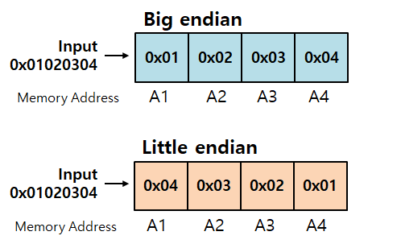
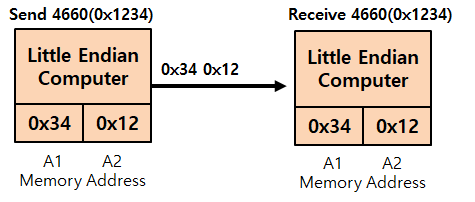
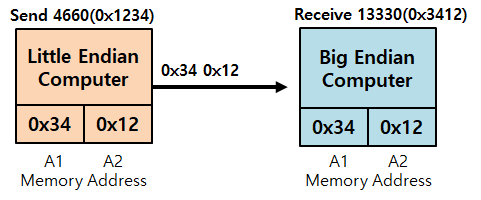

# ⚪빅 엔디안(Big Endian)

- 저장할 때 상위 바이트. 즉, **큰 쪽을 먼저 저장**
- 사람이 읽기 편한 방식
- 사람 읽는 방식과 같아 디버깅이 편함
- **네트워크에서는 빅 엔디안으로 통일**

 

 

 

# ⚪리틀 엔디안(Little Endian)

- 저장할 때 하위 바이트. 즉, 작은 쪽을 먼저 저장하는 것
- Intel x86, x64, AMD 계열은 리틀엔디안을 사용
- 사칙연산에서 이점

 

 

 

# ⚪엔디안이 서로 다르다면

위와 같이 동일한 엔디안 끼리의 통신은, 읽고 쓰는 방식이 같기 때문에 문제가 없음

 

다른 방식의 엔디안 사이의 통신은 문제가 생김

리틀 엔디안에서 0x1234는 저장할 때 0x34 0x12로 저장이 되는데   
이를 그대로 빅 엔디안에 전송하게 되면   
빅 엔디안은 0x3412로 이해하기 때문에 문제가 발생

따라서 이러한 문제를 막기 위해 **네트워크 통신은 빅 엔디안으로 통일**하였음
