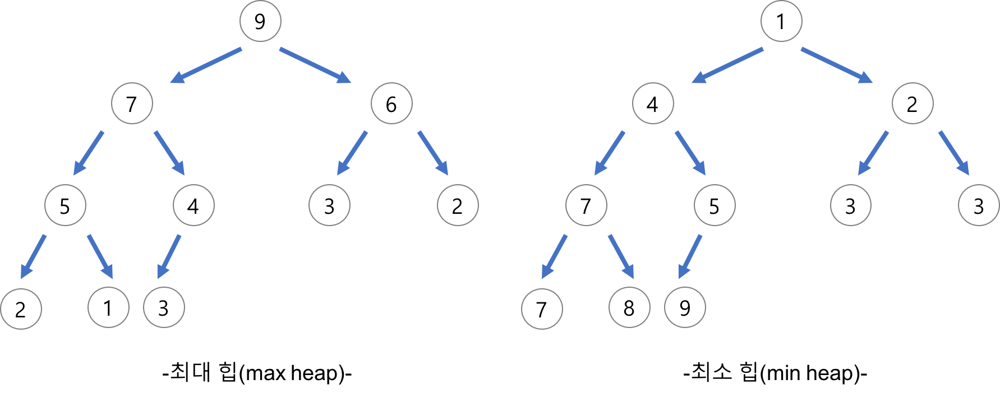
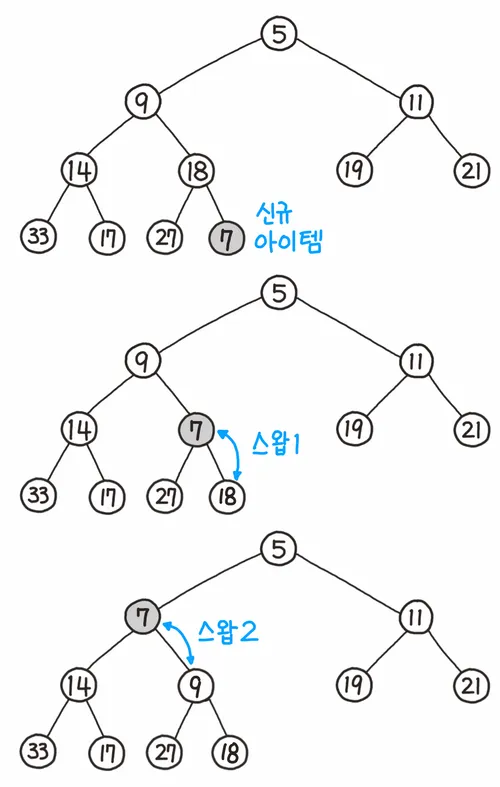
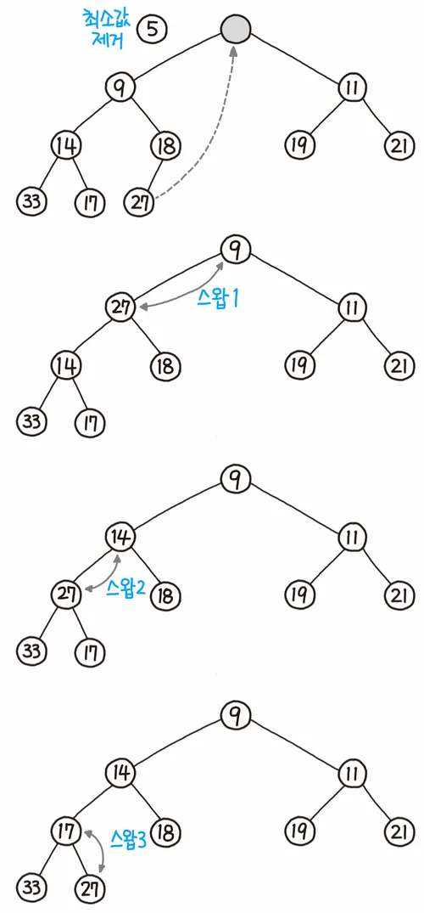
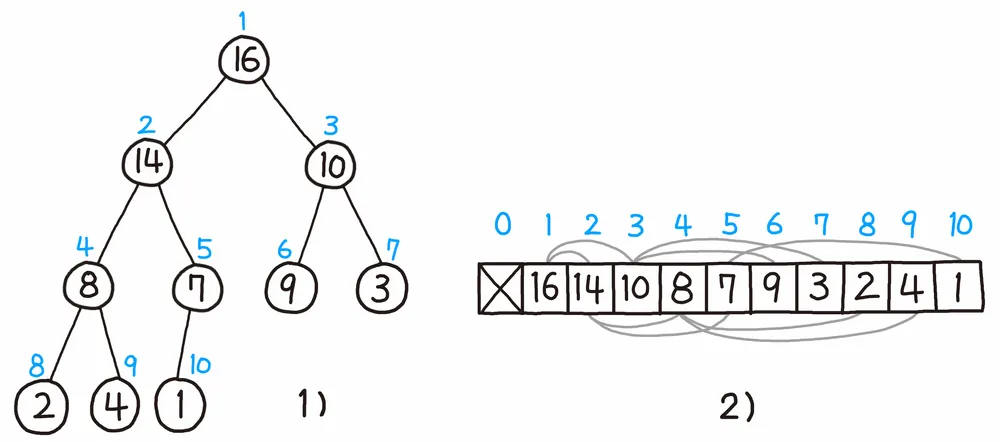

# ⚪정의

{: width="70%"}

여러 개의 값 중에서 **가장 크거나 작은 값을 빠르게 찾기** 위해 만든 이진트리.   
힙(Heap)이라고 줄여서 부르기도 함.

힙은 항상 **완전 이진 트리**(트리의 위부터 아래, 왼쪽부터 오른쪽의 순서로 빠짐없이 가득 차있는 이진 트리)의 형태를 띠어야 하고,   
부모의 값은 항상 자식(들)의 값보다 크거나(**Max heap 최대 힙**), 작아야(**Min heap 최소 힙**)

 

 

 

# ⚪데이터 삽입

{: width="30%"}

1. 가장 끝의 자리에 노드를 삽입한다.
2. 그 노드와 부모 노드를 서로 비교한다.
3. 규칙에 맞으면 그대로 두고, 그렇지 않으면 부모와 교환한다.   
   (부모노드는 **((삽입된 위치의 인덱스 번호/2)**를 하면 쉽게 구할 수 있다.) (인덱스 1부터 사용 가정)
4. 규칙에 맞을 때까지 3번 과정을 반복한다.

 

 

 

# ⚪데이터 삭제

{: width="30%"}

최댓값 혹은 최솟값이 저장된 루트 노드만 제거할 수 있다.

1. 루트 노드를 제거한다.
2. 루트 자리에 가장 마지막 노드를 삽입한다.
3. 올라간 노드와 그의 자식 노드(들)와 비교한다.
4. 조건에 만족하면 그대로 두고, 그렇지 않으면 자식과 교환한다.

- 최대 힙
  1. 부모보다 더 큰 자식이 없으면 교환하지 않고 끝낸다.
  2. 부모보다 더 큰 자식이 하나만 있으면 그 자식하고 교환하면 된다.
  3. 부모보다 더 큰 자식이 둘 있으면 자식들 중 큰 값과 교환한다.

- 최소 힙
  1. 부모보다 더 작은 자식이 없으면 교환하지 않고 끝낸다.
  2. 부모보다 더 작은 자식이 하나만 있으면 그 자식하고 교환하면 된다.
  3. 부모보다 더 작은 자식이 둘 있으면 자식들 중 작은 값과 교환한다.
- 조건을 만족할 때까지 4의 과정을 반복한다.

 

 

 

# ⚪표현

{: width="70%"}

힙은 완전 이진 트리(Complete Binary Tree)로서, **배열로 표현하기 매우 좋은 구조**

높이 순서대로 순회하면 모든 노드를 배열에 낭비 없이 배치할 수 있기 때문

그림처럼 완전 이진 트리는 배열에 빈틈없이 배치가 가능하며,   
대개 트리의 배열 표현의 경우 계산을 편하게 하기 위해 인덱스는 1부터 사용한다

 

해당 노드의 인덱스를 알면 깊이가 얼마인지, 부모와 자식 노드가 배열 어디에 위치하는지 바로 알아낼 수 있다. 

**인덱스는 1부터 시작**했기 때문에 부모/자식 노드의 위치는 각각 **부모 ⌊i/2⌋**, **왼쪽 자식 2i**, **오른쪽 자식 2i+1**로 계산할 수 있다.    
물론 꼭 완전 이진 형태가 아니어도 비어있는 위치는 얼마든지 널(Null)로 표현할 수 있기 때문에, 사실상 모든 트리는 배열로 표현이 가능하다.
