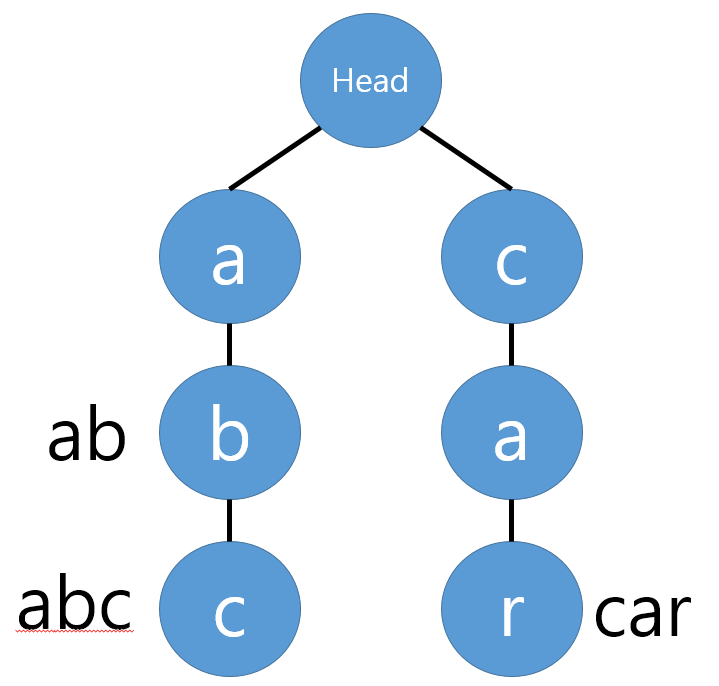
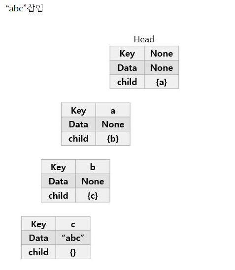
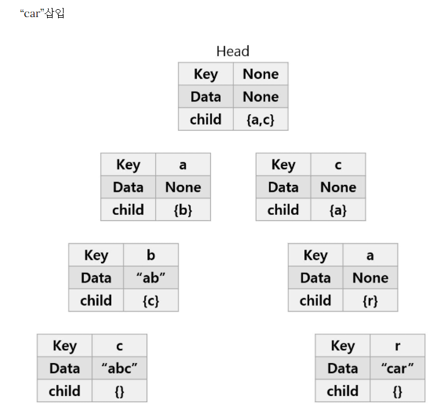

# ⚪<span style="color: #D6ABFA;">정의</span>

{: width="70%"}

- `트라이(Trie)`는 **문자열을 저장하고 효율적으로 탐색하기 위한 `트리` 형태의 자료구조**이다.
- 우리가 검색할 때 볼 수 있는 **자동완성 기능, 사전 검색 등 문자열을 탐색하는데 특화되어있는 자료구조**라고 한다.
- 래딕스 트리(radix tree) or 접두사 트리(prefix tree) or 탐색 트리(retrieval tree)라고도 한다. `트라이`는 re**trie**val tree에서 나온 단어이다.
- 예를 들어 'Datastructure'라는 단어를 검색하기 위해서는 제일 먼저 'D'를 찾고, 다음에 'a', 't', ... 의 순서로 찾으면 된다. 이러한 개념을 적용한 것이 `트라이(Trie)`이다.

> 장단점  
>
> - `트라이(Trie)`는 문자열 검색을 빠르게 한다.
> - 문자열을 탐색할 때, 하나하나씩 전부 비교하면서 탐색을 하는 것보다 시간 복잡도 측면에서 훨씬 더 효율적이다.
> - 각 노드에서 자식들에 대한 포인터들을 배열로 모두 저장하고 있다는 점에서 저장 공간의 크기가 크다는 단점도 있다. (메모리 측면에서 비효율적일 수 있음!)

<br>

<br>

<br>

# ⚪<span style="color: #D6ABFA;">동작 원리</span>

'abc', 'ab', 'car' 단어들을 'abc'부터 `트라이`에 저장한다고 가정해보자.

{: width="70%"}

[1] **'abc' `트라이(Trie)`에 삽입**

- 첫 번째 문자는 'a'이다. 초기에 `트라이` 자료구조 내에는 아무것도 없으므로 Head의 자식노드에 'a'를 추가해준다.
- 'a'노드에도 현재 자식이 하나도 없으므로, 'a'의 자식노드에 'b'를 추가해준다.
- 'c'도 마찬가지로 'b'의 자식노드로 추가해준다.
- 'abc' 단어가 여기서 끝남을 알리기 위해 현재 노드에 abc라고 표시한다. (Data)

<br>

{: width="70%"}

[2] **'ab' `트라이(Trie)`에 삽입**

- 현재 Head의 자식노드로 'a'가 이미 존재한다. 따라서 'a'노드를 추가하지 않고, 기존에 있는 'a'노드로 이동한다.
- 'b'도 'a'의 자식노드로 이미 존재하므로 'b'노드로 이동한다.
- 'ab' 단어가 여기서 끝이므로 현재 노드에 ab를 표시한다.

<br>

{: width="70%"}

[3] **'car' `트라이(Trie)`에 삽입**

- Head의 자식노드로 'a'만 존재하고, 'c'는 존재하지 않는다. 따라서 'c'를 자식노드로 추가한다.
- 'c'의 자식노드가 없으므로 마찬가지로 'a'를 추가한다.
- 'a'의 자식노드가 없으므로 마찬가지로 'r'을 추가한다.
- 'car' 단어가 여기서 끝이므로 현재 노드에 car를 표시한다.

<br>

<br>

<br>

# ⚪<span style="color: #D6ABFA;">코드</span>

```cpp
#include<iostream>
#include <vector>

using namespace std;

struct Node
{
    char key; //어떤 문자인지
    string data; //해당 문자열이 끝나는 지점일때, 해당 전체 문자열이 들어있음
    vector<Node *> children;
};

class Trie
{
    Node *root;

public:
    Trie()
    {
        root = new Node();
    }
    
    //삽입
    void insert(string data)
    {
        Node *current = root;
        for (int i = 0; i < data.size(); i++)
        {
            Node *child = nullptr;
            for (int j = 0; j < current->children.size(); j++)
            {
                if (current->children[j]->key == data[i])
                {
                    child = current->children[j];
                    break;
                }
            }
            if (child == nullptr)
            {
                child = new Node();
                child->key = data[i];
                current->children.push_back(child);
            }
            current = child;
        }
        current->data = data; //해당 문자열이 끝나는 지점일때, 해당 전체 문자열이 들어있음
    }

    //검색
    string search(string data)
    {
        Node *current = root;
        for (int i = 0; i < data.size(); i++)
        {
            Node *child = nullptr;
            for (int j = 0; j < current->children.size(); j++)
            {
                if (current->children[j]->key == data[i])
                {
                    child = current->children[j];
                    break;
                }
            }
            if (child == nullptr)
            {
                return "Not Found";
            }
            current = child;
        }
        return current->data;
    }
};

int main()
{
    Trie trie;
    trie.insert("apple");
    trie.insert("app");
    trie.insert("banana");
    trie.insert("orange");

    cout << trie.search("apple") << endl; //apple
    cout << trie.search("app") << endl; //app
    cout << trie.search("banana") << endl; //banana
    cout << trie.search("orange") << endl; //orange
    cout << trie.search("apples") << endl; //Not Found
    
    return 0;

}
```

> **출력 결과: ** 
>
> apple  
> app  
> banana  
> orange  
> Not Found

<br>

<br>

<br>

# ⚪<span style="color: #D6ABFA;">시간 복잡도</span>

- **`트라이`의 생성 시간 복잡도는 `O(MxL)`, 탐색 시간 복잡도는 `O(L)`**이다.  
  제일 긴 문자열의 길이를 L이라 하고, 총 문자열들의 수를 M이라 할 때 시간 복잡도는 위와 같다.
- **생성 시간 복잡도**는 모든 문자열 M개를 넣어야하고, M개에 대해서 `트라이`에 넣는건 가장 긴 문자열 길이인 L만큼 걸리므로 `O(MxL)`의 시간 복잡도를 가진다. (삽입은 `O(L)`이다.)  
  **탐색 시간 복잡도**는 트리를 제일 깊게 탐색하는 경우는 가장 긴 문자열 길이인 L까지 깊게 들어가는 것이므로 `O(L)`의 시간 복잡도를 가진다.
