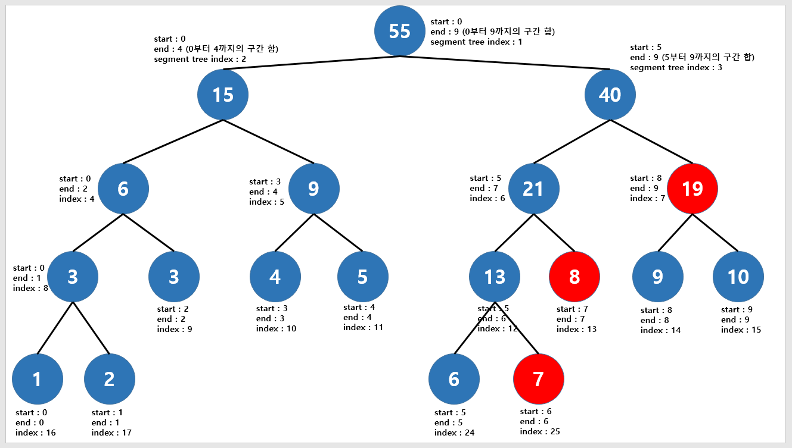

# ⚪<span style="color: #D6ABFA;">정의</span>

- **여러 개의 데이터가 존재할 때 특정 구간의 합(최솟값, 최댓값, 곱 등)을 구하는 데 사용하는 자료구조**이다.
- **트리 종류 중에 하나로 이진 트리의 형태이며, 특정 구간의 합을 가장 빠르게 구할 수 있다**는 장점이 있다. (`O(logN)`)

아래 예제를 통해 `세그먼트 트리(Segment Tree)`를 왜 사용하는지 알아보자.

> **(Ex)**
> 
>
> 위와 같은 배열이 있다고 하자.   
> 이 때 데이터의 개수는 10개로 인덱스는 0부터 9까지 차례대로 1~10의 원소가 삽입되어 있다.   
> 만약 인덱스 2부터 8까지 데이터를 더하려면 어떻게 할까?
>
> 
>
> 위 그림처럼 2~8 범위의 원소를 하나씩 다 더하면 된다. 결과는 42이다.   
> 이러한 방식으로 다른 특정 구간의 합을 구한다고 고려했을 때 앞에서 하나씩 더하므로 데이터의 개수가 N이면 시간 복잡도는 **`O(N)`**이다.   
> 따라서 이러한 방식을 이용하면 구간의 합을 구하는 속도가 너무 느리기 때문에 더 좋은 방법이 필요하다.

**→** 더 좋은 방법이 바로 **`세그먼트 트리(Segment Tree)`를 사용**하는 것이다!

<br>

<br>

<br>

# ⚪<span style="color: #D6ABFA;">동작 원리</span>


> 트리의 루트 인덱스는 1부터 시작하는 것이 계산하기 편함  
> (왼쪽 자식은 x2, 오른쪽 자식은 x2 +1)  
> (부모는 /2)

## 🔹초기화 및 생성

**세그먼트 트리의 크기는 배열(arr)의 개수가 N개일 때, N보다 큰 가장 가까운 N의 제곱수를 구한 뒤에 그것의 2배를 하여 미리 세그먼트 트리의 크기를 만들어놓어야 한다.** (넉넉하게 세그먼트 트리를 생성하는 것이다). 

그래서 **실제로는 데이터의 개수 N에 4를 곱한 크기만큼 미리 세그먼트 트리의 크기를 할당한다.**

start~end 인덱스의 값의 합이 각 노드에 초기값으로 들어간다.

```cpp
// <세그먼트 트리를 배열의 각 구간 합으로 채워주기>
// start : 배열의 시작 인덱스, end : 배열의 마지막 인덱스
// index : 세그먼트 트리의 인덱스 (무조건 1부터 시작)
int init(int start, int end, int index)
{
    //가장 끝에 도달했으면 arr 삽입
    if (start == end)
    {
        tree[index] = arr[start];
        return tree[index];
    }
    int mid = (start + end) / 2;
    
    //좌측 노드와 우측 노드를 채워주면서 부모 노드의 값도 채워준다.
    tree[index] = init(start, mid, index * 2) + init(mid + 1, end, index * 2 + 1);
    return tree[index];
}
```

## 🔹구간 합 구하기



세그먼트 트리는 트리 구조이기 때문에 데이터를 탐색하는데 있어 `O(logN)`의 시간 복잡도를 가진다. 따라서 구간 합을 항상 `O(logN)`의 시간에 구할 수 있다.

예를 들어 6~9의 범위의 구간 합을 구한다고 하자. 그러면 3개의 빨간색 노드의 합만 구해주면 된다.

구간의 합 구하는 함수 또한 재귀적으로 구현한다.   
구간의 합은 **'범위 안에 있는 경우'**에 한해서만 더해주면 된다. 그 밖의 경우는 고려하지 않는다!

```cpp
// 구간 합을 구하는 함수
// start : 시작 인덱스, end : 마지막 인덱스
// left, right : 구간 합을 구하고자 하는 범위
int interval_sum(int start, int end, int index, int left, int right)
{
    // 범위 밖에 있는 경우
    if (left > end || right < start)
    {
        return 0;
    }
    // 범위 안에 있는 경우
    if (left <= start && right >= end)
    {
        return tree[index];
    }
    // 그렇지 않다면 두 부분으로 나누어 합을 구하기
    int mid = (start + end) / 2;
    // start와 end가 변하면서 구간 합인 부분을 더해준다고 생각하면 된다.
    return interval_sum(start, mid, index * 2, left, right) + interval_sum(mid + 1, end, index * 2 + 1, left, right);
}
```

## 🔹특정 원소 값 수정


특정 원소를 수정하면 구간의 합들이 달라지고, 세그먼트 트리의 원소값들도 당연히 달라진다.  
 따라서 특정 원소의 값을 수정할 때는 **해당 원소를 포함하고 있는 모든 구간 합 노드들을 갱신**해주면 된다.   
즉, 세그먼트 트리의 모든 노드를 변경하는 것이 아닌 해당 원소를 포함하고 있는 부분적인 노드들만 바꿔주면 되는 것이다.

예를 들어 인덱스 6의 arr값(`arr[6]`)을 수정한다고 하면 다음과 같이 5개의 구간 합 노드를 모두 수정하면 된다.

이 함수 또한 재귀적으로 구현하며, 수정할 노드로는 '범위 안에 있는 경우'에 한해서만 수정해준다.

```cpp
// 특정 원소의 값을 수정하는 함수
// start : 시작 인덱스, end : 마지막 인덱스
// what : 구간 합을 수정하고자 하는 노드 (즉 배열에서의 인덱스)
// value : 기존값에서 얼마나 수정하는지(ex.6->8로 수정이면 2)
void update(int start, int end, int index, int what, int value)
{
    // 범위 밖에 있는 경우
    if (what < start || what > end)
    {
        return;
    }
    // 범위 안에 있으면 내려가면서 다른 원소도 갱신
    tree[index] += value;
    if (start == end)
    {
        return;
    }
    int mid = (start + end) / 2;
    update(start, mid, index * 2, what, value);
    update(mid + 1, end, index * 2 + 1, what, value);
}
```


<br>

<br>

<br>

# ⚪<span style="color: #D6ABFA;">코드</span>

```cpp
#include <iostream>
#include <vector>

using namespace std;

vector<int> tree;
vector<int> arr={1,2,3,4,5,6,7,8,9,10};

// <세그먼트 트리를 배열의 각 구간 합으로 채워주기>
// start : 배열의 시작 인덱스, end : 배열의 마지막 인덱스
// index : 세그먼트 트리의 인덱스 (무조건 1부터 시작)
int init(int start, int end, int index)
{
    //가장 끝에 도달했으면 arr 삽입
    if (start == end)
    {
        tree[index] = arr[start];
        return tree[index];
    }
    int mid = (start + end) / 2;

    //좌측 노드와 우측 노드를 채워주면서 부모 노드의 값도 채워준다.
    tree[index] = init(start, mid, index * 2) + init(mid + 1, end, index * 2 + 1);
    return tree[index];
}

// 구간 합을 구하는 함수
// start : 시작 인덱스, end : 마지막 인덱스
// left, right : 구간 합을 구하고자 하는 범위
int interval_sum(int start, int end, int index, int left, int right)
{
    // 범위 밖에 있는 경우
    if (left > end || right < start)
    {
        return 0;
    }
    // 범위 안에 있는 경우
    if (left <= start && right >= end)
    {
        return tree[index];
    }
    // 그렇지 않다면 두 부분으로 나누어 합을 구하기
    int mid = (start + end) / 2;
    // start와 end가 변하면서 구간 합인 부분을 더해준다고 생각하면 된다.
    return interval_sum(start, mid, index * 2, left, right) + interval_sum(mid + 1, end, index * 2 + 1, left, right);
}

// 특정 원소의 값을 수정하는 함수
// start : 시작 인덱스, end : 마지막 인덱스
// what : 구간 합을 수정하고자 하는 노드 (즉 배열에서의 인덱스)
// value : 기존값에서 얼마나 수정하는지(ex.6->8로 수정이면 2)
void update(int start, int end, int index, int what, int value)
{
    // 범위 밖에 있는 경우
    if (what < start || what > end)
    {
        return;
    }
    // 범위 안에 있으면 내려가면서 다른 원소도 갱신
    tree[index] += value;
    if (start == end)
    {
        return;
    }
    int mid = (start + end) / 2;
    update(start, mid, index * 2, what, value);
    update(mid + 1, end, index * 2 + 1, what, value);
}


int main()
{
    //트리 크기 설정(데이터 개수 x 4)
    int treeSize = arr.size() * 4;
    tree.resize(treeSize);
    
    //세그먼트 트리 초기화
    init(0, arr.size() - 1, 1);
    
    //구간 합 출력
    cout<<"0~9인덱스까지의 합 : ";
    cout<<interval_sum(0, arr.size() - 1, 1, 0, 9)<<endl; //배열의 0~9인덱스 까지의 합
    cout<<"2~5인덱스까지의 합 : ";
    cout<<interval_sum(0, arr.size() - 1, 1, 2, 5)<<endl; //배열의 2~5인덱스 까지의 합
    
    //특정 원소 수정
    update(0, arr.size() - 1, 1, 5, 2); //5번째 인덱스의 값을 2만큼 증가
    
    //구간 합 출력
    cout<<"5번째 인덱스의 값을 2만큼 증가한 이후 0~9인덱스 값 합:";
    cout<<interval_sum(0, arr.size() - 1, 1, 0, 9)<<endl; //배열의 0~9인덱스 까지의 합
}
```

> **출력 결과: ** 
>
> 0~9인덱스까지의 합 : 55  
> 2~5인덱스까지의 합 : 18  
> 5번째 인덱스의 값을 2만큼 증가한 이후 0~9인덱스 값 합:57

<br>

<br>

<br>

# ⚪<span style="color: #D6ABFA;">시간 복잡도</span>

- 시간 복잡도는 `O(logN)`으로, 세그먼트 트리를 이용하면 기존의 구간 합을 계산할 때 훨씬 더 빠르게 구간 합을 구할 수 있다.
