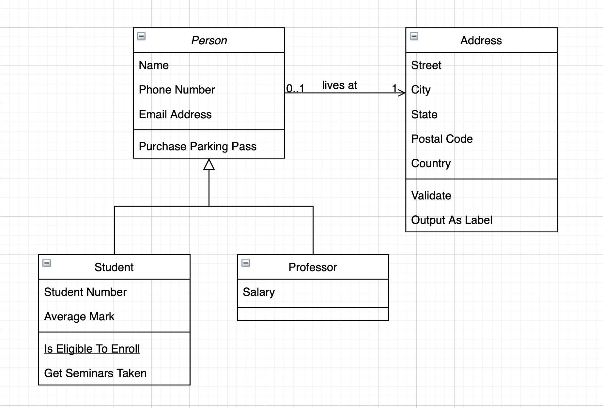
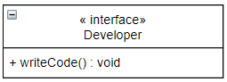
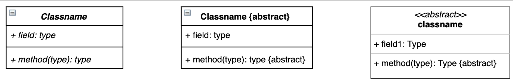
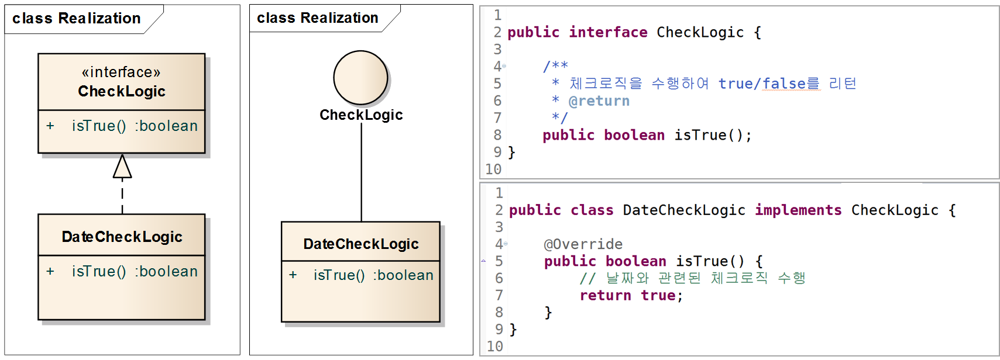

# ⚪<span style="color: #D6ABFA;">UML의 종류</span>

크게 두 종류로 나뉨

1. 구조 다이어그램 (Structure Diagram)
2. 행위 다이어그램 (Behavior Diagram)

<html lang="en">


<head>
    <meta charset="UTF-8">
    <meta name="viewport" content="width=device-width, initial-scale=1.0">
    <title>Images with Captions</title>
    <style>
        .half {
            display: flex;
            gap: 10px; /* 이미지 사이의 여백 설정 */
        }
        .half figure {
            flex: 1; /* 여백을 고려하여 figure 너비 설정 */
            margin: 0; /* 기본 마진 제거 */
            text-align: center;
        }
        .half img {
            width: 100%; /* 이미지 너비를 100%로 설정 */
            height: auto; /* 이미지 높이는 자동으로 설정 */
        }
        .caption {
            font-size: 0.8em; /* 텍스트 크기를 작게 설정 */
            color: #555; /* 텍스트 색상 설정 */
            margin-top: 5px; /* 이미지와 텍스트 사이의 여백 설정 */
        }
    </style>
</head>
<body>

    <div class="half">
        <figure>
            
            <figcaption class="caption">클래스 다이어그램</figcaption>
        </figure>
        <figure>
            
            <figcaption class="caption">시퀀스 다이어그램</figcaption>
        </figure>
    </div>

</body>
</html>

소프트웨어 개발에서 가장 많이 사용하는 다이어그램은 

**클래스 다이어그램(구조 다이어그램)** 과 **시퀀스 다이어그램(행위 다이어그램)** 임

이 중에서, 클래스 다이어그램에 대해서 정리함

<br>

<br>

<br>

# ⚪<span style="color: #D6ABFA;">클래스 다이어그램</span>

## 🔹클래스

<html lang="en">

<head>
    <meta charset="UTF-8">
    <meta name="viewport" content="width=device-width, initial-scale=1.0">
    <title>Resized Image</title>
    <style>
        .container {
            display: flex;
            flex-direction: column;
            align-items: flex-start; /* 왼쪽 정렬 설정 */
            margin-top: 20px;
        }
        .container img {
            width: 30%; /* 이미지 크기를 30%로 설정 */
        }
    </style>
</head>
<body>
    <div class="container">
        
    </div>
</body>
</html>

+ **+** : public
+ **-** : private
+ **#** : protected
+ **~** : default
+ **{readonly}** : final
+ **밑줄** : static
+ **[\*] 또는 [0...n] 또는 [n]** : 리스트와 같은 변수에 지정된 사이즈. *는 List처럼 사이즈가 정해지지 않았을때

속성을 위쪽에 적고, 메소드를 아래쪽에 적음

속성은 {접근제어자} {필드명}: {타입} 순서로

메소드는 {접근제어자} {메소드명}({파라미터타입}): {반환타입} 순서로 적음

## 🔹스테레오 타입

스테레오 타입이란 UML에서 제공하는 기본 요소 외에 추가적인 확장요소를 나타내는 것으로 **길러멧(guillemt, ≪≫)**사이에 적음. (쌍꺾쇠와 다름)

스테레오 타입으로 맣이 사용되는 것은 **`« interface »`**, **`« utility »`**, **`« abstract »`**, **`« enumeration »`** 등이 있음



```java
public interface Developer 
{
    public void writeCode();
}
```


```java
public class Math 
{
    public static final double PI = 3.14159;
    
    public static double sin(double theta){
        return 0;
    }
    public static double cos(double theta){
        return 0;
    }
}
```

(utility는 인스턴스가 없는 static 메서드만 모아둔 클래스)

## 🔹추상 클래스

- 이탤릭체(기울어진 글씨)
- 클래스명 옆에 {abstract} 붙이기
- 길러멧으로 표시



3가지 방법으로 표시 가능

## 🔹클래스 간 관계

이 부분이 항상 헷갈려서 글로 정리 함

| 관계                           | 표기                                                         |
| :----------------------------- | :----------------------------------------------------------- |
| 일반화(Generalization)         |  |
| 실체화(Realization)            |  |
| 의존(Dependency)               |  |
| 연관(Association)              |  |
| 직접연관(Directed Association) |  |
| 집합, 집합연관(Aggregation)    |  |
| 합성, 복합연관(Composition)    |  |

### 🔸 일반화(Generalization)


**슈퍼(부모) 클래스와 서브(자식) 클래스간의 상속** 관계를 나타냄.

Generalization이란 서브 클래스가 주체가 되어 서브클래스를 슈퍼 클래스로 Generalize하는 것을 말하고,  
반대의 개념은 슈퍼 클래스를 서브 클래스로 Specialize(구체화) 하는 것임

### 🔸실체화(Realization)



**interface의 spec(명세,정의)만 있는 메서드를 오버라이딩 하여 실제 기능으로 구현** 하는 것.

Realization의 표기법은 2가지가 있음

첫 번째는 인터페이스를 클래스처럼 표기하고 스테레오 타임 ≪interface≫를 추가함.   
그리고 인터페이스와 클래스 사이의 Realize 관계는 점선과 인터페이스 쪽의 비어있는 삼각형으로 연결

두 번째는 인터페이스를 원으로 표기하고 인터페이스의 이름을 명시함.  
그리고 인터페이스와 클래스 사이의 관계는 실선으로 연결

### 🔸의존(Dependency)


**메소드의 매개변수로 들어오거나 로컬 변수로 특정 클래스를 참조할 경우** (일반적으로 제일 많이 사용됨)


위처럼 스테레오 타입으로 어떠한 목적의 Dependency인지 의미를 명확히 명시 할 수도 있음

### 🔸연관(Association), 직접연관(Directed Association)


**연관 관계는 어떤 클래스가 다른 클래스를 필드로 가진다는 의미**

화살표가 있는 경우는 직접 연관으로 방향성을 표시하는 것임


위와같이 표현도 가능

<br>

아래와 같은 표현도 가능


### 🔸집합, 집합연관(Aggregation)


집합 관계는 합성(composition) 관계와 함께 **연관(Association) 관계를 조금 더 특수하게 나타낸 것**

**전체(whole)와 부분(part)의 관계**를 나타냄

whole쪽에 빈 다이아몬드를 표기. 다이아몬드가 이미 방향을 표현하기 때문에 화살표는 옵션임

>  코드를 보면 연관 관계와 똑같은걸 알 수 있는데 집합 관계와 연관 관계는 집합이라는 개념적인 차이는 있지만 코드에서 이 차이를 구분하기는 힘들다.   
>  UML은 집합이라는 개념 외에 명확한 연관 관계의 정의를 제공하지 않았다.   
>  그래서 여러 프로그래머나 분석가, 설계사가 연관 관계에 대해 자기 나름대로 정의를 내리는 혼란이 생겨 집합 관계는 되도록이면 사용하지 않는 것이 좋다고 한다.

### 🔸합성, 복합연관(Composition)


집합 관계와 비슷하게 전체( whole)와 부분(part)의 집합 관계를 나타내지만 개념적으로 **집합 관계보다 더 강한 집합**을 의미함

표기법은 집합 관계에서 다이아몬드 내부가 채워져 있다는 점만 다르다

합성 관계는 집합 관계보다 강한 집합이라고 했는데, 여기서 강한 집합이란 부분 객체가 전체 객체에 종속적이어서 부분 객체가 전체 객체의 소유 됨을 의미

집합과의 다른점은 아래와 같음

- 부분 객체를 가지는 전체 객체가 부분 객체의 인스턴스의 전체 수명을 책임진다.
  - 전체 객체의 인스턴스가 부분 객체의 인스턴스를 생성
  - 전체 객체의 인스턴스가 소멸되면 부분 객체의 인스턴스도 함께 소멸
  - 전체 객체의 인스턴스가 복사되면 부분 객체의 인스턴스도 함께 복사(깊은 복사)
- 부분 객체에 해당하는 인스턴스는 공유 될 수 없다.
  - 전체 객체의 인스턴스가 복사 되면서 포함하고 있던 부분 객체의 인스턴스가 얕은 복사가 될 경우

<br>

<br>

<br>

> 참고 링크    
>
> [넥스트리 블로그](https://www.nextree.co.kr/p6753/)
>
> [머준이의 기록적인 기록](https://djcho.github.io/etc/etc-uml-classdiagram/#%ED%95%A9%EC%84%B1composition)

