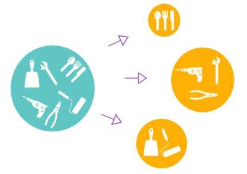
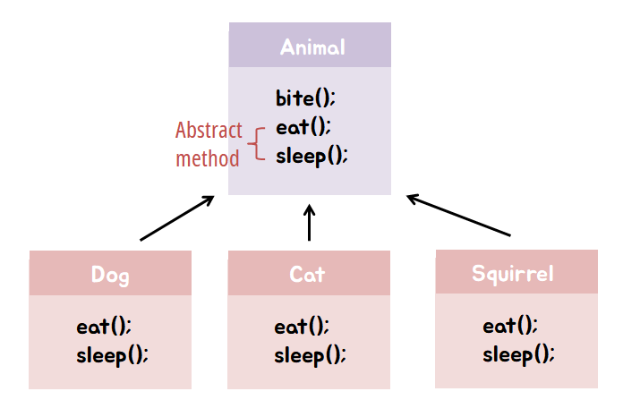
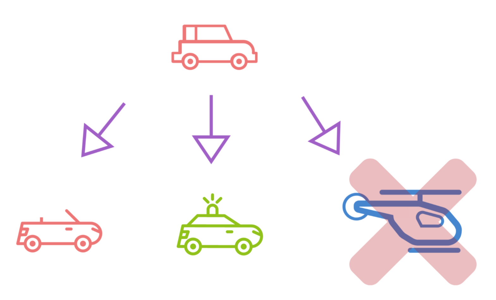
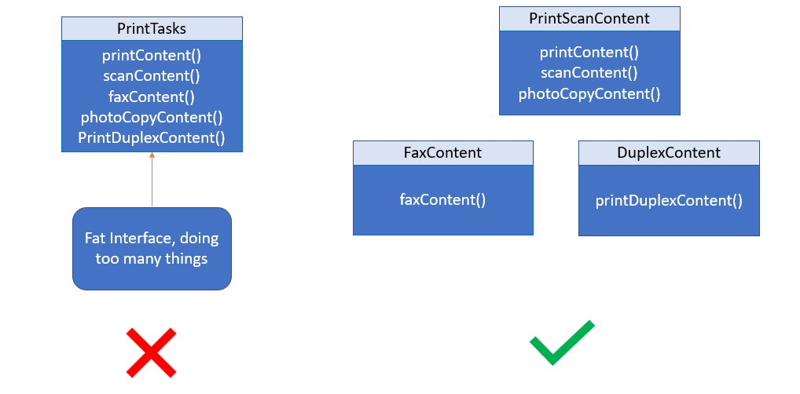
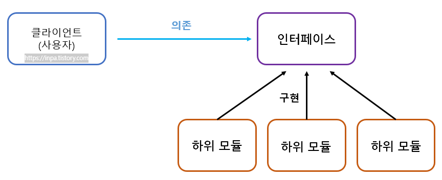

# ⚪SOLID 란

- **SRP**(Single Responsibility Principle): 단일 책임 원칙
- **OCP**(Open Closed Priciple): 개방 폐쇄 원칙
- **LSP**(Listov Substitution Priciple): 리스코프 치환 원칙
- **ISP**(Interface Segregation Principle): 인터페이스 분리 원칙
- **DIP**(Dependency Inversion Principle): 의존 역전 원칙

​     

**SOLID** 원칙이란 객체지향 설계에서 지켜줘야 할 5개의 소프트웨어 개발 원칙( **S**RP, **O**CP, **L**SP, **I**SP, **D**IP )을 말한다.

SOLID 설계 원칙은 OOP의 4가지 특징(추상화, 상속, 다형성, 캡슐화)와 더불어, 객체 지향 프로그래밍의 **단골 면접** 질문 중 하나

여러 **디자인 패턴(Design Pattern)**들이 SOLID 설계 원칙에 입각해서 만들어진 것이기 때문에, 표준화 작업에서부터 아키텍처 설계에 이르기까지 다양하게 적용되는 이의 근간이 되는 SOLID 원칙에 대해 탄탄하게 알아볼 필요가 있다

 

 

 

# ⚪단일 책임 원칙 - SRP (Single Responsibility Principle)

{: width="50%"}

- 단일 책임 원칙은 **클래스(객체)는 단 하나의 책임만 가져야** 한다는 원칙
- 여기서 **'책임'** 이라는 의미는 하나의 '**기능 담당'**으로 보면 된다.
- 최종적으로 단일 책임 원칙의 목적은 **프로그램의 유지보수성을 높이기 위한** 설계 기법
- **책임의 범위**는 딱 정해져있는 것이 아니고, 어떤 프로그램을 개발하느냐에 따라 개발자마다 생각 기준이 달라질 수 있다

 

 

 

# ⚪개방 폐쇄 원칙 - OCP (Open Closed Principle)

{: width="50%"}

- **'확장에 열려있어야 하며, 수정에는 닫혀있어야 한다'** 를 뜻함
- 기능 추가 요청이 오면 **클래스를** **확장을 통해 손쉽게 구현**하면서, **확장에 따른 클래스 수정은 최소화** 하도록 프로그램을 작성해야 하는 설계 기법
-  기존 구성 요소는 수정이 일어나지 않게 하고, 기존 구성 요소를 쉽게 확장해서 재사용할 수 있는 것
- OCP를 가능케 하는 중요 메커니즘은 추상화와 다형성

 

 

 

# ⚪리스코프 치환 원칙 - LSP (Liskov Substitution Principle)

{: width="50%"}

- **서브 타입은 언제나 기반(부모) 타입으로 교체**할 수 있어야 한다는 원칙
- **다형성의 특징을 이용**하기 위해 상위 클래스 타입으로 객체를 선언하여 하위 클래스의 인스턴스를 받으면, **업캐스팅된 상태에서 부모의 메서드를 사용해도 동작이 의도대**로 흘러가야 하는 것을 의미
- 따라서 기본적으로 LSP 원칙은 부모 메서드의 오버라이딩을 조심스럽게 따져가며 해야한다.
  왜냐하면 부모 클래스와 동일한 수준의 선행 조건을 기대하고 사용하는 프로그램 코드에서 예상치 못한 문제를 일으킬 수 있기 때문

 

 

 

# ⚪인터페이스 분리 원칙 - ISP (Interface Segregation Principle)

{: width="50%"}

- **인터페이스를 각각 사용에 맞게 끔 잘게 분리**해야한다는 설계 원칙
- SRP 원칙이 **클래스의 단일 책임**을 강조한다면, ISP는 **인터페이스의 단일 책임**을 강조하는 것으로 보면 된다
- 다만 ISP 원칙의 주의해야 할점은 **한번 인터페이스를 분리하여 구성해놓고 나중에 무언가 수정사항이 생겨서 또 인터페이스들을 분리하는 행위**를 가하지 말아야 한다.
  (인터페이스는 한번 구성하였으면 왜만해선 변하면 안되는 정책 개념)

 

 

 

# ⚪의존 역전 원칙 - DIP (Dependency Inversion Principle)

{: width="50%"}

- 어떤 Class를 참조해서 사용해야하는 상황이 생긴다면, 그 Class를 직접 참조하는 것이 아니라 그 **대상의 상위 요소(추상 클래스 or 인터페이스)로 참조**하라는 원칙
- 구현 클래스에 의존하지 말고, **인터페이스에 의존**하라는 뜻
- 의존 관계를 맺을 때 변화하기 쉬운 것 또는 자주 변화하는 것보다는, 변화하기 어려운 것 거의 변화가 없는 것에 의존하라는 것

---

참고 링크

[Inpa Dev](https://inpa.tistory.com/entry/OOP-%F0%9F%92%A0-%EA%B0%9D%EC%B2%B4-%EC%A7%80%ED%96%A5-%EC%84%A4%EA%B3%84%EC%9D%98-5%EA%B0%80%EC%A7%80-%EC%9B%90%EC%B9%99-SOLID)
