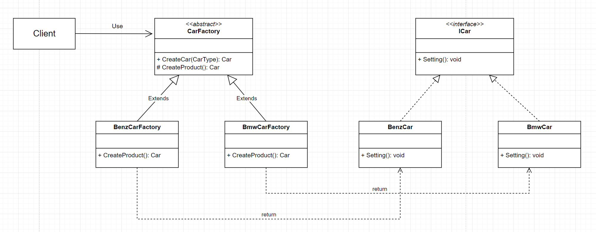
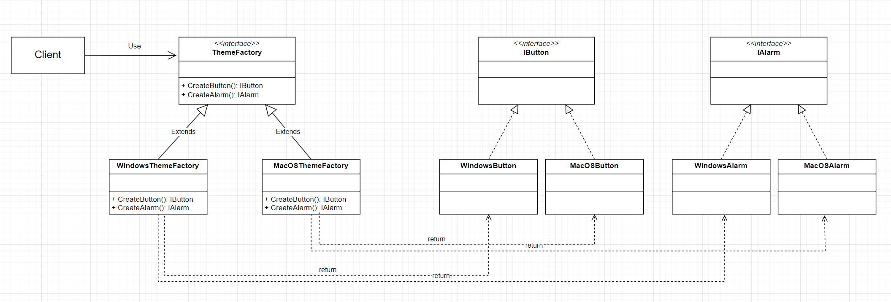

# ⚪<span style="color: #D6ABFA;">왜 사용하는가</span>

**객체 생성하는 코드를 분리**하여 클라이언트 코드와 결합도(의존성)를 낮추어 **코드를 건드리는 횟수를 최소화(결합도를 줄임)** 하기 위한 패턴임

클라이언트 코드는 분리시킨 객체 생성 코드를 호출하는 쪽을 의미함

일단, 객체를 생성하는 일은 구상클래스를 만드는 일인데 새로운 객체가 추가 될 수도 있고 삭제 될 수 있는 가능성이 상대적으로 많다.  
또한 객체를 생성하는 코드가 여러 클래스내 에서도 사용 되면 예를 들어 10개의 클래스 내에서 객체를 생성하는 if ~ else if 구문이 있다고 했을때 객체 추가/수정이 발생하면 10개의 클래스에 코드를 변경해 줘야 하는 일이 발생한다.

바로 이러한 문제점을 해결하기 위해 팩토리 패턴을 사용하는 것이다.

팩토리 패턴을 사용하면 SOLID원칙의 OCP를 지키게 된다.

<br>

<br>

<br>

# ⚪<span style="color: #D6ABFA;"> 종류</span>

팩토리 패턴은 `팩토리 메서드 패턴` 과 `추상 팩토리 패턴` 로 나뉨

`팩토리 메서드 패턴` 은

- 각각 다른 객체들이 필요할 때 사용

`추상 팩토리 패턴` 은

- 서로 연관 있는 객체들의 조합이 필요할 때 사용

## 🔹팩토리 메서드 패턴



**[공장(Factory) 클래스]**

```java
abstract class CarFactory
{
    // 객체 생성 전처리 후처리 메소드 (final로 오버라이딩 방지, 템플릿화)
    final ICar CreateCar(CarType type)
    {
        ICar product = CreateProduct(); //서브 클래스에서 구체화한 팩토리 메서드 실행
        product.Setting(); //.. 이밖의 객체 생성에 가미할 로직 실행
        return product; //객체를 생성하고 추가 설정하고 완성된 제품을 반환
    }
    
    // 팩토리 메소드 : 구체적인 객체 생성 종류는 각 서브 클래스에 위임
    // protected 이기 때문에 외부에 노출이 안됨
    abstract protected ICar CreateProduct();
}

class BenzCarFactory extends CarFactory
{
    @Override
    public ICar CreateProduct()
    {
        return new BenzCar();
    }
}

class BmwCarFactory extends CarFactory
{
    @Override
    public ICar CreateProduct()
    {
        return new BmwCar();
    }
}
```

**[제품(Product) 클래스]**

```java
interface ICar
{
    void Setting();
}

class BenzCar implements ICar
{
    public void Setting(){}
}

class BmwCar implements ICar
{
    public void Setting(){}
}
```

- 팩토리 메서드 패턴은 클라이언트가 특정 객체의 생성을 직접 생성하지 않고 팩토리 역할을 하는 객체에 위임하는 패턴이다.
- 팩토리는 인터페이스나 추상클래스로 추상화되어 구체 팩토리의 변경을 유연하게 한다.
- 구체 팩토리는 추상화된 객체를 생성한다. 이는 클라이언트와의 결합을 낮추고, 생성 객체의 확장성과 변경 용이를 보장한다.
- 팩토리 메서드를 통해 객체의 생성 후 공통으로 할 일을 수행하도록 지정해줄 수 있다
- 캡슐화, 추상화를 통해 생성되는 객체의 구체적인 타입을 감출 수 있다
- 단일 책임 원칙 준수 : 객체 생성 코드를 한 곳 (패키지, 클래스 등)으로 이동하여 코드를 유지보수하기 쉽게 할수 있으므로 원칙을 만족
- 개방/폐쇄 원칙 준수 : 기존 코드를 수정하지 않고 새로운 유형의 제품 인스턴스를 프로그램에 도입할 수 있어 원칙을 만족 (확장성 있는 전체 프로젝트 구성이 가능)
- 생성에 대한 인터페이스 부분과 구현 부분을 따로 나뉘었기 때문에 패키지 분리하여 개별로 여러 개발자가 협업을 통해 개발

<br>

단점도 있는데, 

각 제품 구현체마다 팩토리 객체들을 모두 구현해주어야 하기 때문에, 구현체가 늘어날때 마다 팩토리 클래스가 증가하여 서브 클래스 수가 폭발한다.

코드의 복잡성이 증가한다.

## 🔹추상 팩토리 패턴



- 추상 팩토리 패턴은 특정 그룹에 속하는 여러 객체들을 하나의 팩토리로 묶어서 생성할 수 있는 패턴
- 추상화 팩토리를 구현한 구체 클래스는, 구체 클래스의 특성에 따라 구체화된 요소 객체들을 반환하도록 구현한다
