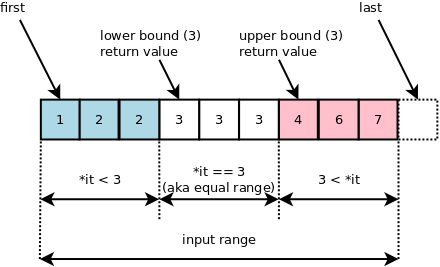

# ⚪<span style="color: #D6ABFA;">이진탐색이란</span>

​	

- 이진 탐색은 **정렬이 된 데이터**에서 어떠한 특정 값이 존재하는지 검색하는 알고리즘
- 기준 값을 구해서 그 값을 기준으로 데이터를 나눠서 검색하는 방법
- 특정 값을 찾을 때는 기본 이진 탐색으로 쉽게 구할 수 있음
- 그러나 중복된 데이터를 탐색할때는 조금 더 응용한 버전을 사용해야 함
  - **Upper Bound** : 특정값보다 **처음으로 큰 값이 나오는 위치**를 리턴
  - **Lower Bound** : 특정값보다 **처음으로 같거나 큰 값이 나오는 위치**를 리턴
- 실제로 응용할때는 단순 크다,작다의 개념이 아닌, 가능하냐 불가능하냐의 개념을 이용해서 이진탐색을 활용할 수 있음
- 시간 복잡도는 **O(log n)**  (n: 배열 길이)

<br>

<br>

<br>

# ⚪<span style="color: #D6ABFA;">Upper Bound</span>


특정값보다 **처음으로 큰 값이 나오는 위치**를 얻고 싶을때 사용

아래 3개의 값을 이용하여서 탐색을 함

- 가장 왼쪽 경계를 의미하는 **left**

- 실제로 테스트할 값이면서 경계의 중간값인 **mid**

- 가장 오른쪽 경계를 의미하는 **right**

이때 주의할 것은, **초기 right의 값**을 배열의 마지막 인덱스가아닌

**마지막 인덱스+1**로 지정해야 한다는 것임!!!!

왜냐하면 찾고자 하는 값 k가 배열내에 존재하는 모든 값들보다 큰 값일때,

초기 right를 마지막 인덱스로 지정할경우 최종결과로 마지막 인덱스를 리턴하기때문에

마지막 인덱스가 실제로 k값보다 처음으로 큰 값이 나오는 위치인것인지, 아니면 k값이 배열 내 모든값보다 큰것인지를 구분할 수가 없음

따라서 ```초기 right를 마지막 인덱스+1``` 로 설정해줘야 k값이 배열 내 모든값보다 클때 마지막 인덱스+1 을 리턴해줌으로서 구분이 가능해짐

## 🔹초기값


**left** = 처음 인덱스  
**mid** = (left+right)/2  
**right** = 마지막 인덱스+1  
{: .notice--primary}

## 🔹알고리즘

1. left, right 값을 세팅
2. while(left < right)일동안 3~5를 반복
3. mid = (left + right) /2 계산
4. mid인덱스에 들어있는 값 'm'과 찾고자 하는 값 'k'와 비교
5. - m <= k 라면 left = mid +1로 세팅
   - m > k 라면 right = mid로 세팅

위 알고리즘이 종료된다면 left 값이 upper bound가 됨

```c++
//value보다 처음으로 큰 값이 나오는 index를 반환 (만약 마지막 인덱스+1 이라면 value보다 큰 값이 없다는 것)
public int UpperBound(int data[], int value) 
{
    int left = 0;
    int right = data.length; //마지막 인덱스+1 과 동일
    int mid = 0;
    
    while (left < right) 
    {
        mid = (left + right) / 2;
        if (data[mid] <= value) 
        {
            left = mid + 1;
        } 
        else 
        {
            right = mid;
        }
    }
    return left;
}
```

<br>

<br>

<br>

# ⚪<span style="color: #D6ABFA;">Lower Bound</span>


 **처음으로 특정값 이상(<=)의 값이 나오는 위치**를 얻고 싶을때 사용

아래 3개의 값을 이용하여서 탐색을 함

- 가장 왼쪽 경계를 의미하는 **left**

- 실제로 테스트할 값이면서 경계의 중간값인 **mid**

- 가장 오른쪽 경계를 의미하는 **right**

이때 주의할 것은, **초기 right의 값**을 배열의 마지막 인덱스가아닌

**마지막 인덱스+1**로 지정해야 한다는 것임!!!!

왜냐하면 찾고자 하는 값 k가 배열내에 존재하는 모든 값들보다 큰 값일때,

초기 right를 마지막 인덱스로 지정할경우 최종결과로 마지막 인덱스를 리턴하기때문에

마지막 인덱스가 실제로 k값보다 처음으로 이상인 값이 나오는 위치인것인지, 아니면 k값이 배열 내 모든값보다 큰것인지를 구분할 수가 없음

따라서 ```초기 right를 마지막 인덱스+1``` 로 설정해줘야 k값이 배열 내 모든값보다 클때 마지막 인덱스+1 을 리턴해줌으로서 구분이 가능해짐

## 🔹초기값

**left** = 처음 인덱스  
**mid** = (left+right)/2  
**right** = 마지막 인덱스+1  
{: .notice--primary}

## 🔹알고리즘

1. left, right 값을 세팅
2. while(left < right)일동안 3~5를 반복
3. mid = (left + right) /2 계산
4. mid인덱스에 들어있는 값 'm'과 찾고자 하는 값 'k'와 비교
5. - m < k 라면 left = mid +1로 세팅
   - m >= k 라면 right = mid로 세팅

위 알고리즘이 종료된다면 left 값이 lower bound가 됨

```c++
//value보다 처음으로 이상인 값이 나오는 index를 반환 (만약 마지막 인덱스+1 이라면 value이상인 값이 없다는 것)
public int UpperBound(int data[], int value) 
{
    int left = 0;
    int right = data.length; //마지막 인덱스+1 과 동일
    int mid = 0;
    
    while (left < right) 
    {
        mid = (left + right) / 2;
        if (data[mid] < value) 
        {
            left = mid + 1;
        } 
        else 
        {
            right = mid;
        }
    }
    return left;
}
```

