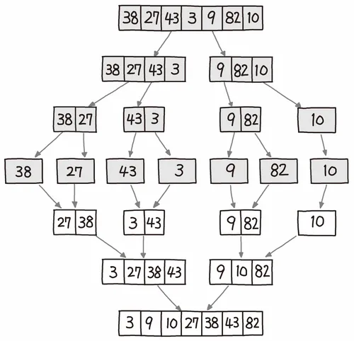

# ⚪<span style="color: #D6ABFA;">원리와 예시 코드</span>

![MergeSort.mp4 [video-to-gif output image]](../../assets/images/2024-07-04-MergeSort/ezgif-1-dbe34c6412.gif)



두 부분으로 쪼개고 쪼개서 자른 순서의 역순으로 크기를 비교해 병합해 나간다  
병합된 부분 안은 이미 정렬되어 있으므로 전부 비교하지 않아도 제자리를 찾을 수 있다


성능은 퀵 정렬보다 전반적으로 뒤떨어지고, 데이터 크기만한 메모리가 더 필요하지만  
최대의 장점은 데이터의 상태에 별 영향을 받지 않는다는 점(=stable하다는 장점)


```cpp
#include <iostream>
#include <vector>

void Merge(std::vector<int>& A, int first, int mid, int last)
{
    int i = first; // 왼쪽 배열 A[first ⋯ mid]의 커서
    int j = mid + 1; // 오른쪽 배열 A[mid+1 ⋯ last]의 커서
    int k = 0; // 합친 배열 tmp[first ⋯ last]의 커서

    std::vector<int> tmp(last - first + 1);

    // 크기 순서대로 끼워 넣기 
    while (i <= mid && j <= last) 
    { 
        if (A[i] <= A[j])
        {
            tmp[k++] = A[i++];
        }
        else
        {
            tmp[k++] = A[j++];
        }
    }

    // 왼쪽 배열이 남은 경우
    while (i <= mid)
    { 
        tmp[k++] = A[i++];
    }

    // 오른쪽 배열이 남은 경우
    while (j <= last)
    { 
        tmp[k++] = A[j++];
    }

    // A에 반영
    for (i = first, k = 0; i <= last;)
    { 
        A[i++] = tmp[k++];
    }
}

void MergeSort(std::vector<int>& A, int first, int last)
{
    if (first < last)
    {
        int mid = (first + last) / 2;
        MergeSort(A, first, mid);
        MergeSort(A, mid + 1, last);
        Merge(A, first, mid, last);
    }
}

int main()
{
    std::vector<int> A = { 3, 5, 2, 1, 4, 6, 7, 8, 9, 0 };
    MergeSort(A, 0, A.size() - 1);
    for (int i = 0; i < A.size(); ++i)
    {
        std::cout << A[i] << " ";
    }

    return 0;
}
```

> 정렬을 했을 때 중복된 값들의 순서가 유지되는 **안정(Stable) 정렬**에 속한다

<br>

<br>

<br>

# ⚪<span style="color: #D6ABFA;">시간 복잡도</span>

 **O(n log n)**


❓ 퀵정렬보다 병합정렬이 유리한 경우가 있을까?

만약 레코드를 연결 리스트(Linked List)로 구성하면, 링크 인덱스만 변경되므로 데이터의 이동은 무시할 수 있을 정도로 작아진다.   
병합 정렬은 순차적인 비교로 정렬을 진행하므로, LinkedList의 정렬이 필요할 때, 사용하면 효율적이다.   
LinkedList를 퀵 정렬에 사용해 정렬하면 성능이 좋지 않다. 이유는 퀵 정렬은 순차 접근이 아닌 임의 접근이기 때문이다.   
LinkedList는 삽입과 삭제 연산에서는 유용하지만, 접근 연산에서는 비효율적이다.

👉 따라서 크기가 큰 레코드를 정렬할 경우에 연결 리스트를 사용한다면, 합병 정렬은 퀵 정렬을 포함한 다른 어떤 정렬 방법보다 효율적이다.

