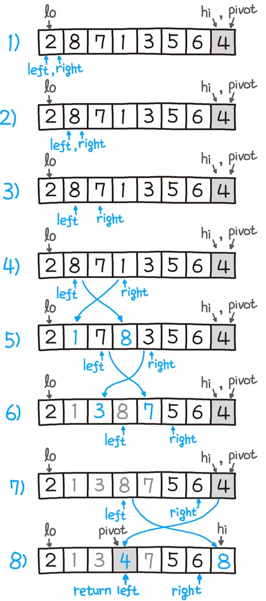

# ⚪<span style="color: #D6ABFA;">원리와 예시 코드</span>

![QuickSort.mp4 [video-to-gif output image]](../../assets/images/2024-07-06-QuickSort/ezgif-6-d80f79be74.gif)

퀵이라는 이름에서 알 수 있듯이 평균적인 상황에서 최고의 성능

언어에서 자체적으로 제공하는 정렬 함수는 대개 퀵 정렬 혹은 퀵 정렬의 변형 알고리즘을 사용

원소 하나를 기준(**피벗, pivot**)으로 삼아 그보다 작은 것을 앞으로 빼내고 그 뒤에 피벗을 옮겨 **피벗보다 작은 것, 큰 것으로 나눈**뒤 나누어진 각각에서 **다시 피벗을 잡고 정렬**해서 각각의 크기가 0이나 1이 될 때까지 정렬

이렇게 피벗을 잡고 이보다 작은 원소들을 왼쪽으로, 보다 큰 원소들을 오른쪽으로 나누는걸 **partition step**이라 한다

퀵 정렬에도 이 partition step을 어떻게 하느냐에 따라 바리에이션이 매우 많으며, 성능 차이도 날 수 있다


{: width="30%"}

퀵 정렬의 가장 간단한 분할 알고리즘인 로무토 파티션을 도식화한 것

pivot은 맨 오른쪽 값을 기준으로 하며, 이를 기준으로 2개의 포인터가 이동해서   
오른쪽 포인터의 값이 pivot보다 작다면 왼쪽 포인터와 오른쪽 포인터의 값을 서로 스왑하는 형태로 진행된다

스왑 이후에는 왼쪽 왼쪽 포인터가 한번 이동 한다(오른쪽 포인터는 매번 움직임)

오른쪽 포인터가 pivot에 도달하게 되면, 왼쪽 포인터의 값과 pivot에 해당하는 값을 바꿈. 

이렇게 계속 분할하면서 정복을 진행하여 코드 기준으로 left<right를 만족하지 않을때까지 계속 재귀로 반복되면서 정렬이 완료됨\


```cpp

```

> 정렬을 했을 때 중복된 값들의 순서가 변하는 **불안정(Unstable) 정렬**에 속한다

<br>

<br>

<br>

# ⚪<span style="color: #D6ABFA;">시간 복잡도</span>

 **O(n log n)**

**최악**(피봇을 최솟값이나 최댓값으로 계속해서 잡는 경우): **O(n<sup>2</sup>)** 


즉, 이미 정렬된 배열을 정렬하게 될 경우 최악...

나쁜 케이스들을 막기 위해서 다른 빠른 정렬 알고리즘을 섞어서 쓰는 하이브리드 퀵 소트가 많이 쓰임  
(재귀 깊이가 일정이상 깊어지면 힙 정렬을 사용하여 O(n log n)을 보장해주는 인트로 정렬이라던지...)
