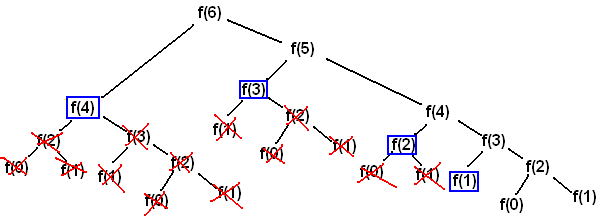
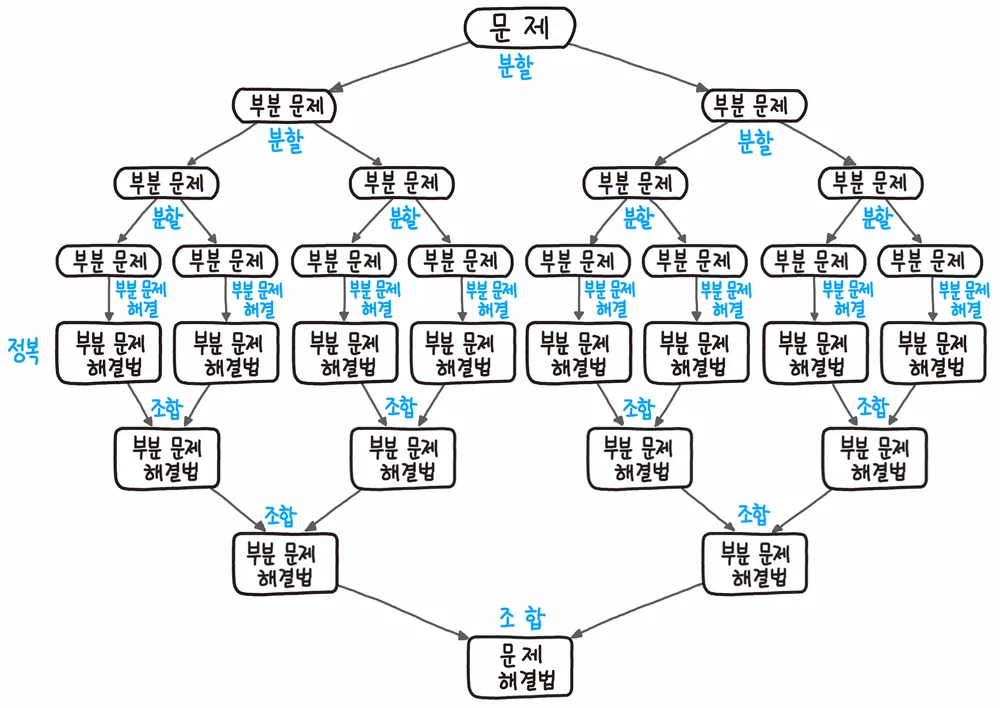
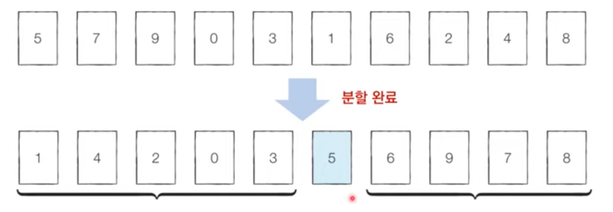

# ⚪<span style="color: #D6ABFA;">동적 계획법(DP)</span>

## 🔹동적 계획법이란?

{: width="70%"}

동적 계획법(Dynamic Programming)이란

-  주어진 문제를 작은 문제로 나누어 푸는 알고리즘
-  top-down(하향식), bottom-up(상향식) 두가지 방식이 있음
-  이미 계산된 결과(작은 문제)는 별도의 메모리 영역에 저장하여 다시 계산하지 않도록 함
   - 즉, 한번 계산하여 해결한 문제는 다시 계산X
-  (동적이라는 단어는 별 의미가 없음)

## 🔹동적 계획법의 조건

### 🔸1. 최적 부분 구조(Optimal Substructure)

큰 문제를 작은 문제로 나눌 수 있으며 작은 문제의 답을 모아서 큰 문제를 해결할 수 있음


예를 들어, 서울에서 부산까지 가는 최적 경로를 구한다고 가정하자.  
이 때, **서울 -> 대구 -> 부산**이 최적 경로의 해답이라고 한다면,  
각 부분 문제인 **서울 -> 대구** 와 **대구 -> 부산**의 해가 합쳐져 주어진 문제에 대해 **서울 -> 대구 -> 부산**의 해가 나오는 것이다.

<br>


이를 **피보나치 수열**에 적용한다면 다음과 같다.

 

주어진 문제 : N번째 피보나치 수를 구한다.  
부분 문제 : N-1번째 피보나치 수를 구한다, N-2번째 피보나치 수를 구한다.    
**주어진 문제의 해답 : 부분문제(N-1번째 피보나치 수, N-2번째 피보나치 수)의 해를 합친다.**

 

주어진 문제 : N-1번째 피보나치 수를 구한다.  
부분 문제 : N-2번째 피보나치 수를 구한다, N-3번째 피보나치 수를 구한다.  
**주어진 문제의 해답 : 부분문제(N-2번째 피보나치 수, N-3번째 피보나치 수)의 해를 합친다.**


~ (반복)

### 🔸2. 중복되는 부분 문제(Overlapping Subproblem)

중복되는 작은 문제를 반복적으로 해결해야 함


이 역시도 피보나치 수열에 적용하면 다음과 같다.

 

주어진 문제 : N번째 피보나치 수를 구한다.  
**부분 문제 :** N-1번째 피보나치 수를 구한다, **N-2번째 피보나치 수를 구한다.**

 

파생된 부분 문제 : N-1번째 피보나치 수를 구한다.  
**부분 문제 : N-2번째 피보나치 수를 구한다,** N-3번째 피보나치 수를 구한다.

 

~ (반복)

 

이러한 부분 문제가 계속 이어짐으로써, 위와 같이 N-m번 째 피보나치 수를 구하는 부분 문제가 중복된다.

## 🔹탑다운, 바텀업

- **탑다운(하향식)**, **바텀업(상향식)**의 2 가지 방식으로 다이나믹 프로그래밍 구현이 가능함
- 탑다운 방식일때 계산한 결과를 저장하는 **메모이제이션(Memoization)**을 통해서 캐싱을 하고 사용함
- 전형적인 형태는 바텀업(상향식)임.
  - 바텀업일때의 결과 저장용 리스트를 **DP 테이블**이라고도 부름

메모이제이션이든 DP테이블이든 결과를 캐싱했다가 사용하는 것은 동일함. 부르는 용어의 차이인듯

**메모이제이션**은 DP에만 국한된 개념이 아니고 **이전에 계산된 결과를 일시적으로 기록해 놓는 넓은 개념**을 의미

### 🔸피보나치 수열 top-down 코드 예시

```cpp
//메모이제이션을 위한 배열
int memoization[100]={0};

int fibo (int n)
{
    if (n==1 || n==2)
        return 1;
    
    //이미 계산한 적 있는 문제라면 그대로 반환
    if (memoization[n] != 0)
        return memoization[n];
    
    //아직 계산하지 않은 문제라면 점화식에 따라서 피보나치 결과 반환
    memoization[n] = fibo(n-1) + fibo(n-2);
    return memoization[n];
}
```

### 🔸피보나치  수열 bottom-up 코드 예시

```cpp
//DP 테이블
int _dpTable[100]={0};

_dpTable[1]=1;
_dpTable[2]=1;

//n번째 피보나치수를 반복문으로 구함(바텀업 방식)
for (int i = 3; i <= n; ++i)
{
    _dpTabpe[i] = _dpTable[i-1] + _dpTable[i-2];
}
```

<br>

<br>

<br>

# ⚪<span style="color: #D6ABFA;">분할 정복(Divide&Conquer)</span>

## 🔹분할 정복이란?

{: width="70%"}

- **문제를 나눌 수 없을 때까지 나누어서 각각을 풀면서 다시 합병**하여 문제의 답을 얻는 알고리즘
- **하향식 접근법**으로, 상위의 해답을 구하기 위해, 아래로 내려가면서 하위의 해답을 구하는 방식
  - **일반적으로 재귀함수**로 구현
- 문제를 잘게 쪼갤 때, **부분 문제는 서로 중복되지 않음**
  - 예: 병합 정렬, 퀵 정렬 등

<br>

세 과정으로 나눠서 생각할 수 있음

- **분할**: 문제를 더이상 분할할 수 없을 때까지 동일한 유형의 여러 하위 문제로 나눈다.
- **정복**: 가장 작은 단위의 하위 문제를 해결하여 정복한다.
- **조합**: 하위 문제에 대한 결과를 원래 문제에 대한 결과로 조합한다.

## 🔹 예시(퀵 소트 코드)

분할 정복의 대표적인 예시로는 **퀵 정렬**(quick sort)가 있음

{: width="70%"}

한 번 pivot을 선정해서 분할을 완료하면, 그 피봇의 위치는 바뀌지 않음

분할 이후에 해당 pivot을 다시 처리하는 부분 문제는 호출하지 않음

```cpp
#include <iostream>
#include <vector>

using namespace std;

int partition(vector<int>& arr, int low, int high) {
    int pivot = arr[low];
    int i = low;

    for (int j = low + 1; j <= high; j++) {
        if (arr[j] < pivot) {
            i++;
            swap(arr[i], arr[j]);
        }
    }
    swap(arr[i], arr[low]);
    return i;
}

void quickSort(vector<int>& arr, int low, int high) {
    if (low < high) {
        int pi = partition(arr, low, high);

        quickSort(arr, low, pi - 1);
        quickSort(arr, pi + 1, high);
    }
}

int main() {
    vector<int> arr = {2,1};
    int n = arr.size();
    quickSort(arr, 0, n - 1);
    for (int i = 0; i < n; i++) {
        cout << arr[i] << " ";
    }
    return 0;
}
```


<br>

<br>

<br>

# ⚪<span style="color: #D6ABFA;">둘의 공통점,차이점</span>

## 🔹공통점

- 문제를 작은 단위로 쪼개서 해결함

## 🔹차이점

- **DP** 
  - **부분 문제들이 중복**되어서, 상위 문제 해결 시 **재활용** 됨.
  - **Memoization** (DP 테이블) 기법을 통해서 **캐싱**을 하여 최적화 함
- **분할 정복**
  - **부분 문제가 서로 중복되지 않음**
  - Memoization 사용 안함
