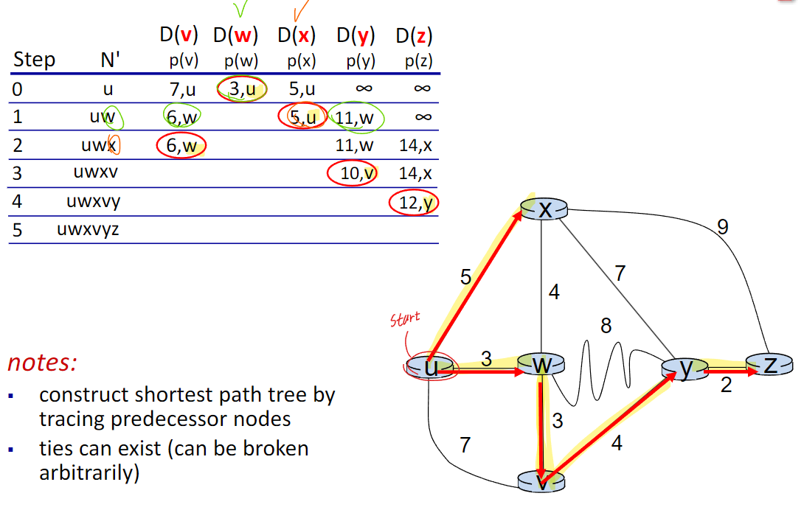

# ⚪<span style="color: #D6ABFA;">다익스트라?</span>

다익스트라(Dijkstra) 알고리즘은 **그래프의 한 정점(Vertex)에서 모든 정점까지의 최단 거리**를 각각 구하는 알고리즘이다.

다르게 표현하면 가중 그래프에서 간선 가중치의 합이 최소가 되는 경로를 찾는 알고리즘중 하나


다익스트라는 그리디와 동적 계획법이 합쳐진 형태이다.   
현재 위치한 노드에서 최선의 경로를 반복적으로 찾으면서도 계산 해둔 경로를 활용해 중복된 하위 문제를 풀기 때문이다.   


다익스트라는 만약 **그래프에 음의 가중치가 있다면 사용할 수 없다**. (음의 가중치로 사이클이 생성되면...)  
그 이유는 그리디를 통해 최단 경로라고 여겨진 경로 비용을 DP 테이블에 저장한 뒤, 재방문하지 않는데, 만약 음의 가중치가 있다면 이러한 규칙이 어긋날 수 있기 때문이다.   
**음의 가중치가 포함된다면 플로이드 워셜이나 벨만 포드 알고리즘**을 사용해 최단 경로를 구할 수 있다.   
다만 시간 복잡도가 늘어나는 단점이 있기에 해결하고자 하는 문제에 맞게 사용해야 한다.

<br>

<br>

<br>

# ⚪<span style="color: #D6ABFA;">동작 원리</span>

먼저 사용할 용어 설명

- **c(x,y) :** **인접한 노드 x에서 y까지의 거리 값**. 직접적인 이웃이 아니라면  c(x,y) = ∞
- **D(v) :** 현재까지 계산된 **시작 지점에서 v까지의 최단거리 값**
- **p(v) :** 현재까지 계산된 시작지점에서 v까지의 최단 경로에서, v 바로 이전의 노드
- **N'** : **최소 비용 경로가 확정된 노드들의 집합**

## 🔹의사코드(pseudo-code)



```
[초기 설정]

N` = {u} //u는 시작 노드
for all nodes v
	if v adjacent to u
		then D(v) = c(u,v)
	else D(v) = ∞
	
------------------------------------------------------------

[초기설정 이후 루프]

Loop(until all nodes in N')
    find w not in N' such that D(w) is a minimum
        add w to N'
        update D(v) for all v adjacent to w and not in N'
	
	
```

## 🔹코드 예시

의사코드에 있는 그래프 예시를 가지고 만든 코드. (c++)

시작 노드는 u

```c++
#include <iostream>
#include <set>
#include <map>
#include <vector>

using namespace std;

map<char,vector<pair<char,int>>> _graph; //그래프(key:노드, value:인접노드,가중치 쌍들)
map<char,int> _minCost; //출발노드로부터 해당 노드까지 가는데 최소비용
map<char,char> _predecessorNode; //(key:노드, value:해당 노드까지 가는데 최소비용 경로상의 이전 노드)
set<char> _finishNodes; //최소 비용 경로가 확정된 노드들의 집합

void Dijsktra()
{
    //초기 설정 과정
    _finishNodes.insert('u');
    _minCost['u'] = 0;
    
    //u를 제외한 모든 노드들의 최소비용을 무한대로 설정
    for(auto node : _graph)
    {
        if(node.first == 'u')
            continue;
        _minCost[node.first] = INT_MAX;
    }
    
    for(auto node : _graph)
    {
        if (node.first == 'u')
            continue;
        
        vector<pair<char,int>> adjNodes = node.second;
        for(auto adjNode : adjNodes)
        {
            if(adjNode.first == 'u')
            {
                _minCost[node.first] = adjNode.second;
                _predecessorNode[node.first] = 'u';
                break;
            }
        }
    }
    
    
    //루프 과정
    while(_finishNodes.size() != _graph.size())
    {
        char minNode;
        int minCost = INT_MAX;
        
        //finishNodes에 속하지 않은 노드들 중에서 최소비용을 가지는 노드를 찾음
        for(auto node : _graph)
        {
            if(_finishNodes.find(node.first) != _finishNodes.end())
                continue;
            
            if(_minCost[node.first] < minCost)
            {
                minNode = node.first;
                minCost = _minCost[node.first];
            }
        }
        
        //해당 노드를 finishNodes에 추가
        _finishNodes.insert(minNode);
        
        //해당 노드와 인접하면서 finishNodes에 속하지 않은 노드들의 최소비용을 업데이트
        vector<pair<char,int>> adjNodes = _graph[minNode];
        for(auto adjNode : adjNodes)
        {
            if(_finishNodes.find(adjNode.first) != _finishNodes.end())
                continue;
            
            if(_minCost[adjNode.first] > minCost + adjNode.second)
            {
                _minCost[adjNode.first] = minCost + adjNode.second;
                _predecessorNode[adjNode.first] = minNode;
            }
        }
    }
}

int main()
{
    //그래프를 설정함
    _graph['u'] = {make_pair('v',7),make_pair('w',3),make_pair('x',5)};
    _graph['v'] = {make_pair('u',7),make_pair('w',3),make_pair('y',4)};
    _graph['w'] = {make_pair('u',3),make_pair('v',3),make_pair('x',4),make_pair('y',8)};
    _graph['x'] = {make_pair('u',5),make_pair('w',4),make_pair('y',7),make_pair('z',9)};
    _graph['y'] = {make_pair('v',4),make_pair('w',8),make_pair('x',7),make_pair('z',2)};
    _graph['z'] = {make_pair('x',9),make_pair('y',2)};
    
    Dijsktra(); //시작노드 u인 설정
    
    //u->z까지 가는 최소비용과 경로 출력
    cout << "u->z까지 가는 최소비용: " << _minCost['z'] << endl;
    cout << "u->z까지 가는 최소비용 경로: ";
    char node = 'z';
    while(true)
    {
        cout << node;
        if(node == 'u')
            break;
        cout << " <- ";
        node = _predecessorNode[node];
    }
    
}
```

> 출력 결과:
>
> u->z까지 가는 최소비용: 12
>
> u->z까지 가는 최소비용 경로: z <- y <- v <- w <- u
