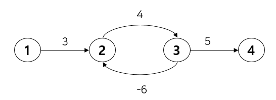

# ⚪<span style="color: #D6ABFA;">벨만포드?</span>

벨먼-포드(Bellman-Ford) 알고리즘은 가중 유향 그래프(Weighted-Directed Graph)에서 노드 사이의 최단 경로를 찾는 알고리즘.

**다익스트라 알고리즘의 한계점을 보완**하기 위해 나왔다.   
그 한계점이란 간선이 음수일 때 최단 경로를 구할 수 없다는 것이다.   
사실 정확히는 음의 가중치 자체가 문제가 되진 않는다. 문제는 사이클 형성 여부에 따라 달렸다.   
만약 사이클을 형성하면 문제가 된다. 아래 그림을 보자.



만약 다익스트라 알고리즘을 통해 특정 한 노드(1)에서 다른 노드(2)로의 최소 거리를 구하는 문제를 해결하려 한다면 가중치 3 → 4 → 5를 거쳐 비용이 12가 된다.   
하지만 중간에 사이클이 있기 때문에 3 → 4 → **-6** → 4 → **-6** → 4 → **-6** ...이 되어 비용이 무한히 작아지게 된다.


이러한 **문제점을 해결하기 위해 나온 알고리즘이 벨만 포드**이다.   
기본적으로 다익스트라와 동일하지만 핵심 차이점은 **간선의 가중치가 음일 때도 최소 비용을 구할 수 있다.**   
다만 **시간복잡도가 늘어나**기 때문에 **가중치가 모두 양수일 경우 다익스트라**를 사용하는 것이 좋다.   
시간 복잡도가 늘어나는 이유는 그리디하게 최소 비용 경로를 찾아가는 다익스트라와 달리, 벨만 포드는 모든 경우의 수를 고려하는 동적 계획법이 사용되기 때문이다.


그렇다면 모든 경우의 수를 어떻게 고려할까? 그 방법은 **매 단계 마다 모든 간선을 전부 확인**하는 것이다.   
다익스트라는 출발 노드에서만 연결된 노드를 반복적으로 탐색하며 다른 모든 노드까지의 최소 거리를 구했다.   
하지만 **벨만 포드는 모든 노드가 한번씩 출발점이 되어 다른 노드까지의 최소 비용을 구한다.**


아래 의사코드에서 **마지막 for문에서 확인하는 것은 음수 사이클이 있는지 확인**하는 것이다.   
만약 음수 사이클이 있다면, 사이클을 한번 돌 때마다 간선이 완화가 된다. 그래서 모든 간선을 V-1번씩 확인했음에도 불구하고 맨 마지막 for문에서 거리를 추가로 완화시킬 수 있는 간선이 있다면 음수 사이클이 있다고 판단할 수 있다.

<br>

<br>

<br>

# ⚪<span style="color: #D6ABFA;">동작 원리</span>

## 🔹의사코드(pseudo-code)

```c++
BellmanFord(G,w,s):

//초기화 과정
for each v in G.V:     //노드를 초기화 하기
      distance[v] = inf      //모든 노드의 최단거리를 무한으로 지정
      parent[v] = null       //모든 노드의 부모 노드를 널값으로 지정
distance[s] = 0 //출발점의 최단거리는 0으로 지정한다
          
//거리측정 과정
for len(G.V)-1:   //(노드-1)번 반복
     for each (u,v) in G.E:   //모든 변을 체크해 최단 거리를 찾아본다.
          if distance[u] + w[(u,v)] < distance[v]:   
          //만약 u를 경유하여 v로 가는 거리가 현재 v의 최단 거리보다 짧으면
               distance[v] = distance[u] + w[(u,v)]  //그 거리를 v의 최단거리로 지정
               parent[v] = u   //u를 v의 부모 노드로 지정
                   
//음수 사이클 체크 과정
for each (u,v) in G.E:
     if distance[u] + w[(u,v)] < distance[v]:
          return false //음수 사이클을 확인하고 알고리즘을 정지
return distance[], parent[]
```

## 🔹코드 예시

```c++

#include <iostream>
#include <set>
#include <map>
#include <vector>

using namespace std;

map<char,vector<pair<char,int>>> _graph; //그래프(key:노드, value:인접노드,가중치 쌍들)
map<char,int> _minCost; //출발노드로부터 해당 노드까지 가는데 최소비용
map<char,char> _predecessorNode; //(key:노드, value:해당 노드까지 가는데 최소비용 경로상의 이전 노드)

void BellmanFord(char source)
{
    //모든 정점까지의 거리를 무한대로 초기화, 시작 정점의 거리를 0으로 설정
    for(auto iter = _graph.begin(); iter != _graph.end(); iter++)
    {
        _minCost[iter->first] = INT_MAX;
    }
    _minCost[source] = 0;
    
    //정점 수 -1 반복해서 최단거리 갱신
    for(int i = 0; i < _graph.size()-1; i++)
    {
        for(auto iter = _graph.begin(); iter != _graph.end(); iter++)
        {
            char node = iter->first;
            for(auto adjNode : _graph[node])
            {
                char adj = adjNode.first;
                int weight = adjNode.second;
                if(_minCost[adj] > _minCost[node] + weight)
                {
                    _minCost[adj] = _minCost[node] + weight;
                    _predecessorNode[adj] = node;
                }
            }
        }
    }
    
    //음수 사이클이 있는지 확인
    for(auto iter = _graph.begin(); iter != _graph.end(); iter++)
    {
        char node = iter->first;
        for(auto adjNode : _graph[node])
        {
            char adj = adjNode.first;
            int weight = adjNode.second;
            if(_minCost[adj] > _minCost[node] + weight)
            {
                cout << "음수 사이클이 존재합니다." << endl;
                return;
            }
        }
    }
}

int main()
{
    //그래프를 설정함
    _graph['0'] = {{'1',-1},{'2',4}};
    _graph['1'] = {{'2',3},{'3',2},{'4',2}};
    _graph['2'] = {};
    _graph['3'] = {{'2',5},{'1',1}};
    _graph['4'] = {{'3',-3}};
    
    BellmanFord('0'); //시작 노드 0 에서 다른 노드까지의 최소비용 계산
    
    //결과 출력
    for(auto iter = _minCost.begin(); iter != _minCost.end(); iter++)
    {
        cout << "Node : " << iter->first << ", MinCost : " << iter->second << endl;
    }
    cout<<endl;
    
    //시작노드 0에서 다른 노드까지의 최소비용 경로를 전부 출력
    for(auto iter = _minCost.begin(); iter != _minCost.end(); iter++)
    {
        char node = iter->first;
        cout << "Path : ";
        while(node != '0')
        {
            cout << node << " <- ";
            if (_predecessorNode.find(node) == _predecessorNode.end())
            {
                cout << "No Path" << endl;
                break;
            }
            node = _predecessorNode[node];
        }
        cout << "0" << endl;
    }
}

```

>**출력 결과:**
>
>Node : 0, MinCost : 0  
>Node : 1, MinCost : -1  
>Node : 2, MinCost : 2  
>Node : 3, MinCost : -2  
>Node : 4, MinCost : 1  
>
>
>
>Path : 0  
>Path : 1 <- 0  
>Path : 2 <- 1 <- 0  
>Path : 3 <- 4 <- 1 <- 0  
>Path : 4 <- 1 <- 0  

<br>

<br>

<br>

# ⚪<span style="color: #D6ABFA;">시간 복잡도</span>

V: 노드의 숫자, E: 간선의 숫자

**O(VE)**

