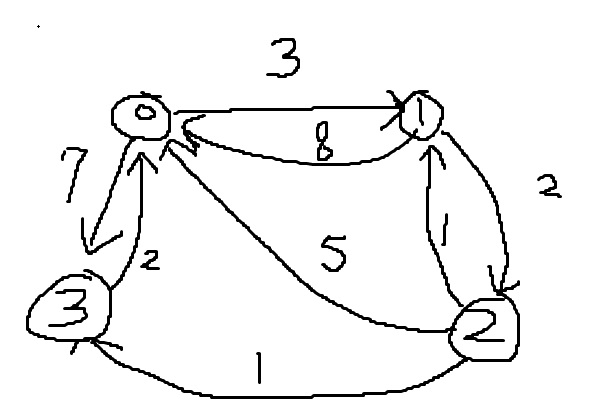

# ⚪<span style="color: #D6ABFA;">플로이드-워셜?</span>

**플로이드-워셜 알고리즘**(Floyd-Warshall Algorithm)은 그래프에서 **모든 정점 쌍 간의 최단 경로**를 찾는 알고리즘.  
주로 가중치가 있는 그래프에서 사용되며, **음의 가중치를 허용**


플로이드-워셜 알고리즘은 **동적 프로그래밍**을 이용하여 모든 정점 쌍 사이의 최단 경로를 구함.  


플로이드-워셜 알고리즘은 다음과 같은 상황에서 유용하다:

- **모든 정점 쌍 간의 최단 경로를 구해야 할 때**: 네트워크 상의 모든 노드 간의 최단 경로를 계산해야 하는 경우 (예: 통신 네트워크, 도로 네트워크).
- **가중치가 있는 그래프에서**: 특히 가중치가 음수일 때도 사용할 수 있다. 단, 음수 사이클이 존재하면 결과가 올바르지 않다.
- **밀집 그래프 (Dense Graph)**: 모든 정점 쌍을 검사하므로 정점 수가 적고 간선 수가 많은 밀집 그래프에 적합하다.

플로이드-워셜 알고리즘의 주요 장점은 구현이 간단하고 특정 그래프 유형에 대해 매우 효과적이라는 점이다.   
그러나 시간 복잡도가 O(V<sup>3</sup>)이기 때문에 정점 수가 많은 그래프에는 적합하지 않을 수 있다.

<br>

<br>

<br>

# ⚪<span style="color: #D6ABFA;">동작 원리</span>

플로이드-워셜 알고리즘은 초기에는 각 경로의 길이를 직행 경로의 가중치로 설정한다.   
이후 모든 가능한 경유 정점 k에 대해 경로를 업데이트하면서 최단 경로를 찾는다.   
다음과 같은 단계로 이루어진다:

1. 그래프의 모든 정점 k를 하나씩 경유 정점으로 고려한다.
2. 각 정점 쌍 (i,j)에 대해 i에서 j로 가는 경로가 k를 경유하는 것이 더 짧은지 확인하고, 그렇다면 경로를 갱신한다.

좀 더 풀어서 설명하면

1. 모든 정점 쌍 (i,j)에 대해 초기 최단 거리를 설정한다.  
   i에서 j로의 직접 경로가 존재하면 그 가중치로, 존재하지 않으면 무한대로 설정한다.   
   자기 자신으로의 경로는 0으로 설정한다.
2. 각 경유 정점 k에 대해, 모든 정점 쌍 (i,j)에 대해 경로 i→k→j가 i→j보다 짧으면 최단 경로를 갱신한다.


## 🔹의사코드(pseudo-code)

```c++
procedure FloydWarshall(G) //(|V|는 정점의 개수를 의미함)
    let dist be a |V| x |V| array of minimum distances initialized to ∞ (infinity)
    for each vertex v
        dist[v][v] ← 0
    for each edge (u, v) with weight w in G
        dist[u][v] ← w

    for k from 1 to |V|
        for i from 1 to |V|
            for j from 1 to |V|
                if dist[i][j] > dist[i][k] + dist[k][j]
                    dist[i][j] ← dist[i][k] + dist[k][j]

    return dist
```

이 의사코드는 다음과 같은 단계를 포함한다:

1. `dist` 배열을 초기화하여 모든 정점 쌍 간의 거리를 무한대로 설정한다. 단, 자기 자신으로의 거리는 0으로 설정한다.
2. 각 간선에 대해, 그 가중치를 `dist` 배열에 설정한다.
3. 모든 경유 정점 k에 대해, 모든 정점 쌍 (i,j)에 대해 경로 i→k→j가 더 짧으면 `dist[i][j]`를 갱신한다.
4. 최종적으로 모든 정점 쌍 간의 최단 경로를 담고 있는 `dist` 배열을 반환한다.

## 🔹코드 예시

**최단 거리 행렬 읽는 법**

행렬의 인덱스는 다음과 같다:

- **행 인덱스 i**는 출발 정점을 나타낸다.
- **열 인덱스 j**는 도착 정점을 나타낸다.

원소의 값은 다음과 같다:

- `dist[i][j]`는 정점 i에서 정점 j로 가는 최단 거리를 나타낸다.
- `INF`는 무한대(또는 매우 큰 값)를 의미하며, 정점 i에서 정점 j로 직접 연결된 경로가 없다는 것을 나타낸다.

```c++
#include <iostream>
#include <vector>
#include <climits> // INT_MAX 사용을 위해

using namespace std;

// 플로이드-워셜 알고리즘 함수
void floydWarshall(vector<vector<int>>& graph) {
    int V = graph.size(); // 그래프의 정점 개수

    // 거리 배열 초기화
    vector<vector<int>> dist = graph;

    // 경로 배열 초기화
    vector<vector<int>> next(V, vector<int>(V, -1));

    // 초기 경로 배열 설정
    for (int i = 0; i < V; ++i) {
        for (int j = 0; j < V; ++j) {
            if (graph[i][j] != INT_MAX && i != j) {
                next[i][j] = j;
            }
        }
    }

    // 플로이드-워셜 알고리즘 적용
    for (int k = 0; k < V; ++k) { // 모든 정점을 중간 정점으로 사용
        for (int i = 0; i < V; ++i) { // 출발 정점
            for (int j = 0; j < V; ++j) { // 도착 정점
                if (dist[i][k] != INT_MAX && dist[k][j] != INT_MAX && dist[i][j] > dist[i][k] + dist[k][j]) {
                    dist[i][j] = dist[i][k] + dist[k][j];
                    next[i][j] = next[i][k];
                }
            }
        }
    }

    // 결과 출력
    cout << "최단 거리 행렬:" << endl;
    for (int i = 0; i < V; ++i) {
        for (int j = 0; j < V; ++j) {
            if (dist[i][j] == INT_MAX) {
                cout << "INF ";
            } else {
                cout << dist[i][j] << " ";
            }
        }
        cout << endl;
    }

    // 경로 추적 함수
    auto printPath = [&](int u, int v) {
        if (next[u][v] == -1) {
            cout << "경로 없음";
            return;
        }
        cout << u;
        while (u != v) {
            u = next[u][v];
            cout << " -> " << u;
        }
    };

    // 경로 출력
    cout << "경로 출력:" << endl;
    for (int i = 0; i < V; ++i) {
        for (int j = 0; j < V; ++j) {
            if (i != j) {
                cout << "정점 " << i << "에서 정점 " << j << "까지의 최단 경로: ";
                printPath(i, j);
                cout << endl;
            }
        }
    }
}

int main() {
    vector<vector<int>> graph = {
            {0, 3, INT_MAX, 7},
            {8, 0, 2, INT_MAX},
            {5, INT_MAX, 0, 1},
            {2, INT_MAX, INT_MAX, 0}
    };

    // 플로이드-워셜 알고리즘 실행
    floydWarshall(graph);

    return 0;
}

```

>**출력 결과:**
>
>최단 거리 행렬:  
>0 3 5 6  
>5 0 2 3  
>3 6 0 1  
>2 5 7 0  
>
>경로 출력:  
>정점 0에서 정점 1까지의 최단 경로: 0 -> 1  
>정점 0에서 정점 2까지의 최단 경로: 0 -> 1 -> 2  
>정점 0에서 정점 3까지의 최단 경로: 0 -> 1 -> 2 -> 3  
>정점 1에서 정점 0까지의 최단 경로: 1 -> 2 -> 3 -> 0  
>정점 1에서 정점 2까지의 최단 경로: 1 -> 2  
>정점 1에서 정점 3까지의 최단 경로: 1 -> 2 -> 3  
>정점 2에서 정점 0까지의 최단 경로: 2 -> 3 -> 0  
>정점 2에서 정점 1까지의 최단 경로: 2 -> 3 -> 0 -> 1  
>정점 2에서 정점 3까지의 최단 경로: 2 -> 3  
>정점 3에서 정점 0까지의 최단 경로: 3 -> 0  
>정점 3에서 정점 1까지의 최단 경로: 3 -> 0 -> 1  
>정점 3에서 정점 2까지의 최단 경로: 3 -> 0 -> 1 -> 2   

{: width="50%"}

<br>

<br>

<br>

# ⚪<span style="color: #D6ABFA;">시간 복잡도</span>

V는 그래프의 정점 수

이 알고리즘은 모든 정점 쌍 간의 최단 경로를 찾기 위해 세 개의 중첩된 루프를 사용함.  
 각 루프는 그래프의 모든 정점을 한 번씩 순회하며, 따라서 전체 시간 복잡도는 다음과 같이 계산됨:

- 첫 번째 루프: V번 반복
- 두 번째 루프: 각 반복마다 V번 반복
- 세 번째 루프: 각 반복마다 V번 반복

결과적으로, 이 중첩된 루프들의 시간 복잡도는 O(V\*V\*V) = O(V<sup>3</sup>)

**O(V<sup>3</sup>)**
