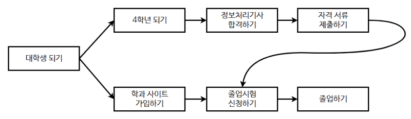

# ⚪<span style="color: #D6ABFA;">위상정렬?</span>



**위상정렬**(Topological Sort)은 **방향 그래프(Directed Graph)**의 정점들을, **간선들이 나타내는 순서에 따라 나열**하는 작업이다.   
즉, 모든 간선 u → v에 대해 u가 v보다 앞에 오도록 정렬하는 것이다. 위상정렬은 주로 작업의 순서를 결정할 때 사용된다. 


(사이클이 있을땐 위상정렬 불가능. 알고리즘 상에서 사이클 발생여부 파악 가능)


위상정렬을 수행하는 방법은 여러 가지가 있다.   
그 중 가장 널리 사용되는 방법은 **Kahn 알고리즘**과 **DFS(깊이 우선 탐색)**를 이용한 방법이다.

<br>

<br>

<br>

# ⚪<span style="color: #D6ABFA;">동작 원리</span>


## 🔹Kahn 알고리즘

1. 그래프에서 진입차수가 0인 모든 정점을 큐에 넣는다.
2. 큐에서 정점을 하나씩 꺼내어 결과 리스트에 추가한다.
3. 해당 정점에서 나가는 간선을 그래프에서 제거하고, 새롭게 진입차수가 0이 된 정점을 큐에 넣는다.
4. 큐가 빌 때까지 2-3번 과정을 반복한다.
5. 모든 정점을 처리하면 결과 리스트가 위상정렬 순서가 된다. 그래프에 사이클이 있으면 모든 정점을 처리하기 전에 큐가 빌 것이다.

###  🔸의사코드(pseudo-code)

```cpp
def kahn_topological_sort(graph):
    # 진입차수를 저장하는 딕셔너리 초기화
    in_degree = {u: 0 for u in graph}
    
    # 모든 정점의 진입차수를 계산
    for u in graph:
        for v in graph[u]:
            in_degree[v] += 1
    
    # 진입차수가 0인 정점을 큐에 추가
    queue = [u for u in graph if in_degree[u] == 0]
    
    # 결과 리스트 초기화
    topological_order = []
    
    # 큐가 빌 때까지 반복
    while queue:
        # 큐에서 정점을 하나 꺼냄
        current_node = queue.pop(0)
        
        # 결과 리스트에 현재 정점을 추가
        topological_order.append(current_node)
        
        # 현재 정점에서 나가는 모든 간선을 제거
        for neighbor in graph[current_node]:
            in_degree[neighbor] -= 1  # 간선을 제거하므로 진입차수 감소
            if in_degree[neighbor] == 0:  # 진입차수가 0이 되면 큐에 추가
                queue.append(neighbor)
    
    # 모든 정점을 처리했는지 확인 (사이클이 있는 경우 처리되지 않은 정점이 존재)
    if len(topological_order) == len(graph):
        return topological_order
    else:
        # 사이클이 존재하여 위상정렬이 불가능한 경우
        return []

# 그래프 예제 (딕셔너리로 표현)
graph = {
    'A': ['B', 'C'],
    'B': ['D'],
    'C': ['D'],
    'D': []
}

# 위상정렬 수행
result = kahn_topological_sort(graph)
print(result)  # ['A', 'B', 'C', 'D'] 또는 ['A', 'C', 'B', 'D']

```

1. **진입차수를 저장하는 딕셔너리 초기화**
   - 각 정점의 진입차수를 0으로 초기화한다.
2. **모든 정점의 진입차수를 계산**
   - 그래프의 각 간선을 확인하여 해당 간선의 도착점의 진입차수를 증가시킨다.
3. **진입차수가 0인 정점을 큐에 추가**
   - 초기 상태에서 진입차수가 0인 정점을 큐에 넣는다.
4. **큐가 빌 때까지 반복**
   - 큐에서 정점을 하나씩 꺼내어 결과 리스트에 추가한다.
   - 현재 정점에서 나가는 모든 간선을 그래프에서 제거하고, 새롭게 진입차수가 0이 된 정점을 큐에 추가한다.
5. **모든 정점을 처리했는지 확인**
   - 결과 리스트의 길이가 그래프의 정점 수와 같으면 위상정렬이 완료된 것이고, 그렇지 않으면 그래프에 사이클이 존재하여 위상정렬이 불가능한 것이다.

이 알고리즘은 그래프의 모든 정점을 정확히 한 번씩 처리하고, 간선도 한 번씩 처리하므로 **시간 복잡도는 O(V + E)**이다.   
여기서 V는 정점의 수, E는 간선의 수를 의미한다.

### 🔸코드 예시

```c++
#include <iostream>
#include <vector>
#include <queue>
#include <unordered_map>
using namespace std;

// 그래프의 위상정렬을 수행하는 함수
vector<char> kahnTopologicalSort(unordered_map<char, vector<char>>& graph)
{
    unordered_map<char, int> inDegree;  // 각 정점의 진입차수를 저장하는 맵
    queue<char> zeroInDegreeQueue;  // 진입차수가 0인 정점을 저장하는 큐
    vector<char> topologicalOrder;  // 결과로 반환될 위상정렬 순서

    // 그래프의 모든 정점에 대해 진입차수를 0으로 초기화
    for (const auto& pair : graph)
    {
        inDegree[pair.first] = 0;
    }

    // 모든 정점의 진입차수를 계산
    for (const auto& pair : graph)
    {
        for (char neighbor : pair.second)
        {
            inDegree[neighbor]++;
        }
    }

    // 진입차수가 0인 정점을 큐에 추가
    for (const auto& pair : graph)
    {
        if (inDegree[pair.first] == 0)
        {
            zeroInDegreeQueue.push(pair.first);
        }
    }

    // 큐가 빌 때까지 반복
    while (!zeroInDegreeQueue.empty())
    {
        char currentNode = zeroInDegreeQueue.front();
        zeroInDegreeQueue.pop();

        // 결과 리스트에 현재 정점을 추가
        topologicalOrder.push_back(currentNode);

        // 현재 정점에서 나가는 모든 간선을 제거
        for (char neighbor : graph[currentNode])
        {
            inDegree[neighbor]--;  // 간선을 제거하므로 진입차수 감소
            if (inDegree[neighbor] == 0)  // 진입차수가 0이 되면 큐에 추가
            {
                zeroInDegreeQueue.push(neighbor);
            }
        }
    }

    // 모든 정점을 처리했는지 확인 (사이클이 있는 경우 처리되지 않은 정점이 존재)
    if (topologicalOrder.size() == graph.size())
    {
        return topologicalOrder;
    }
    else
    {
        // 사이클이 존재하여 위상정렬이 불가능한 경우 빈 벡터 반환
        return {};
    }
}

int main()
{
    // 그래프 예제 (unordered_map으로 표현)
    unordered_map<char, vector<char>> graph = {
        {'A', {'B', 'C'}},
        {'B', {'D'}},
        {'C', {'D'}},
        {'D', {}}
    };

    // 위상정렬 수행
    vector<char> result = kahnTopologicalSort(graph);

    // 결과 출력
    if (!result.empty())
    {
        for (char node : result)
        {
            cout << node << " ";
        }
        cout << endl;
    }
    else
    {
        cout << "사이클이 존재하여 위상정렬이 불가능합니다." << endl;
    }

    return 0;
}
```

>**출력 결과:**
>
>A B C D

## 🔹DFS 이용

### 🔸의사코드(pseudo-code)

```c++
def dfs_topological_sort(graph):
    def dfs(node, visited, stack):
        visited[node] = True  # 현재 노드를 방문 처리
        for neighbor in graph[node]:  # 현재 노드의 모든 인접 노드에 대해
            if not visited[neighbor]:  # 인접 노드를 방문하지 않았다면
                dfs(neighbor, visited, stack)  # 인접 노드에 대해 재귀적으로 DFS 수행
        stack.append(node)  # 현재 노드의 모든 인접 노드 방문 후 스택에 추가

    visited = {u: False for u in graph}  # 모든 노드를 방문하지 않은 상태로 초기화
    stack = []  # 위상정렬 결과를 저장할 스택

    for node in graph:  # 모든 노드에 대해
        if not visited[node]:  # 노드를 방문하지 않았다면
            dfs(node, visited, stack)  # 해당 노드에 대해 DFS 수행

    # 스택의 top부터 읽어서 위상정렬 순서 반환
    topological_order = []
    while stack:
        topological_order.append(stack.pop())
    
    return topological_order

# 그래프 예제 (딕셔너리로 표현)
graph = {
    'A': ['B', 'C'],
    'B': ['D'],
    'C': ['D'],
    'D': []
}

# 위상정렬 수행
result = dfs_topological_sort(graph)
print(result)  # ['A', 'C', 'B', 'D'] 또는 ['A', 'B', 'C', 'D']
```

1. **DFS 함수 정의**
   - `dfs(node, visited, stack)` 함수는 주어진 노드에서 시작하여 DFS를 수행하고, 모든 인접 노드를 방문한 후에 스택에 현재 노드를 추가한다.
   - `visited[node] = True`: 현재 노드를 방문 처리.
   - `for neighbor in graph[node]`: 현재 노드의 모든 인접 노드를 탐색.
   - `if not visited[neighbor]`: 인접 노드를 방문하지 않았다면 재귀적으로 DFS 수행.
   - `stack.append(node)`: 현재 노드의 모든 인접 노드를 방문한 후 스택에 현재 노드를 추가.
2. **방문 여부 초기화**
   - `visited = {u: False for u in graph}`: 모든 노드를 방문하지 않은 상태로 초기화.
3. **위상정렬 결과를 저장할 스택 초기화**
   - `stack = []`: 결과를 저장할 스택 초기화.
4. **모든 노드에 대해 DFS 수행**
   - `for node in graph`: 모든 노드를 순회.
   - `if not visited[node]`: 노드를 방문하지 않았다면 해당 노드에 대해 DFS 수행.
5. **스택의 top부터 읽어서 위상정렬 순서 반환**
   - 스택이 빌 때까지 `stack.pop()`으로 스택의 top부터 원소를 꺼내어 위상정렬 순서를 얻음.

이 의사코드는 방향 그래프에서 DFS를 이용하여 위상정렬을 수행하고, 결과를 반환한다.   
그래프에 사이클이 있는 경우에도 동작은 하지만, **사이클이 있는지 여부는 별도로 확인해야 한다**.

### 🔸코드 예시

```cpp
#include <iostream>
#include <vector>
#include <unordered_map>
#include <stack>
using namespace std;

// DFS를 사용하여 위상정렬을 수행하는 함수
void dfs(char node, unordered_map<char, vector<char>>& graph, unordered_map<char, bool>& visited, stack<char>& resultStack)
{
    visited[node] = true;  // 현재 노드를 방문 처리

    // 현재 노드의 모든 인접 노드에 대해
    for (char neighbor : graph[node])
    {
        if (!visited[neighbor])  // 인접 노드를 방문하지 않았다면
        {
            dfs(neighbor, graph, visited, resultStack);  // 인접 노드에 대해 재귀적으로 DFS 수행
        }
    }

    resultStack.push(node);  // 현재 노드의 모든 인접 노드 방문 후 스택에 추가
}

// 그래프의 위상정렬을 수행하는 함수
vector<char> dfsTopologicalSort(unordered_map<char, vector<char>>& graph)
{
    unordered_map<char, bool> visited;  // 모든 노드를 방문하지 않은 상태로 초기화
    stack<char> resultStack;  // 위상정렬 결과를 저장할 스택

    // 모든 노드를 방문하지 않은 상태로 초기화
    for (const auto& pair : graph)
    {
        visited[pair.first] = false;
    }

    // 모든 노드에 대해
    for (const auto& pair : graph)
    {
        if (!visited[pair.first])  // 노드를 방문하지 않았다면
        {
            dfs(pair.first, graph, visited, resultStack);  // 해당 노드에 대해 DFS 수행
        }
    }

    // 스택의 top부터 읽어서 위상정렬 순서 반환
    vector<char> topologicalOrder;
    while (!resultStack.empty())
    {
        topologicalOrder.push_back(resultStack.top());
        resultStack.pop();
    }

    return topologicalOrder;
}

int main()
{
    // 그래프 예제 (unordered_map으로 표현)
    unordered_map<char, vector<char>> graph = {
        {'A', {'B', 'C'}},
        {'B', {'D'}},
        {'C', {'D'}},
        {'D', {}}
    };

    // 위상정렬 수행
    vector<char> result = dfsTopologicalSort(graph);

    // 결과 출력
    for (char node : result)
    {
        cout << node << " ";
    }
    cout << endl;

    return 0;
}

```

> **출력결과:**
>
> A B C D

<br>

<br>

<br>

# ⚪<span style="color: #D6ABFA;">시간 복잡도</span>

위상 정렬 알고리즘의 시간 복잡도는 그래프의 정점 수와 간선 수에 따라 결정된다. 위상 정렬을 수행하는 대표적인 두 가지 방법인 Kahn의 알고리즘과 DFS 기반 알고리즘 모두 시간 복잡도가 \(O(V + E)\)이다. 여기서 \(V\)는 그래프의 정점 수, \(E\)는 그래프의 간선 수를 의미한다.

**Kahn의 알고리즘 시간 복잡도**

1. **진입 차수를 계산하는 단계:** 각 정점에 대해 모든 간선을 검사하므로 O(V + E)
2. **큐를 이용한 정점 처리 단계:** 각 정점을 한 번씩 큐에 추가하고 제거하며, 각 간선을 한 번씩 검사하므로 O(V + E)

따라서, Kahn의 알고리즘 전체의 시간 복잡도는 O(V + E)이다.


**DFS 기반 알고리즘 시간 복잡도**

1. **DFS 수행:** 각 정점을 한 번씩 방문하며, 각 간선을 한 번씩 검사하므로 O(V + E)
2. **스택에서 정점을 꺼내는 단계:** 정점 수에 비례하여 정점을 꺼내고 정렬하므로 O(V)

따라서, DFS 기반 알고리즘 전체의 시간 복잡도는 O(V + E)이다.


**결론**

위상 정렬 알고리즘의 시간 복잡도는 Kahn의 알고리즘과 DFS 기반 알고리즘 모두에서 O(V + E)이다. 이는 그래프의 모든 정점과 모든 간선을 각각 한 번씩 처리하기 때문이다.
