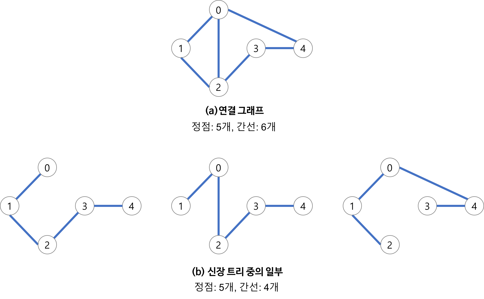
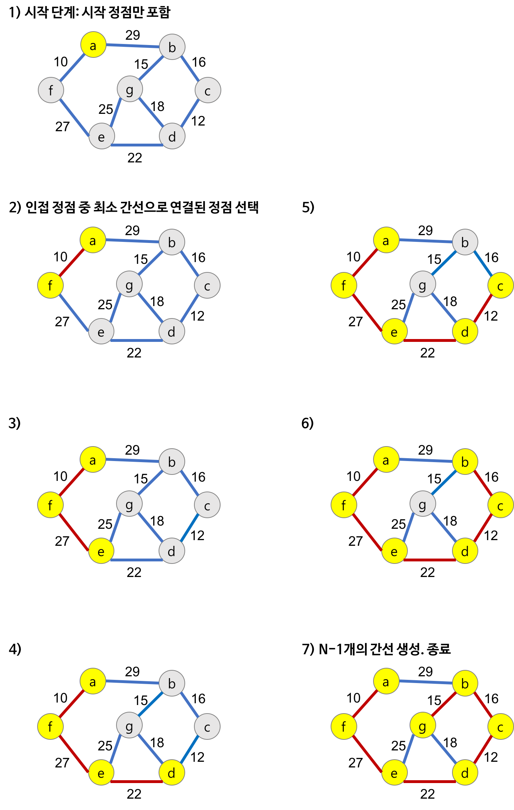

# ⚪<span style="color: #D6ABFA;">최소 스패닝 트리?</span>

## 🔹스패닝 트리

### 🔸정의



Spanning Tree = 신장 트리 = 스패닝 트리

**그래프의 최소 연결 부분 그래프**

- **최소 연결 : 간선의 수가 가장 적다**
- n개의 정점을 갖는 그래프의 최소 간선의 수는 (n-1)개이고,  
  (n-1)개의 간선으로 연결되어 있으면 필연적으로 트리 형태가 되고, 이것이 바로 Spanning Tree가 된다
- 즉, 그래프에서 일부 간선을 선택해서 만든 트리

### 🔸 특징

- **DFS, BFS을 이용하여 그래프에서 스패닝 트리**를 찾을 수 있다
  - 탐색 도중에 사용된 간선만 모으면 만들 수 있음
- 하나의 그래프에는 많은 스패닝 트리가 존재할 수 있음
- Spanning Tree는 트리의 특수한 형태이므로 **모든 정점들이 연결** 되어 있어야 하고 **사이클을 포함해서는 안됨**
- 따라서 Spanning Tree는 그래프에 있는 **n개의 정점을 정확히 (n-1)개의 간선으로 연결** 한다

## 🔹최소 스패닝 트리

### 🔸정의

Minimal Spanning Tree = 최소 신장 트리 = 최소 스패닝 트리

- 각 간선의 가중치가 동일하지 않을 때 단순히 가장 적은 간선을 사용한다고 해서 최소 비용이 얻어지는 것은 아님
- MST는 간선에 가중치를 고려하여 최소 비용의 Spanning Tree를 선택하는 것을 말함
- 즉, 네트워크(가중치를 간선에 할당한 그래프)에 있는 모든 정점들을 가장 적은 수의 간선과 비용으로 연결하는 것

### 🔸특징

- 간선의 가중치의 합이 최소여야 한다.
- n개의 정점을 가지는 그래프에 대해 반드시 (n-1)개의 간선만을 사용해야 한다.
- 사이클이 포함되어서는 안된다.

<br>

<br>

<br>

# ⚪<span style="color: #D6ABFA;">동작 원리</span>

## 🔹Kruskal MST 알고리즘

**탐욕적인 방법(greedy method)** 을 이용하여 네트워크(가중치를 간선에 할당한 그래프)의 모든 정점을 최소 비용으로 연결하는 최적 해답을 구하는 것

- 탐욕적인 방법
  - 결정을 해야 할 때마다 그 순간에 가장 좋다고 생각되는 것을 선택함으로써 최종적인 해답에 도달하는 것
  - 탐욕적인 방법은 그 순간에는 최적이지만, 전체적인 관점에서 최적이라는 보장이 없기 때문에 반드시 검증해야 한다.
  - 다행히 Kruskal 알고리즘은 최적의 해답을 주는 것으로 증명되어 있다.
- MST(최소 비용 신장 트리) 가 1) 최소 비용의 간선으로 구성됨 2) 사이클을 포함하지 않음 의 조건에 근거하여 **각 단계에서 사이클을 이루지 않는 최소 비용 간선을 선택** 한다.

### 🔸동작 원리

1.  그래프의 간선들을 가중치의 오름차순으로 정렬한다.
2. 정렬된 간선 리스트에서 순서대로 사이클을 형성하지 않는 간선을 선택한다.
   - 즉, 가장 낮은 가중치를 먼저 선택한다.
   - 사이클을 형성하는 간선을 제외한다.
3. 해당 간선을 현재의 MST(최소 비용 신장 트리)의 집합에 추가한다.

> - **간선 선택을 기반** 으로 하는 알고리즘
> - 이전 단계에서 만들어진 신장 트리와는 상관없이 무조건 최소 간선만을 선택하는 방법


- 다음 간선을 이미 선택된 간선들의 집합에 추가할 때 사이클을 생성하는지를 체크!
  - 새로운 간선이 이미 다른 경로에 의해 연결되어 있는 정점들을 연결할 때 사이클이 형성된다.
  - 즉, 추가할 새로운 간선의 양끝 정점이 같은 집합에 속해 있으면 사이클이 형성된다.
- **사이클 생성 여부를 확인하는 방법**
  - 추가하고자 하는 간선의 양끝 정점이 같은 집합에 속해 있는지를 먼저 검사해야 한다.
  - [**‘union-find 알고리즘’**](https://igh01gi.github.io/datastructure/DisjointSet/){:target="_blank"} 이용

### 🔸코드

```cpp
#include <iostream>
#include <vector>
#include <algorithm>

using namespace std;

// 간선을 표현하는 구조체
struct Edge
{
    int startNode, endNode, weight;
};

// Union-Find 자료구조를 위한 클래스
class UnionFind
{
private:
    vector<int> parent, rank;

public:
    // 초기화 함수
    UnionFind(int n)
    {
        parent.resize(n);
        rank.resize(n, 0);
        for (int i = 0; i < n; ++i)
        {
            parent[i] = i;
        }
    }

    // 노드의 루트 찾기
    int find(int u)
    {
        if (u != parent[u])
        {
            parent[u] = find(parent[u]);
        }
        return parent[u];
    }

    // 두 집합을 합치기
    void unionSets(int u, int v)
    {
        int rootU = find(u);
        int rootV = find(v);
        if (rootU != rootV)
        {
            if (rank[rootU] > rank[rootV])
            {
                parent[rootV] = rootU;
            }
            else if (rank[rootU] < rank[rootV])
            {
                parent[rootU] = rootV;
            }
            else
            {
                parent[rootV] = rootU;
                rank[rootU]++;
            }
        }
    }
};

// 간선들을 가중치 기준으로 정렬하기 위한 비교 함수
bool compareEdges(const Edge &a, const Edge &b)
{
    return a.weight < b.weight;
}

// Kruskal 알고리즘 함수
vector<Edge> kruskalMST(int nodeCount, vector<Edge> &edges)
{
    vector<Edge> mst; // 최소 스패닝 트리를 저장할 벡터

    // 간선들을 가중치 오름차순으로 정렬
    sort(edges.begin(), edges.end(), compareEdges);

    // Union-Find 자료구조 초기화
    UnionFind uf(nodeCount);

    // 간선들을 하나씩 검사하여 MST에 추가
    for (const auto &edge : edges)
    {
        if (uf.find(edge.startNode) != uf.find(edge.endNode))
        {
            uf.unionSets(edge.startNode, edge.endNode);
            mst.push_back(edge);
        }
    }

    return mst;
}

int main()
{
    int nodeCount = 4; // 노드의 수
    vector<Edge> edges = {
            {0, 1, 10},
            {0, 2, 6},
            {0, 3, 5},
            {1, 3, 15},
            {2, 3, 4}
    };

    vector<Edge> mst = kruskalMST(nodeCount, edges);

    cout << "Edges in the Minimum Spanning Tree:" << endl;
    for (const auto &edge : mst)
    {
        cout << edge.startNode << " - " << edge.endNode << " : " << edge.weight << endl;
    }

    return 0;
}
```

> **출력 결과:**
>
> Edges in the Minimum Spanning Tree:  
> 2 - 3 : 4  
> 0 - 3 : 5  
> 0 - 1 : 10

### 🔸시간 복잡도

- union-find 알고리즘을 이용하면 Kruskal 알고리즘의 시간 복잡도는 간선들을 정렬하는 시간에 좌우된다.
- 즉, 간선 e개를 퀵 정렬과 같은 효율적인 알고리즘으로 정렬한다면
  Kruskal 알고리즘의 시간 복잡도는 **O(elog₂e)** 이 된다.


## 🔹Prim MST 알고리즘

시작 정점에서부터 출발하여 신장트리 집합을 단계적으로 확장해나가는 방법
### 🔸동작 원리

1. 시작 단계에서는 시작 정점만이 MST(최소 비용 신장 트리) 집합에 포함된다.
2. 앞 단계에서 만들어진 MST 집합에 인접한 정점들 중에서 최소 간선으로 연결된 정점을 선택하여 트리를 확장한다.
   - 즉, 가장 낮은 가중치를 먼저 선택한다.
3. 위의 과정을 트리가 (N-1)개의 간선을 가질 때까지 반복한다.

{: width="70%"}

- **정점 선택을 기반** 으로 하는 알고리즘
- 이전 단계에서 만들어진 스패닝 트리를 확장하는 방법

### 🔸코드

```cpp
#include <iostream>
#include <vector>
#include <queue>
#include <utility>

using namespace std;

// 간선을 표현하는 구조체
struct Edge
{
    int node, weight;
    Edge(int n, int w) : node(n), weight(w) {}
};

// 비교 연산자를 정의하여 우선순위 큐에서 사용할 수 있도록 함
bool operator<(const Edge &a, const Edge &b)
{
    return a.weight > b.weight;
}

// Prim 알고리즘 함수
vector<Edge> primMST(int nodeCount, vector<vector<Edge>> &adjList)
{
    vector<bool> inMST(nodeCount, false); // MST에 포함 여부를 나타내는 벡터
    vector<Edge> mst; // 최소 스패닝 트리를 저장할 벡터
    priority_queue<Edge> pq; // 우선순위 큐를 사용하여 최소 가중치 간선을 선택

    // 임의의 시작 노드 (0번 노드)에서 시작
    pq.push(Edge(0, 0));

    while (!pq.empty())
    {
        Edge currentEdge = pq.top();
        pq.pop();

        int currentNode = currentEdge.node;

        // 노드가 이미 MST에 포함되어 있으면 무시
        if (inMST[currentNode])
        {
            continue;
        }

        // 노드를 MST에 포함시킴
        inMST[currentNode] = true;
        mst.push_back(currentEdge);

        // 인접한 모든 간선을 확인
        for (const Edge &nextEdge : adjList[currentNode])
        {
            if (!inMST[nextEdge.node])
            {
                pq.push(nextEdge);
            }
        }
    }

    return mst;
}

int main()
{
    int nodeCount = 5; // 노드의 수
    vector<vector<Edge>> adjList(nodeCount);

    // 간선 추가 (양방향 그래프)
    adjList[0].push_back(Edge(1, 2));
    adjList[0].push_back(Edge(3, 6));
    adjList[1].push_back(Edge(0, 2));
    adjList[1].push_back(Edge(2, 3));
    adjList[1].push_back(Edge(3, 8));
    adjList[1].push_back(Edge(4, 5));
    adjList[2].push_back(Edge(1, 3));
    adjList[2].push_back(Edge(4, 7));
    adjList[3].push_back(Edge(0, 6));
    adjList[3].push_back(Edge(1, 8));
    adjList[4].push_back(Edge(1, 5));
    adjList[4].push_back(Edge(2, 7));

    vector<Edge> mst = primMST(nodeCount, adjList);

    cout << "Edges in the Minimum Spanning Tree (node-weight):" << endl;
    for (const auto &edge : mst)
    {
        if (edge.weight != 0) // 첫 번째 간선은 가중치가 0이므로 제외
        {
            cout << edge.node << " - " << edge.weight << endl;
        }
    }

    return 0;
}

```

> **출력 결과:**
>
> Edges in the Minimum Spanning Tree (node-weight):  
> 1 - 2  
> 2 - 3  
> 4 - 5  
> 3 - 6

### 🔸시간 복잡도

주 반복문이 정점의 수 n만큼 반복하고, 내부 반복문이 n번 반복
Prim의 알고리즘의 시간 복잡도는 **O(n<sup>2</sup>)** 이 된다.

<br>

<br>

<br>

# ⚪<span style="color: #D6ABFA;">시간 복잡도</span>

Kruskal 알고리즘: **O(elog<sub>2</sub>e)**

Prim 알고리즘: **O(n<sup>2</sup>)** 

- 그래프 내에 **적은 숫자의 간선**만을 가지는 ‘희소 그래프(Sparse Graph)’의 경우 **Kruskal 알고리즘**이 적합하고
- 그래프에 **간선이 많이 존재**하는 ‘밀집 그래프(Dense Graph)’ 의 경우는 **Prim 알고리즘**이 적합하다.
  

