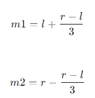

# ⚪<span style="color: #D6ABFA;">삼분탐색?</span>

삼분 탐색(ternary search)은 특정 범위 내에서 **함수의 최대값 또는 최소값**을 찾는 데 사용되는 알고리즘이다. 

**산 모양(peak) 함수나 골짜기(valley) 형태**의 함수에서 극값(최대값 또는 최소값)을 찾는 데 사용

## 🔹조건

**최소,최대값이 아닌데 평평한 구간이 있는 함수면 불가능** 

볼록하고 최솟,최댓값이 아닌 값에서 평평하지 않은, 즉 삼분탐색 조건에 만족하는 함수를 유니모달(unimodal)하다고 함.

 unimodal한 함수의 특징은 아래로 볼록한 함수끼리의 max값을 표현한 새로운 함수도 unimodal하고 반대로 위로 볼록한 함수끼리의 min값을 표현한 새로운 함수도 unimodal함.

또한 볼록한 방향이 같으면 더해도 unimodal함.

<br>

<br>

<br>

# ⚪<span style="color: #D6ABFA;">동작 원리</span>

삼분 탐색은 탐색 범위를 세 부분으로 나누어 다음과 같은 단계를 반복한다:

1. 주어진 범위 [l,r]에서 두 개의 중간점 m1과m2를 계산한다.   
   보통 m1과 m2는 다음과 같이 설정된다:  
   
2. 함수 f(m1)과 f(m2)를 비교한다.  
   - f(m1)<f(m2)인 경우, f의 최대값이 [m1,r] 범위 내에 있음이 보장된다.
     - 따라서, 새로운 범위는 [m1,r]이다.
   - f(m1)>f(m2)인 경우, f의 최대값이 [l,m2] 범위 내에 있음이 보장된다.
     - 따라서, 새로운 범위는 [l,m2]이다.
   - f(m1)=f(m2)인 경우, 최대값이 [m1,m2] 범위 내에 있음이 보장된다.
     - 따라서, 새로운 범위는 [m1,m2]이다.
3. 이 과정을 범위의 길이가 충분히 작아질 때까지 반복한다.

## 🔹코드

```cpp
#include <iostream>
#include <cmath>
#include <functional>

// 삼분 탐색 함수
double ternarySearch(double left, double right, std::function<double(double)> f, double epsilon = 1e-9) 
{
    // 오른쪽과 왼쪽 범위 차이가 epsilon보다 클 때까지 반복
    while (right - left > epsilon) 
    {
        // 세 부분으로 나누기 위한 두 중간점 계산
        double m1 = left + (right - left) / 3;
        double m2 = right - (right - left) / 3;

        // 함수 값 비교
        if (f(m1) < f(m2)) 
        {
            left = m1; // 최대값이 오른쪽 범위 내에 있음
        } 
        else 
        {
            right = m2; // 최대값이 왼쪽 범위 내에 있음
        }
    }
    // 최종적으로 최대값이 존재하는 위치 반환
    return (left + right) / 2;
}

// 예제 함수: -x^2 + 4x + 1 (최대값을 찾기 위한 함수)
double exampleFunction(double x) 
{
    return -std::pow(x, 2) + 4 * x + 1;
}

int main() 
{
    double left = 0; // 탐색 범위의 왼쪽 경계
    double right = 5; // 탐색 범위의 오른쪽 경계

    // 삼분 탐색을 이용하여 최대값 위치 찾기
    double maxX = ternarySearch(left, right, exampleFunction);
    double maxY = exampleFunction(maxX);
    
    // 최대값 출력
    std::cout << "최대값은 (" << maxX << ", " << maxY << ") 입니다." << std::endl;

    return 0;
}
```

> **출력 결과:**   
> 최대값은 (2, 5) 입니다.

<br>

<br>

<br>

# ⚪<span style="color: #D6ABFA;">시간 복잡도</span>

삼분 탐색 알고리즘의 시간 복잡도는 **O(log⁡<sub>n</sub>)**이다. 

여기서 n은 탐색 범위의 크기이다. 
