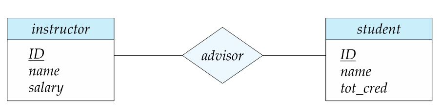
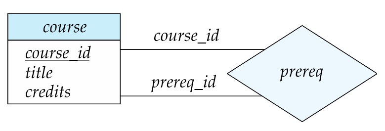
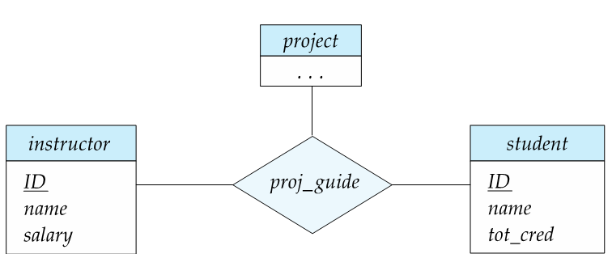
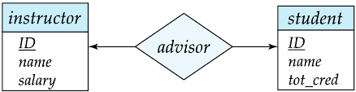
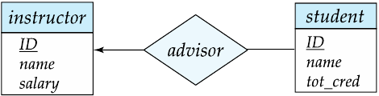
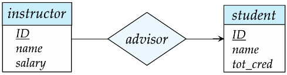

> [hudi.blog](https://hudi.blog/entity-relation-diagram/)를 참고하였음.

## ERD란?

데이터베이스 설계는 **개념적 모델링 → 논리적 모델링 → 물리적 모델링** 세 단계로 진행.

1. **개념적 모델링**은 Entity 를 도출하고 ERD를 작성하는 단계이다.
2. **논리적 모델링**은 ERD 를 사용할 특정 DBMS 의 논리적 자료구조에 맞게 사상 (Mapping) 하는 과정이다. 예를들어 RDBMS 를 사용한다고 하면, ERD를 RDB로 사상한다. 테이블 설계와 정규화도 여기서 이루어진다.
3. **물리적 모델링**은 데이터베이스의 저장 구조, 액세스 경로, 인덱스 등을 설계한다.

ERD (Entity Relationship Diagram)는 한국어로 개체-관계 모델.

**Entity (개체)** 란 현실에 존재하는 개별적으로 식별할 수 있는 물리적 또는 추상적인 개체를 의미한다. 각 Entity 는 특징을 나타낼 수 있는 **Attribute (속성)** 들을 가지고 있다. 예를 들어 ‘학생’ 이라는 Entity 는 ‘학번’, ‘학생 이름’ 등의 Attribute 를 가질 수 있고, ‘수업’ 이라는 Entity 는 ‘학수번호’, ‘수업 이름’ 등의 Attribute 를 가질 수 있다.

**ER(개체-관계) 모델**은 위에서 설명한 Entity 사이의 **Relation (관계)** 을 통해 현실 세계를 표현하기 위한 설계 방식이다. 예를 들어 ‘학생’ 과 ‘수업’ Entity 끼리는 ‘수강하다’ 라는 관계를 맺을 수 있다.

이는 현재 가장 인기있는 **관계형 데이터베이스의 테이블 구조로 사상 (Mapping) 하기에도 쉬워** 인기가 많은 방식이다. ER 모델을 도식화 하여 표현하는 방법이 ERD 라고 할 수 있다.

 

## ERD 표기법 종류

- Peter-Chen 표기법

실제로 자주 사용되는 표기법은 아니기에 설명 생략.

 

- Crow's foot (까마귀 발)표기법

Crow's foot 표기법은 `바커 표기법(Baker Notation)`과 `I/E 표기법(Information Engineering Notation)`

등의 종류가 있는데, 많이 쓰이는 현업에서 자주 쓰는 I/E 표기법에 대해 작성할 것임.

 

## Entity Set 표기법

- 사각형은 entity set을 의미함
- attribute는 사각형 속에 나열됨.(아래 부분)
- 밑줄친 attribute는 primary key attributes임

 

## Relationship Set 표기법

- 다이아몬드 기호를 통해서 relationship을 나타냄

 

## Relationship Set 의 Attributes 표기법

- 다이아몬드에 점선을 통해 연결한 사각형으로 표현함
- 위 예시는 교수-학생의 advisor 관계가 성립된 날짜 속성을 표현함

 

## Role 표기법

- entity가 relationship에서 수행하는 기능을 role이라고 함
- entity와 relationship을 연결하는 선 위에 표시함
- 위 예시에서는 courese_id와 prereq_id가 role임

 

## Relationship Set의 종류

- **Binary Relationship**

  - 2개의 entity sets사이에 존재하는 관계를 의미함
  - 대부분의 relationship set는 여기에 속함

   

- **Ternary Relstionship**
  - 
  - 3개의 entity sets사이에 존재하는 관계를 의미함

 

이것보다 많은 관계가 있을 수 있지만 주로 이 두가지가 대부분임

 

## Attributes 상세

 

위 두 사진은 Composite attributes의 예시.

- **Simple, Composite attributes** : simple은 단일속성, composite은 여러 속성값으로 이루어져 있음 (ex. 주소=도로명+상세주소)
- **Single-valued, Multivalued attributes** : 1개의 value만을 가질 수있으면 sigle, 2개 이상 가능하다면 multi. (ex. 사람은 폰 번호를 여러개 가질수있기 때문에 사람 entity의 phone-number속성은 multivalued라고 볼 수 있음.)
- **Derived attributes** : 다른 속성들로부터 계산되어 구해질수 있는 속성. (ex. 총 가격)
- **Key attribute** : pribmary key인 attribute. 밑줄로 표현됨
- **Domain** : attribute에 허용된 value집합을 의미함

< br>

## Mapping Cardinality Constraints

- **One to one** : 1대1 대응
- **One to many** : 1대다 대응
- **Many to one** : 다대1 대응
- **Many to many** : 다대다 대응

반드시 모든 원소가 서로 매칭되는것은 아님

 

ERD에서는 화살표(->)는 1개 대응을 의미하고 선(-)은 여러개 대응을 의미함 

화살표가 가리키는 방향이 1개

- **1대1**

  

- **1대다** (학생입장에서는 지도교수는 1명. 교수입장에서는 여러명의 지도학생을 지님)

  

- **다대1** 

   

- **다대다**

  

 

## Total & Partial Participation

- Total Participation (전체 참여)
  - 두줄로 표현함(=)
  - 모든 학생은 반드시 교수와 advisor관계를 이루고 있어야 함을 의미
- Partial Participation (부분 참여)
  - 한줄로 표현(-)
  - 어떤 entites는 relationship에 참여하지 않을수도 있다는 것을 의미
  - 교수는 학생과 advisor관계를 이루고 있는 교수가 있을수도 있고 아닌 교수도 있을수 있음을 의미

 

## Minimum & Maximum Constraints

- i...j 와 같은 방식으로 표현. i가 minimum, j가 maximum
- 교수는 0명 이상의 학생과 advisor관계가 가능함
- student는 최소1,최대 1,  즉 한명의 교수와만 advisor관계가 가능함

 

## Weak Entity Set 표기법

- Section이 weak entity set임
- Weak entity set은 primary key를 형성하기에 충분한 attribute가 존재하지 않음
- Weak entity set은 현재 속성으로는 중복되는 개체들도 존재할 수 있음
- Weak entity는 primary key가 없기 때문에 단독으로 존재할 수 없고 다른 개체(strong entity set. 또는 identifying entity라고도 함)에 의존해서 존재함
- strong entity set은 primary key를 갖고있는 일반적인 entity set임. 위에서는 course가 그것임
