> 이미지는 [Database System Concepts](https://db-book.com/) 7판의 이미지를 사용함.

## 관계대수란?

- 데이터베이스 이론에서 관계 대수는 대수 구조를 사용하여 데이터를 모델링하고 그에 대한 쿼리를 잘 정립된 의미론으로 정의하는 이론
- 관계 대수의 주요 응용은 주로 관계형 데이터베이스, 특히 SQL과 같은 쿼리 언어를 위한 이론적 기반을 제공하는 데 사용됨
- relation은 set이기 때문에 그 결과는 **중복이 없음**.

 

## 사용되는 연산자들

- select : **σ**
- project: **π**
- cartesian product: **X** 
- theta join: **⨝****AθB**
- natural join: **⨝**
- union operation: **∪**
- set-intersection: **∩**
- set-difference: **-**
- assignment: **←**
- rename: **ρ**
- division: **÷**

> 이중에서 기본 연산자는 select(**σ**), project(**π**), cartesian product(**X**), union operation(**∪**), set-difference(**-**), rename(**ρ**) 이렇게 총 6개임
>
> 위 6개의 연산자로 모든 관계를 서술 할 수 있음.
>
> 다른 연산자들은 편의상 만들어짐

 

## select: σ

조건문

- `=` ,  `≠` , `>` , `≥` , `<` , `≤` 를 select문에서 사용 가능
- ∧(**and**), ∨(**or**), ¬ (**not**) 를 select문에서 사용 가능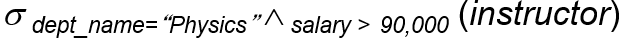
- 중복되는 rows가 없음. (중복을 제거함. 하나만 남게)

 

ex) instructor테이블에서 dept_name이 Physics인 것들을 가져옴

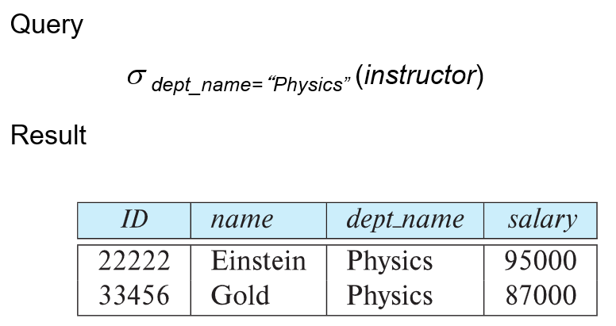

 

## project: π

- 인자로 받은 릴레이션에서 특정 속성들만을 가져오기위해 사용
- unary operation 임
- 아래 그림에서 A1~Ak는 속성의 이름이고 r은 릴레이션의 이름  
  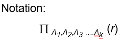
- 중복되는 rows가 없음. (중복을 제거함. 하나만 남게)
- SQL에서 SELECT DISTINCT문에 해당됨

 

ex)

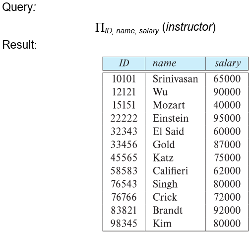

 

select문과 섞어서 쓰는것도 가능

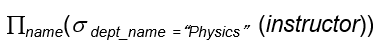

 

## cartesian product: X

가능한 경우를 모두 조합함. 

위 예시의 경우 instructor와 teaches 테이블에 동일한 이름의 ID 속성이 존재하기때문에 instructor.ID와 teaches.ID를 통해서 구분해줬음.

 

ex)

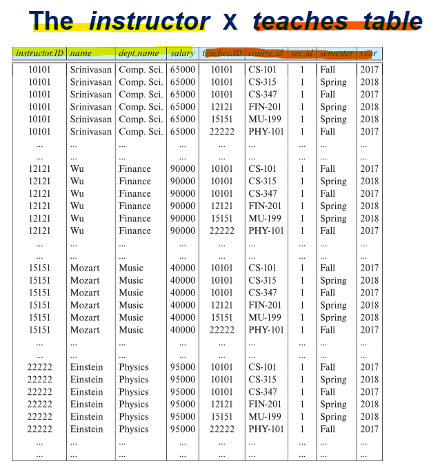

 

## theta join: **⨝** AθB

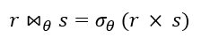

- θ는 비교연산자( `=` ,  `≠` , `>` , `≥` , `<` , `≤` )를 사용한 식이 옴.

 

ex) 

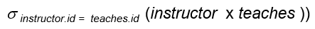이거랑

 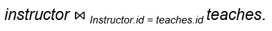 이것은 같은 뜻임.

위 예시의 연산의 결과는

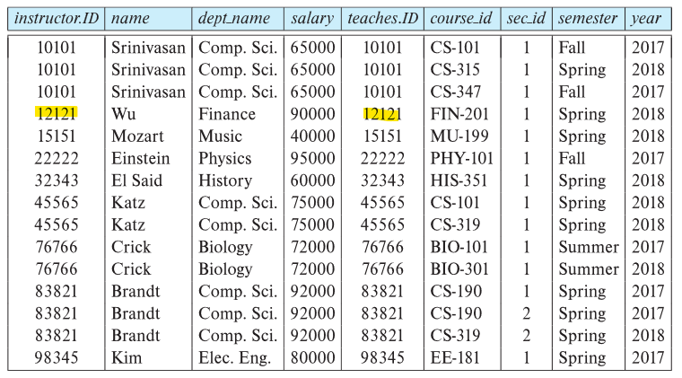

## natural join:  ⨝

- theta join에서 θ가 `=` 인 경우. 자주 쓰여서 따로 용어가 있음.

- 두 릴레이션에서 **컬럼명이 같은 모든 컬럼간의 equi-join**을 수행하는 것임.

 

ex) 

릴레이션 r의 속성을 ( A, B, C )

릴레이션 s의 속성을 ( A, D )라고 가정했을때

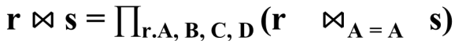

 

## union :  ∪

2개의 릴레이션을 섞는 합치는 용도

r ∪ s 연산을 하기 위해서 필요한 조건은 (r과 s 는 릴레이션임)

- r, s는 동일한 개수의 속성을 지녀야 함 (same arity)
- r, s의 각 속성은 서로 compatible 해야함. 

 

ex)

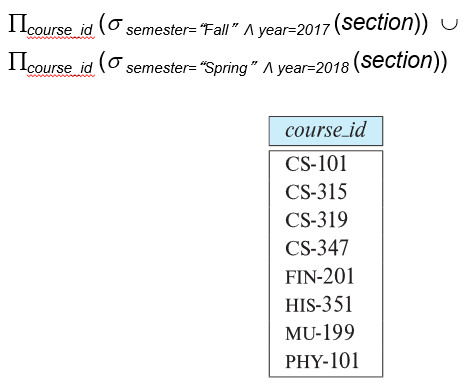

 

## set-intersection: ∩

2개의 릴레이션에서 공통부분을 얻는 용도

r ∩ s 연산을 하기 위해서 필요한 조건은 (r과 s 는 릴레이션임)

- r, s는 동일한 개수의 속성을 지녀야 함 (same arity)
- r, s의 각 속성은 서로 compatible 해야함. 

 

ex)

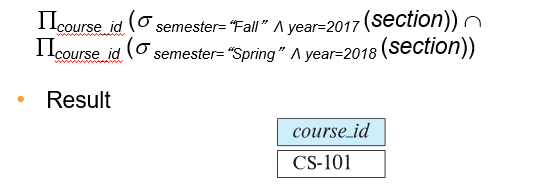

 

## set-difference: -

2개의 릴레이션에서 하나의 릴레이션을 기준으로 다른 릴레이션에는 들어있지 않은 부분만 얻는 용도

r - s 연산을 하기 위해서 필요한 조건은 (r과 s 는 릴레이션임)

- r, s는 동일한 개수의 속성을 지녀야 함 (same arity)
- r, s의 각 속성은 서로 compatible 해야함. 

 

ex)

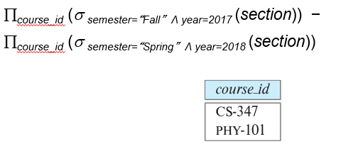

 

## assignment: ←

- 관계 대수식을 작성할 때, 일부를 임시 관계 변수에 할당하여 표현하기위해 사용. (편의성,가시성)
- 코딩할때 변수를 할당하는 이유와 비슷

 

ex)

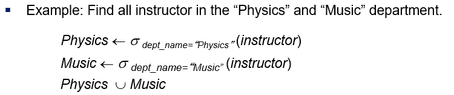

 

## rename: ρ

- 릴레이션의 이름, 릴레이션의 이름+속성의이름을 변경하기 위해 사용

 

ex) 릴레이션 E 의 이름만 x로 변경할 때

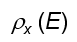

ex) 릴레이션 E의 이름을 x로 변경하고 각 속성의 이름을 A1~An으로 변경할 때

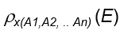

 

## division: ÷

예시를 보고 이해하는것이 빠름

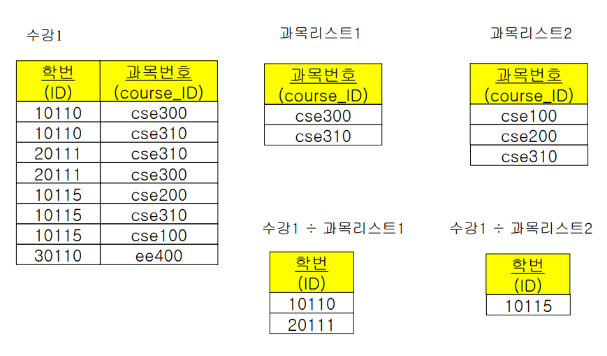
