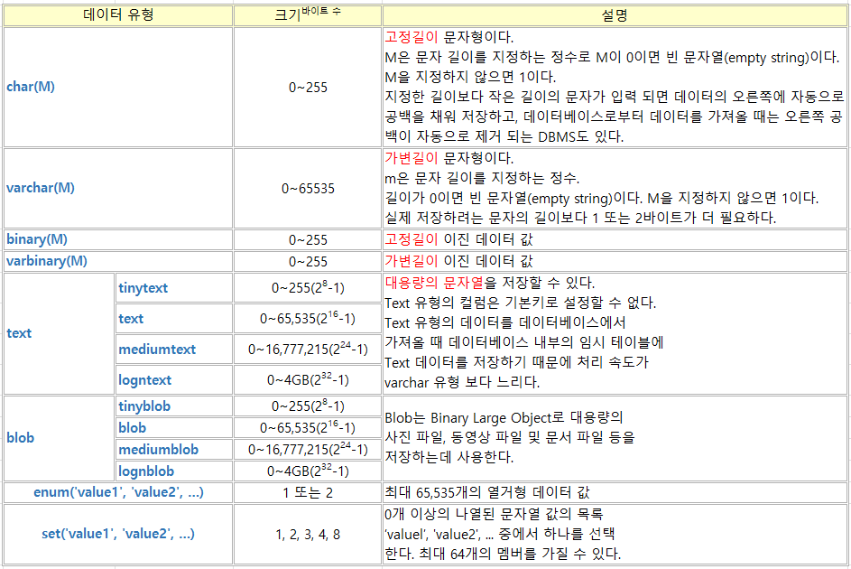
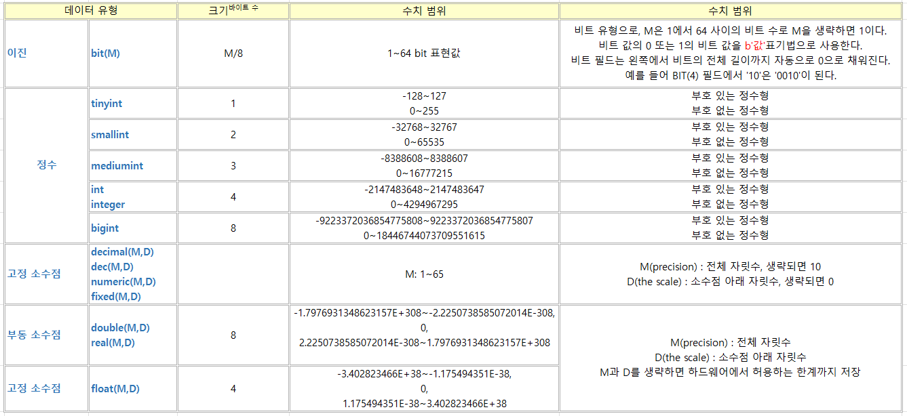
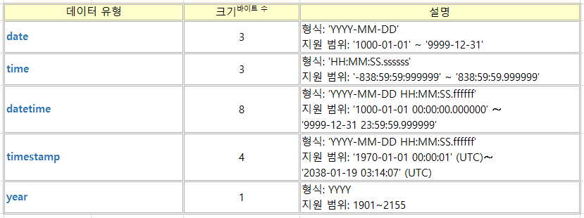
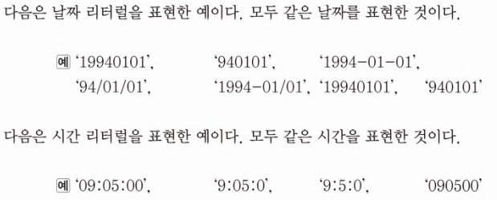
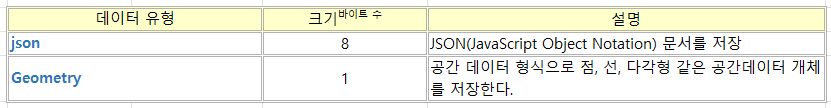

> MariaDB로 따라 하며 배우는 SQL프로그래밍 내용 참고

## 문자 데이터 유형



char과 varchar는 SQL문에서 사용하는 방법에서의 차이는 없음.  
하지만 이점을 구분하여 사용하는 것이 좋음.  
또한, 기본 문자 셋인 UTF8에서 한글은 다루는 문자의 길이보다 실제로 더 많은 메모리가 할당되는 것에 주의해야 함.

blob 형은 데이터베이스 용량이 커져서 데이터베이스의 성능에 문제가 발생할 수 있기 때문에 일반 폴더의 파일로 저장하여 관리하는 방법과 데이터베이스에 저장하여 관리하는 방법 중 데이터 사용 목적에 따라 명확하게 정의하고, 그에 따른 방법을 선택하는 것이 좋음.

<br>


## 숫자 데이터 유형



<br>


## 날짜, 시간 데이터 유형



```
datetime과 timestamp차이

[타입]
datetime: 문자형
timestamp: 숫자형

[index]
datetime: 불가능
timestamp: 가능

datetime은 입력된 날짜와 시간 그대로 데이터를 저장함
timestamp는 time_zone 시스템 변수로 값을 지정함. 
timestamp는 데이터 입출력시 time_zone 시스템 변수 값을 체크해 그 기반으로 변환하여 처리함. 

즉, datetime은 일정하지만, timestamp는 time_zone설정의 영향을 받음.
```



<br>


## 기타 데이터 유형


