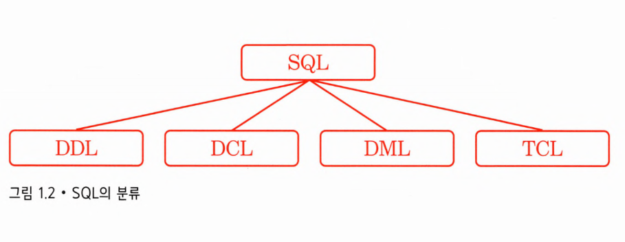
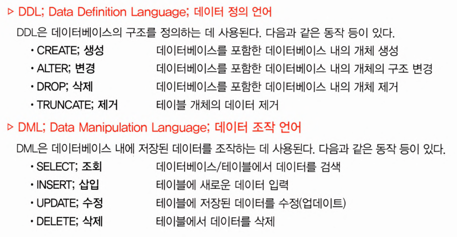
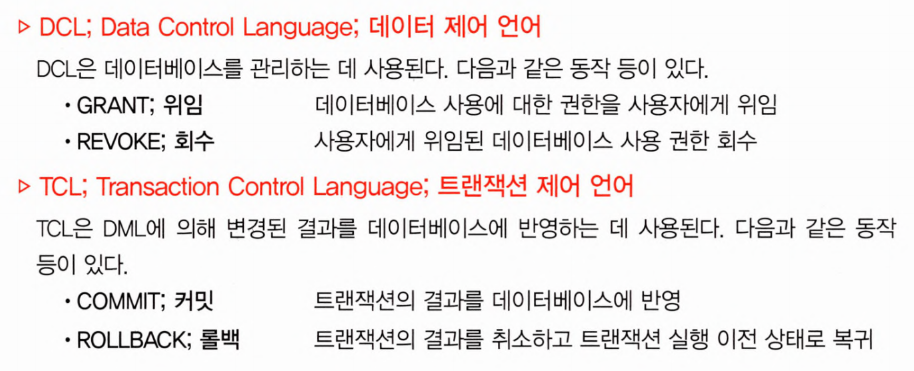

> MariaDB로 따라 하며 배우는 SQL프로그래밍 내용 참고

## SQL이란?

관계형 데이터베이스 관리 시스템(RDBMS)에서 사용되는 `SQL`(Structured Query Language)은 데이터베이스를 관리하고, 조작하고, 정의하기 위한 `ANSI`(American National Standards Institute)표준 언어임.

즉, 데이터베이스 생성, 변경, 삭제와 레코드 삽입, 조회, 삭제, 수정 그리고 데이터베이스의 백업, 롤백, 보안 ,관리 등에 의한 처리에 사용되는 표준 언어임.

하지만 RDMBS의 종류에따라서 ANSI SQL을 기반으로 조금씩 개조하여 사용하고있음.

 

SQL의 문법은 아래와 같은 종류로 구분됨.

 
