> [hudi.blog](https://hudi.blog/entity-relation-diagram/)를 참고하였음.


# ⚪<span style="color: #D6ABFA;">ERD</span>

## 🔹ERD란?

데이터베이스 설계는 **개념적 모델링 → 논리적 모델링 → 물리적 모델링** 세 단계로 진행.

1. **개념적 모델링**은 Entity 를 도출하고 ERD를 작성하는 단계이다.
2. **논리적 모델링**은 ERD 를 사용할 특정 DBMS 의 논리적 자료구조에 맞게 사상 (Mapping) 하는 과정이다. 예를들어 RDBMS 를 사용한다고 하면, ERD를 RDB로 사상한다. 테이블 설계와 정규화도 여기서 이루어진다.
3. **물리적 모델링**은 데이터베이스의 저장 구조, 액세스 경로, 인덱스 등을 설계한다.

ERD (Entity Relationship Diagram)는 한국어로 개체-관계 모델.

**Entity (개체)** 란 현실에 존재하는 개별적으로 식별할 수 있는 물리적 또는 추상적인 개체를 의미한다. 각 Entity 는 특징을 나타낼 수 있는 **Attribute (속성)** 들을 가지고 있다. 예를 들어 ‘학생’ 이라는 Entity 는 ‘학번’, ‘학생 이름’ 등의 Attribute 를 가질 수 있고, ‘수업’ 이라는 Entity 는 ‘학수번호’, ‘수업 이름’ 등의 Attribute 를 가질 수 있다.

**ER(개체-관계) 모델**은 위에서 설명한 Entity 사이의 **Relation (관계)** 을 통해 현실 세계를 표현하기 위한 설계 방식이다. 예를 들어 ‘학생’ 과 ‘수업’ Entity 끼리는 ‘수강하다’ 라는 관계를 맺을 수 있다.

이는 현재 가장 인기있는 **관계형 데이터베이스의 테이블 구조로 사상 (Mapping) 하기에도 쉬워** 인기가 많은 방식이다. ER 모델을 도식화 하여 표현하는 방법이 ERD 라고 할 수 있다.

<br>

## 🔹ERD 표기법 종류

- Peter-Chen 표기법


주로 초기 모델링할때 사용

<br>

- Crow's foot (까마귀 발)표기법


Crow's foot 표기법은 `바커 표기법(Baker Notation)`과 `I/E 표기법(Information Engineering Notation)`

등의 종류가 있는데, 많이 쓰이는 현업에서 자주 쓰는것은 I/E 표기법임.

```
보통 처음에는 Peter Chen표기법으로 모델링한 후, IE표기로 바꿔서 DB모델링을 한다.

Peter Chen 표기법이 더 직관적이고, 관계타입명과 관계대응수를 알아보기 수월하기 때문

IE 표기법은 관계타입명이 드러나지 않는다는 단점이 있고, 관계대응수를 숫자가 아닌 세발표기를 이용해서 식별함.

바로 IE표기로 해도 괜찮을듯
```

<br>

<br>

<br>

<br>


# ⚪<span style="color: #D6ABFA;">Chen표기법(entity는 IE로 표현함)</span>

## 🔹Entity Set 표기법

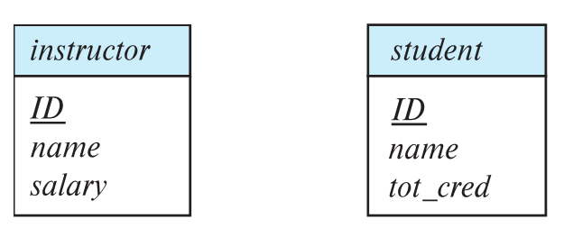

- 사각형은 entity set을 의미함
- attribute는 사각형 속에 나열됨.(아래 부분)
- 밑줄친 attribute는 primary key attributes임
- Chen은 원래 속성을 원으로 따로 표현하지만 IE표기법으로 쓰는것이 더 보기 편함 ( 위 그림은 IE에서의 entity set표기법)
- entity set표기법은 사실 위처럼 정해져있는 것은 아니고 툴마다 다름

<br>

## 🔹Relationship Set 표기법

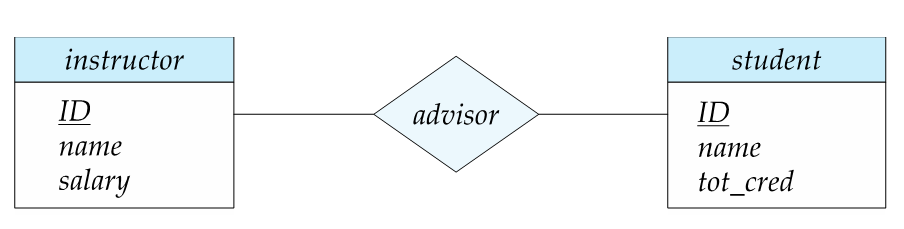

- 다이아몬드 기호를 통해서 relationship을 나타냄

<br>

## 🔹Relationship Set 의 Attributes 표기법

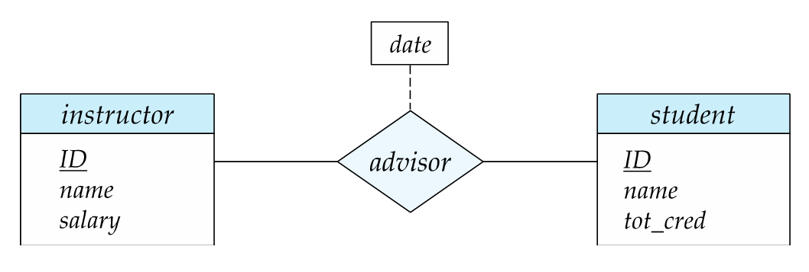

- 다이아몬드에 점선을 통해 연결한 사각형으로 표현함
- 위 예시는 교수-학생의 advisor 관계가 성립된 날짜 속성을 표현함

<br>

## 🔹Role 표기법

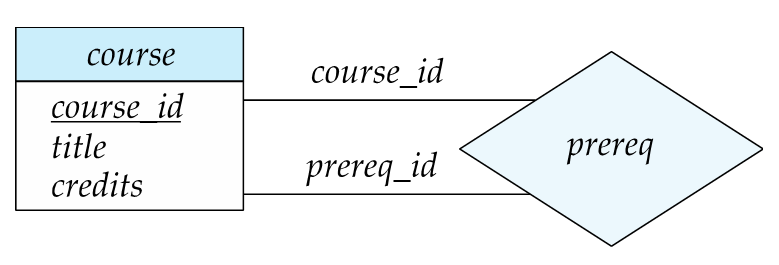

- entity가 relationship에서 수행하는 기능을 role이라고 함
- entity와 relationship을 연결하는 선 위에 표시함
- 위 예시에서는 courese_id와 prereq_id가 role임

<br>

## 🔹Relationship Set의 종류

- **Binary Relationship**

  - 2개의 entity sets사이에 존재하는 관계를 의미함
  - 대부분의 relationship set는 여기에 속함

  <br>

- **Ternary Relstionship**
  - 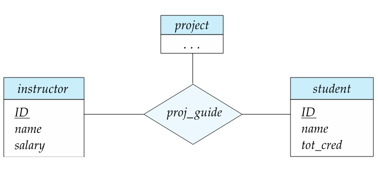
  - 3개의 entity sets사이에 존재하는 관계를 의미함

<br>

이것보다 많은 관계가 있을 수 있지만 주로 이 두가지가 대부분임

<br>

## 🔹Attributes 상세

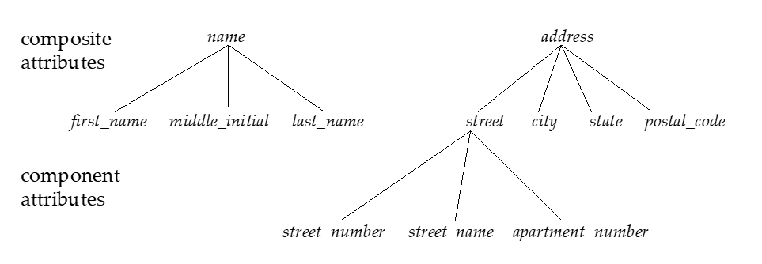 

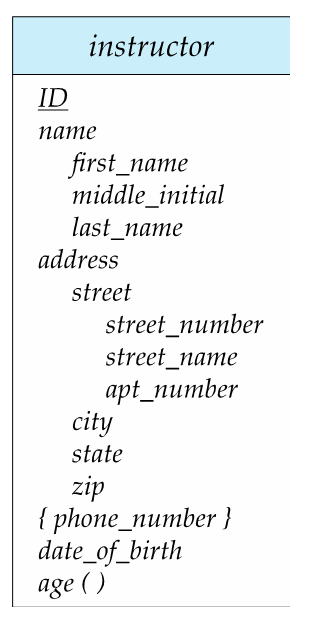

위 두 사진은 Composite attributes의 예시.

- **Simple, Composite attributes** : simple은 단일속성, composite은 여러 속성값으로 이루어져 있음 (ex. 주소=도로명+상세주소)
- **Single-valued, Multivalued attributes** : 1개의 value만을 가질 수있으면 sigle, 2개 이상 가능하다면 multi. (ex. 사람은 폰 번호를 여러개 가질수있기 때문에 사람 entity의 phone-number속성은 multivalued라고 볼 수 있음.)  '{ }'기호를 통해서 표현함.
- **Derived attributes** : 다른 속성들로부터 계산되어 구해질수 있는 속성. (ex. 총 가격) 위 예시에서는 name과 address가 그 예임
- **Key attribute** : pribmary key인 attribute. 밑줄로 표현됨
- **Domain** : attribute에 허용된 value집합을 의미함

< br>

## 🔹Mapping Cardinality

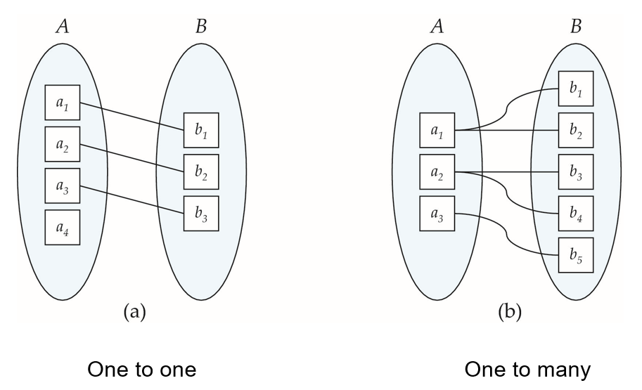

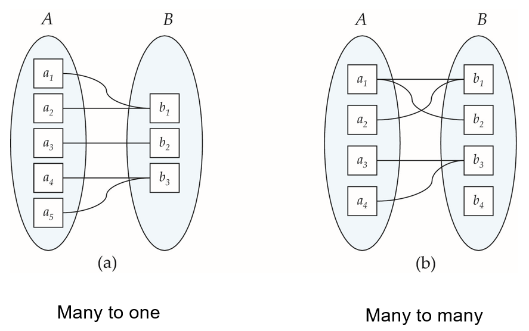

- **One to one** : 1대1 대응
- **One to many** : 1대다 대응
- **Many to one** : 다대1 대응
- **Many to many** : 다대다 대응

반드시 모든 원소가 서로 매칭되는것은 아님

<br>

ERD에서는 화살표(->)는 1개 대응을 의미하고 선(-)은 여러개 대응을 의미함 

화살표가 가리키는 방향이 1개

- **1대1**

  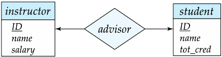

- **1대다** (학생입장에서는 지도교수는 1명. 교수입장에서는 여러명의 지도학생을 지님)

  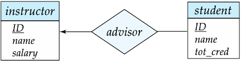

- **다대1** 

   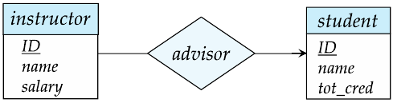

- **다대다**

  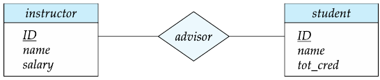

<br>

## 🔹Total & Partial Participation

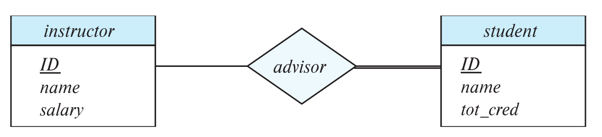

- Total Participation (전체 참여)
  - 두줄로 표현함(=)
  - 모든 학생은 반드시 교수와 advisor관계를 이루고 있어야 함을 의미
- Partial Participation (부분 참여)
  - 한줄로 표현(-)
  - 어떤 entites는 relationship에 참여하지 않을수도 있다는 것을 의미
  - 교수는 학생과 advisor관계를 이루고 있는 교수가 있을수도 있고 아닌 교수도 있을수 있음을 의미

<br>

## 🔹Minimum & Maximum Constraints

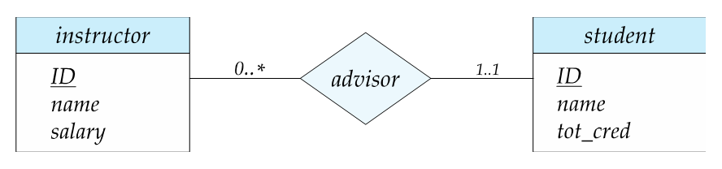

- i...j 와 같은 방식으로 표현. i가 minimum, j가 maximum
- 교수는 0명 이상의 학생과 advisor관계가 가능함
- student는 최소1,최대 1,  즉 한명의 교수와만 advisor관계가 가능함

<br>

## 🔹Weak Entity Set 표기법

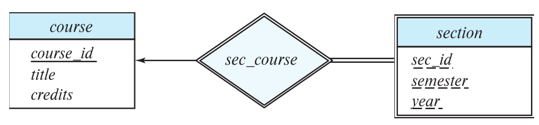

- Section이 weak entity set임. weak entity는 두겹의 네모로 표현
- Weak entity set을 identifying entity와 이어주는 relationship set은 두겹의 다이아몬드로 표현
- Weak entity set은 primary key를 형성하기에 충분한 attribute가 존재하지 않음
- Weak entity set은 현재 속성으로는 중복되는 개체들도 존재할 수 있음
- Weak entity는 primary key가 없기 때문에 단독으로 존재할 수 없고 다른 개체(그러한 개체를 identifying entity 라고 함)에 의존해서 존재함
- Strong entity set은 primary key를 갖고있는 일반적인 entity set임. 위에서는 course가 그것임. 여기서 course는 identifying entity이기도 함
- Weak entity는 반드시 전체참여('=' 두줄) 해야함.
- Discriminator 또는 partial key라고 불리는 구별자는 weak entity set의 모든 entity를 구별하는데 보조적으로 필요한 attribute의 집합임. 이것만으로는 weak entity를 구분할수 없지만, identifying entity set의 primary key와 합쳐서 weak entity set의 primary key가 만들어지게 됨 (즉 section의 primary key는 course_id+sec_id+semester+year 임)
- Discriminator 또는 partial key는 점선 밑줄을 통해서 표현함

<br>

<br>

<br>

<br>


# ⚪<span style="color: #D6ABFA;">IE 표기법</span>

## 🔹Entity Set 표기법


- 사각형은 entity set을 의미함
- 가장 상단은 entity set의 이름
- 좌측에 PK,FK 등의 정보를 표기함
- 우측에 attribute이름을 표기함
- entity set표기법은 사실 위처럼 정해져있는 것은 아니고 툴마다 다름

<br>

## 🔹Relation

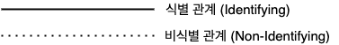

- **식별관계**란 부모 entity의 기본키 또는 유니크키를 자식 entity의 기본키이자 외래키로 사용하는 관계. 즉 자식 entity는 부모 entity가 존재해야 존재할 수 있음 (ex. 게시글-댓글 관계)   
  //**strong entity와weak entity사이의 관계**

- **비식별 관계**는 부모 entity의 기본키 또는 유니크 키를 자식 entity에서 외래키로 사용하는 관계. 즉 자식 entity는 부모 entity의 존재유무와 관계없이 독립적으로 존재할 수 있음 (ex. 부서-사원 관계. 사원이 부서가 배정되지 않을수도있음)  
  //**strong entity 사이의 관계**

  <br>

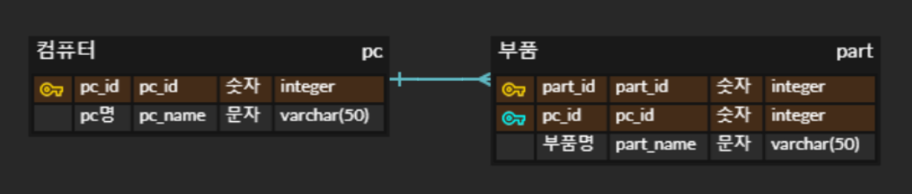

**식별관계**의 예시.

부모(컴퓨터)가 존재해야 자식(부품)에 데이터를 추가할 수 있음

위 그림에서는 PK를 part_id로 갖고 PFK로 pc_id로 갖음

부모 테이블의 키를 기본키로 갖고 있어서 부모 테이블에 데이터가 있어야지 자식 테이블에 데이터 추가 가능

- 장점: 데이터의 정합성 유지를 DB에서 검증
- 단점: 구조 변경이 어려움

<br>

.png)

**비식별 관계**의 예시

부모(컴퓨터)데이터가 없어도 자식(부품)에 데이터를 추가할 수 있음

위 그림에서는 PK를 part_id로 갖고 FK로 pc_id를 갖음

부모 테이블의 키를 외래키로 갖고있어서 부모 테이블에 데이터가 없어도 생성할 수 있고 의존성을 낮출 수 있음

- 장점: 구조 변경이 비교적 자유로움, 부모 데이터로부터 독립
- 단점: 데이터 정합성을 위한 로직 필요, 데이터 무결성을 보장하지 않음

<br>

> 보통 식별 관계보다 비식별 관계를 선호함
>
> 이유)
>
> - 구조 변경에 용이. 식별 관계는 부모테이블의 기본키가 자식테이블에서도 기본키로 사용되므로 구조변경 어려움
> - 부모테이블과의 의존성 제거
> - 과도한 인덱스 제거
>
> 상황에 따라서 설정하자
>
> - 비식별관계는 ''필수적 비식별관계''와 ''선택적 비식별 관계''로 나누기도 하는데,
>   필수적은 외래키에 NULL을 허용하지않고
>   선택적은 NULL을 허용함
>   가능하면 필수적 비식별관계를 사용하는것이 더 좋음

## 🔹Mapping Cardinality

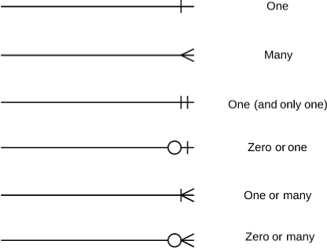

<br>

<br>

<br>

<br>


# ⚪<span style="color: #D6ABFA;">Extended E-R Features</span>

## 🔹Specialization

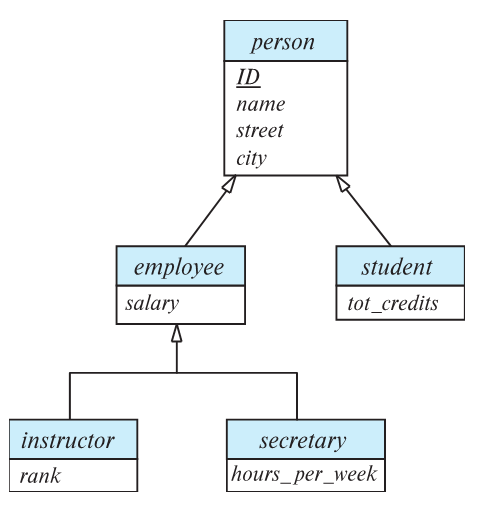

- Top-Down design process을 의미함
- 하위 entity set은 상위 entity set의 속성과 relationship participation을 모두 상속받음

<br>

## 🔹Generalization

- Bottom-Up design process를 의미함
- Specialization과 단지 관점의 차이일 뿐 똑같은걸 표현할수 있다

<br>

## 🔹Aggregation

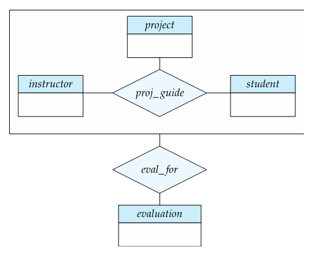

- 어떤 entities들 사이의 관계가 entity로 여겨질때 Aggregation을 사용
- 위 그림처럼 사각형으로 묶어줌
- evalution은 project, instructor, student 모두에게 동시에 enquire해야 함
- 위 예시에서는 아마 proj_guide가 쓸모가 없어질 것임(중복됨) 

<br>

## 🔹Copleteness  Constraint

상위 level이 entity set이 generalization관계에 있는 하위 entity sets중 최소 하나에 반드시 포함되어야 하는가에 대한 제약

**total**과 **partial**로 구분할 수 있음

###  0️⃣Total

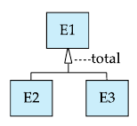

- entity가 반드시 하위 entity sets중에 최소 하나에는 속해있어야 한다는 뜻
- 예를들면 E1=사람, E2=남성, E3=여성
- 속이 빈 화살표에 점선을 통해서 연결해 total을 써줌
- total(disjoint) generalization 이라고도 하고 total specialization이라고도 하는 듯

<br>

### 1️⃣Partial

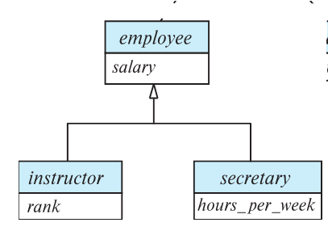

- entity가 반드시 하위 entity sets중에 최소 하나에 속할 필요가 **없음**
- 따로 total 표시가 없다면 default로 partial임
- instructor나 secretary에 속하지 않은 일반적인 employee도 존재할 수 있다는 뜻

<br>

<br>

<br>

<br>


# ⚪<span style="color: #D6ABFA;">Summary</span>

<p align="center">
  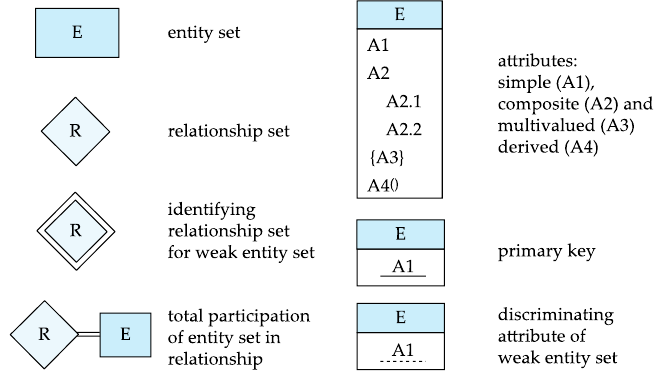
  <span style="margin: 20px;"></span> <!-- 간격을 조절할 span 요소 추가 -->
  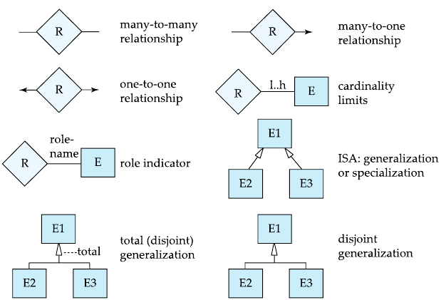
  <figcaption align="center">2번째 사진의 마지막 2개는 generalization대신 specialization이 들어가도 되는듯 함</figcaption>
</p>

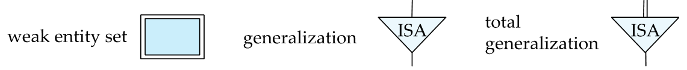

