> ERD에 관한 정리글 : [클릭](https://igh01gi.github.io/db/Erd/)

> Chen표기법으로 만든 ERD를 실제 DB생성에 써먹을수 있는 IE표기법 및 정규화과정등을 거친 것으로 변환하는것에 가깝다.

# ⚪<span style="color: #D6ABFA;">Binary Relationship에서 Relationship Set 을 구성하는 Primary Key 얻기</span>

- **다:다** : Entity Sets의 primary keys들의 union
- **1:다** : '다' 쪽의 primary key를 사용
- **1:1** : 양쪽 entity sets중 하나의 primary key를 선택해서 사용

``` 
- relationship set 'R'에 어떤 속성이 있다면, primary key를 구성할때 포함될 수 있음 (이건 불확실)
- relation set을 RDB로 변환할때 각 entity의 primary key는 다 포함되어 있어야 할 듯
```

<br><br><br><br>


# ⚪<span style="color: #D6ABFA;">Entity Set 변환</span>

## 🔹Strong Entity Set

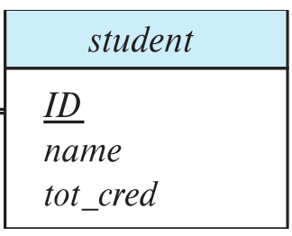

- Strong Entity Set은 그대로 변환이 됨
- student=(<u>ID</u>, name, tot_cred)

<br>

## 🔹Weak Entity Set

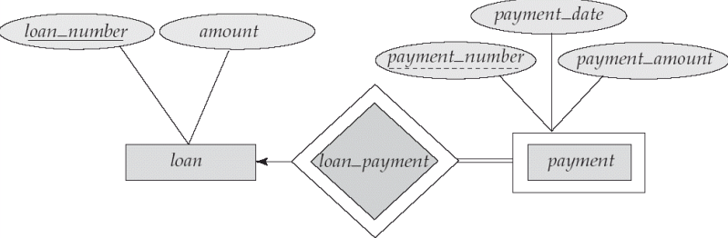

- Strong Entity Set은 그대로 변환. 
- loan=(<u>loan_number</u>, amount)
- Weak Entity Set은 Identifying Strong Entity Set의 Primary Key를 자신의 Discriminator(=Partial Key)와 함께 Primary Key로 설정함. 
- payment=(<u>loan_number</u>(FK), <u>payment_number</u>, payment_date, payment_amount )
- loan_payment 스키마는 생성되지 않음

<br><br><br><br>


# ⚪<span style="color: #D6ABFA;">Attributes  변환</span>

## 🔹Composite Attributes

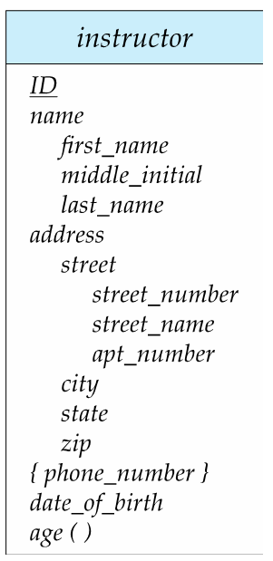

- name과 address,street이 composite attributes임
- 펼쳐서 속성으로 변환해서 표현함
- instructor(<u>ID</u>, first_name, middle_initial, last_name, street_number, street_name, apt_number, city, state, zip_code, date_of_birth)

<br>

## 🔹Multivalued Attributes 

<p align="center">
  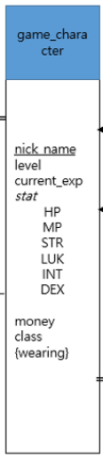
  <span style="margin: 20px;"></span> <!-- 간격을 조절할 span 요소 추가 -->
  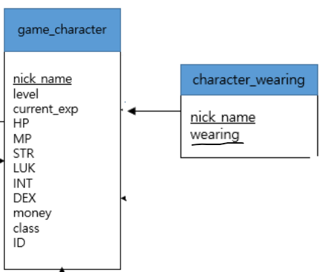
  <figcaption align="center">좌(ERD) 에서 우측 RDB스키마로 변환</figcaption>
</p>


- multivalued attributes가 존재하는 entity sets의 primary key를 복사해와서 또 다른 스키마로 생성해야 함
- {wearing}이 그 예시이므로 우측과같이 기존 primary key인 nick_name을 가져와서 기존 multivalued attribute인 wearing과 함께primary key로 설정하여 새로운 스키마를 생성함함
- character_wearing(<u>nick_name</u>(FK), <u>wearing</u>)

<br><br><br><br>


# ⚪<span style="color: #D6ABFA;">Relationship Set 변환</span>

## 🔹Unary

>Unary Relation Set을 변환하는 방법은 크게 2가지가 있다.
>
>1. 독립된 테이블로 변환
>2. 독립된 테이블을 사용하지 않고 extra 속성을 이용하여 변환

### 0️⃣독립된 테이블로 변환하는 방법

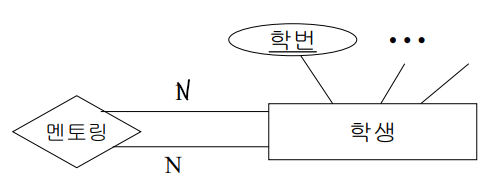

- **다:다** : 양 entity sets의 primary key를 가져와서 합성 primarykey로 구성됨 
- 멘토링=(<u>멘토학번</u>(FK),<u>멘티학번</u>(FK))

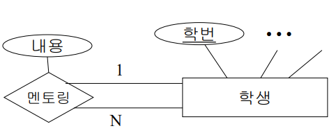

- **1:다** : entity sets의 primary key를 두개 가져오되, '다'쪽의 primary key를 primary key로서 사용함
- 멘토링=(<u>멘티학번</u>(FK),멘토학번(FK),내용)

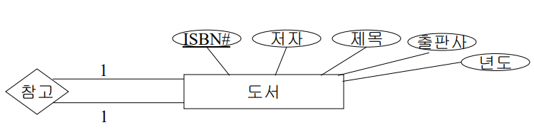

- **1:1** : 양 entity sets의 primary key를 가져오되, 둘 중에 한 곳의 primary key를 선택해서 primary key로서 사용함
- 참고=(<u>도서 ISBN#</u>(FK), 참고하는 도서ISBN#(FK)) 또는 (<u>참고하는 도서ISBN#</u>(FK), 도서 ISBN#)

<br>


### 1️⃣ extra 속성을 이용한 변환


- **1:다** :  '다'쪽의 primary key를 primary key로서 사용하고, '1'쪽의 것은 외래키로 사용
- 학생=(<u>학번</u>(FK),멘토학번(FK),내용)
- 멘토링 스키마는 생성되지 않음


- **1:1** : primary key를 fk로 설정
- 도서=(<u>도서 ISBN#</u>(FK), 저작, 제목, 출판사, 년도, 참고하는 도서ISBN#(FK))
- 참고 스키마는 생성되지 않음

<br>

## 🔹Binary

> Binary Relation Set을 변환하는 방법은 크게 2가지가 있다.
>
> 1. 독립된 테이블로 변환
> 2. 독립된 테이블을 사용하지 않고 extra 속성을 이용하여 변환

###  0️⃣ 독립된 테이블로 변환하는 방법

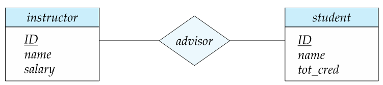

- **다:다** : 양 entity sets의 primary key를 가져와서 합성 primarykey로 구성됨 
- advisor=(<u>s_id</u>(FK),<u>i_id</u>(FK))

<br>

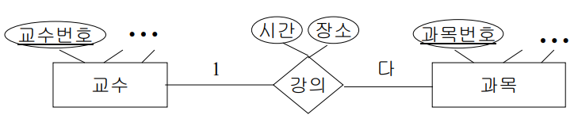

- **1:다** : 양 entity sets의 primary key를 가져오되, '다'쪽의 primary key를 primary key로서 사용함
- 강의=(<u>과목번호</u>(FK),교수번호(FK),시간,장소)

<br>

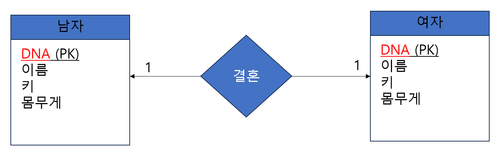

- **1:1** : 양 entity sets의 primary key를 가져오되, 둘 중에 한 곳의 primary key를 선택해서 primary key로서 사용함
- 결혼=(<u>남자DNA</u>(FK), 여자DNA(FK), ...) 또는 (<u>여자DNA</u>(FK), 남자DNA(FK), ...)

<br>


### 1️⃣ extra 속성을 이용한 변환


- **1:다** : '다' 쪽에 '1'에 해당하는 primary key를 외래키로서 설치. 관계집합의 속성도 '다' 쪽에 설치
- 과목=(<u>과목번호</u>, 교수번호(FK), 시간, 장소, ...)  
- 강의 스키마는 생성되지 않음

<br>

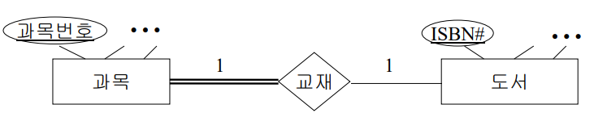

- **1:1** : 전체참여쪽, 없다면 튜플수가 적은 쪽에 외래키(반대편의 primary key를 이용해) 설치
- 과목=(<u>과목번호</u>, ISBN(FK), ...)
- 교재 스키마는 생성되지 않음

<br>

## 🔹Ternary

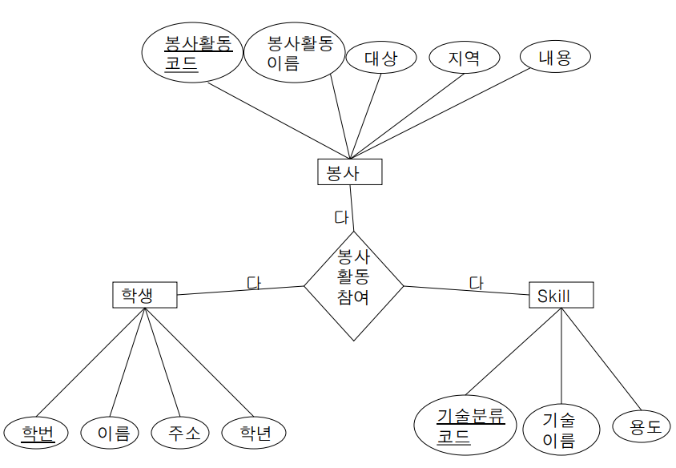

이 경우 생성되는 최종 스키마는 다음과 같음

•학생(<u>학번</u>, 이름, 주소, 학년) 

• Skill(<u>기술분류코드</u>, 기술이름, 용도) 

•봉사(<u>봉사활동코드</u>, 봉사활동이름, 대상, 지역, 내용) 

•봉사활동참여(<u>학번</u>(FK), <u>기술분류코드</u>(FK), <u>봉사활동코드</u>(FK))

<br>

<br>

<br>

<br>


# ⚪<span style="color: #D6ABFA;">정규화 과정</span>

해당 [링크](https://igh01gi.github.io/db/Normalization/) 참고
