# ⚪다운로드

## 🔹SQL Server 다운

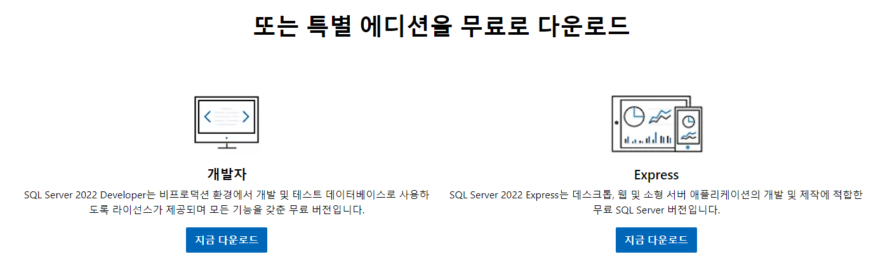

[SQL Server 다운 링크](https://www.microsoft.com/ko-kr/sql-server/sql-server-downloads){:target="_blank"}

오른쪽의 Express를 다운받았음

다운받은 후 설치

## 🔹SSMS 다운

- SSMS(SQL Server Management Studio)는 SQL Server에서 Azure SQL Database까지 모든 SQL 인프라를 관리하기 위한 통합 환경
- 초기 설정을 위해서 필요

[SSMS 다운 링크](https://learn.microsoft.com/ko-kr/sql/ssms/download-sql-server-management-studio-ssms?view=sql-server-ver16){:target="_blank"}

다운받은 후 설치

 

 

 

# ⚪SSMS로 서버 인증 변경

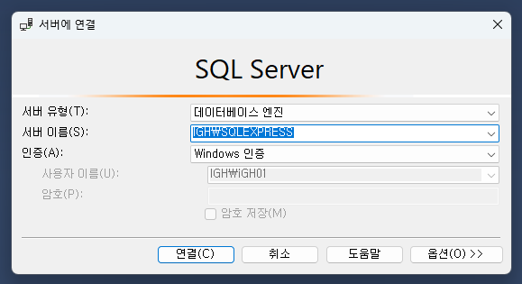

- 먼저 SSMS를 사용하여서 아무것도 건드리지 않고 연결한다 (서버이름은 본인 PC 이름으로 기본 설정돼있음)

 

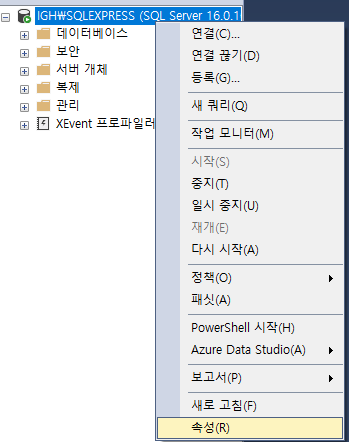

- 속성에 들어간다

 

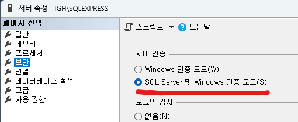

- ''보안 - 서버 인증'' 을 **SQL Server 및 Windows 인증 모드**로 변경

 

 

 

# ⚪Sql Server Configuration Manager 설정

## 🔹서비스 설정

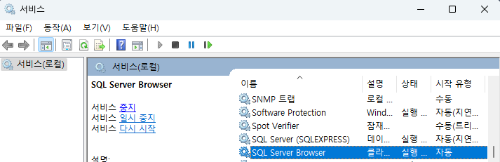

- 서비스에 들어가서 SQL Server Browser를 시작유형 : 자동, 그리고 실행 시킴

## 🔹포트번호 설정

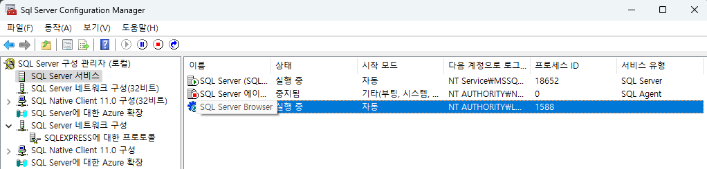

- Sql Server Configuration Manager에 들어가서 SQL Server Browser를 시작모드 : 자동,  그리고 실행 시킴

 

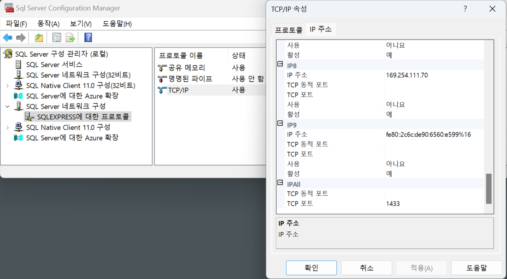

- TCP/IP의 IP 주소 설정으로 들어간다
- 동적포트에 숫자가 적혀있다면 모두 지운다
- IPALL부분에만 TCP 포트에 1433 (SQL Server의 기본 포트 번호)를 적는다
- TCP/IP를 사용상태로 변경한다

 

 

 

# ⚪SSMS로 계정 설정

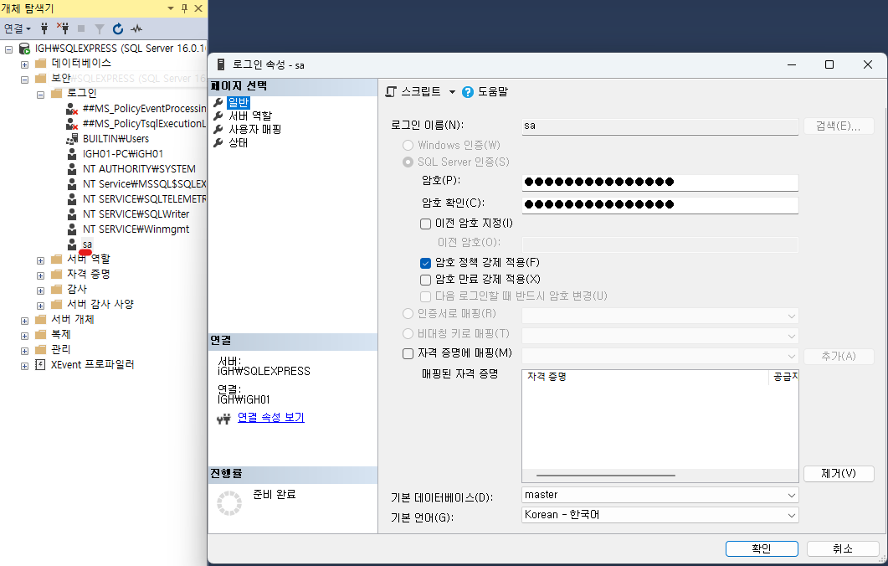

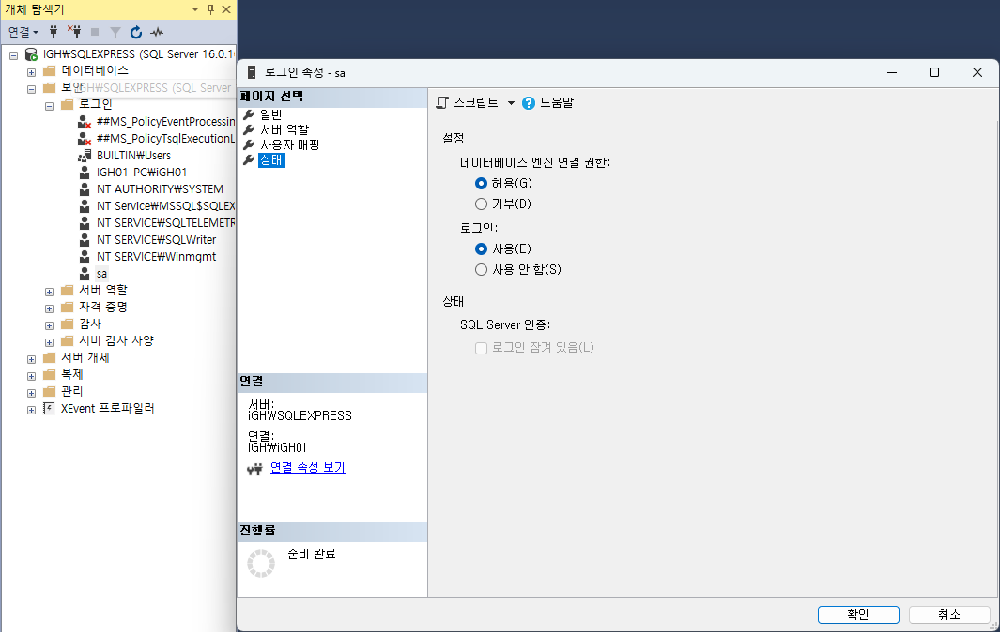

- 최상위 계정인 sa(system admin)의 속성을 다음과 같이 변경
- 암호는 원하는 것으로 설정

 

 

 

# ⚪Data Grip 설정

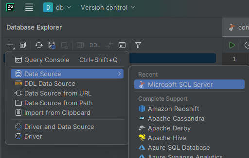

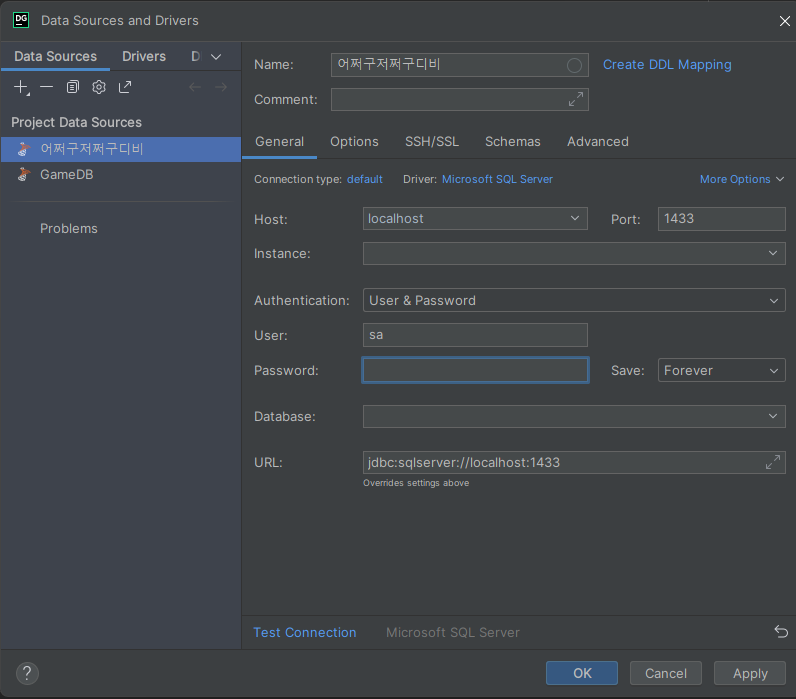

- **Name** 에는 원하는 디비 이름을 적음
- **Host** 에는 로컬로 하는 것이기에 localhost
- **Port** 에는 전에 설정해둔 1433
- **User** 는 전에 설정한 sa
- **Password** 는 본인이 sa에 설정했던걸로
- **Test** **Connection** 누르고 성공하면 끝

