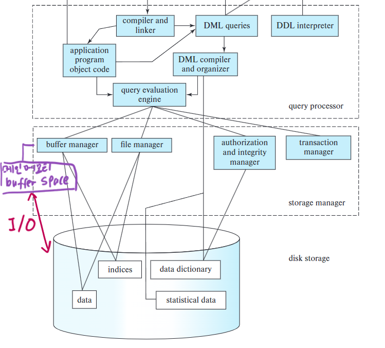
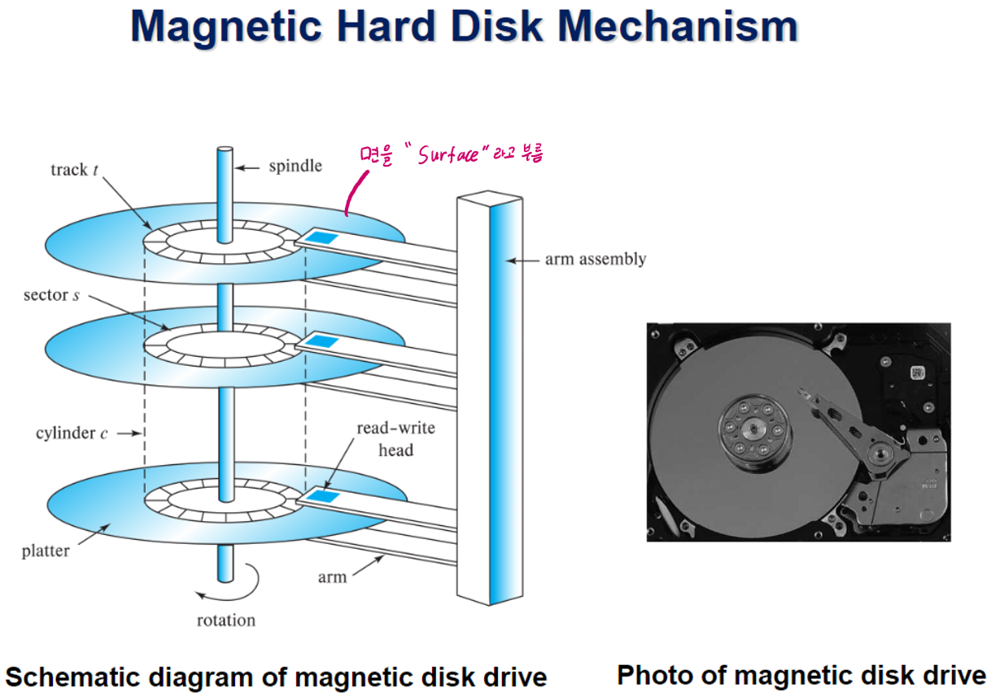
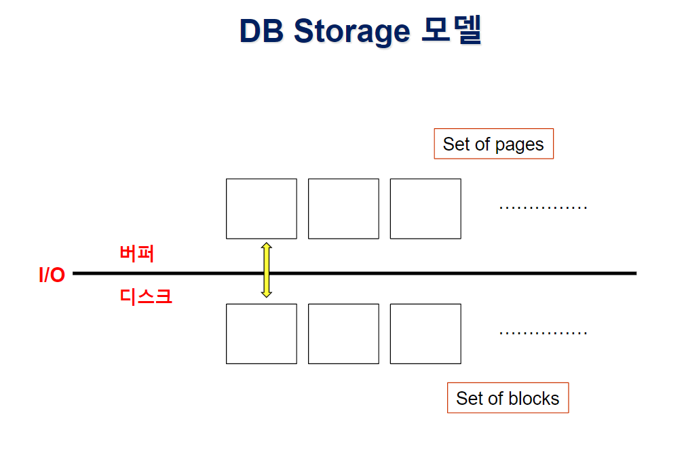

# ⚪DB 아키텍쳐

## 

- 위쪽의 두개의 점선 박스가 DBMS엔진에 해당됨
- buffer manager가 메인메모리의 buffer space를 관리함
- 응용프로그램에서 db 데이터에 접근하려면 데이터를 디스크에서 메인메모리의 버퍼 공간으로 가져와야함 (디스크 I/O작업 필요)
- 이 I/O작업이 DB시스템에서 **성능의 병목** 지점임!
- DB시스템은 따라서 디스크 I/O의 횟수를 줄이려고 설계되어져 있음

 

 

 

# ⚪Magnetic Hard Disk

## 🔹개요

- 디스크 원판을 플래터라고함
- 플래터는 양면에 데이터를 기록할수 있는데, 이 면을 **surface**라고 함
- 각각의 surface에는 circular 형태의 **track**들이 있음
- 회전축(spindle)을 중심으로하는 동심원들 각각이 모두 track임
- track은 또 **sector**라고 하는 단위로 나뉨
- sector가 데이터를 쓰거나 읽을때의 기본 단위임
- sector가 head밑을 지나면서 데이터를 읽거나 쓰게 됨
- arm이 물리적으로 앞뒤로 움직여서 head의 위치를 조절함

## 🔹디스크의 성능 요소

- Access time (준비과정. 기계적인 동작. 이 부분이 오래걸림)
  - **Seek time(탐색시간)** : head를 원하는 track으로 위치하게 하기 위해서 arm을 움직이는데 걸리는 시간
  - **Rotational latency(회전지연시간)** : 원하는 sector가 head아래에 위치하기 위해서 회전하는데 걸리는 시간 (Seek time이 완료된 이후)
- **Data-transfer rate**(실질적인 data read/write) : Access time이 완료된이후 단위시간당 데이터 전송률

따라서 Access time을 최소화하기 위해서 함께 다뤄야할 데이터들은 동일 **sector**또는 같은 **cylinder** 상에 위치시키는 것이 좋음.

 

 

 

# ⚪Disk block

- Disk I/O를 하는 논리적인 단위
- 보통 4~16 kilobytes
- 메인메모리 <->디스크 간 데이터를 읽어오거나 쓰거나 할때 그 단위 크기

 

 

 

# ⚪DB Storage 모델

- 위쪽은 주기억장치(메인메모리)의 버퍼 공간
- 디스크를 여러 블록들의 집합으로 추상화한 것
- 디스크의 **block**이 버퍼로 들어오면 **page**라고 부름
- 버퍼는 디스크 블록의 일부를 캐시한 공간 (page와 block의 크기는 같음)
- I/O횟수로 성능을 측정

