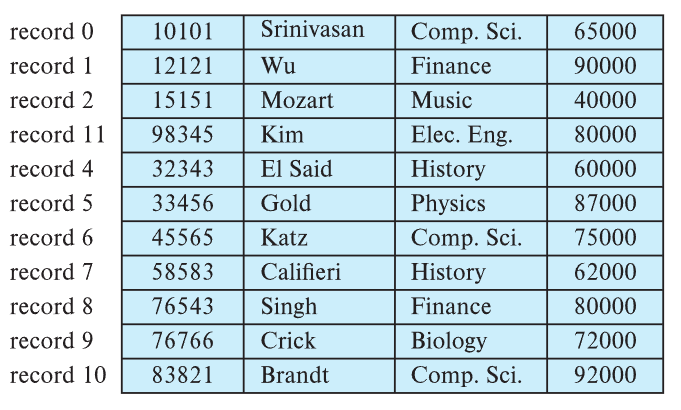
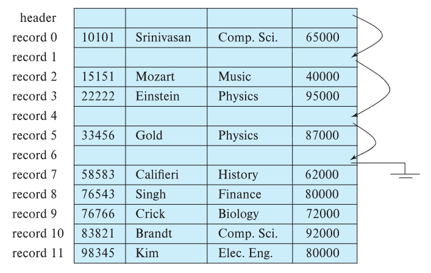
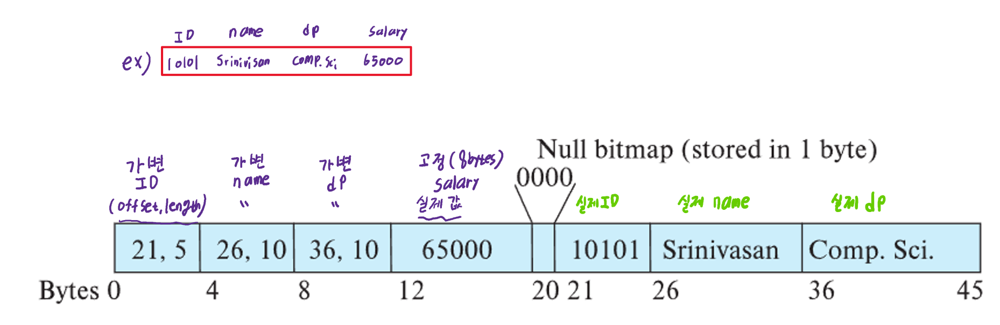
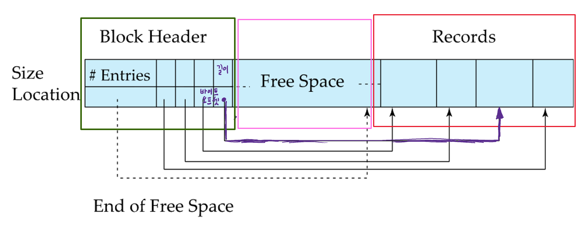

# ⚪File

- 데이터베이스는 파일들의 집합으로 저장됨
- 각 파일은 record들의 sequence이다
- record는 field들의 sequence이다
- 일반적으로 record의 크기는 disk block의 크기보다 작다고 생각하면 됨
- **한 file안에 하나의 relation만 들어 있지 않을수도 있음!**

 

 

 

# ⚪Fixed-Length Records

## 🔹저장

예를들어서 

- 블록크기 = 4096 bytes
- 레코드 하나의 크기 = 100bytes

라고 가정하면,

1블록에는 40레코드를 저장가능하고 96bytes가 unused한 상태로 남겨진다.

이때, 레코드를 최대한 넣은 a,b블록이 있을때 새로운 레코드 하나를 a,b블록 각각에 50바이트씩 나눠서 저장할 수 있을것 같지만,  
보통 db시스템은 이러한 방식 (cross block boundaries)을 허용하지 않음.

## 🔹삭제

### 🔸한 칸씩 당기기

만약 i번째 레코드가 삭제되었을때, 빈 공간을 만들지 않기 위해서 그 뒤 레코드들을 모두 앞으로 한칸씩 당기는 방식을 사용한다면,

file이 디스크에 있기때문에, 영향이 가는 디스크블록들을 전부 I/O작업을 통해 메인메모리에 적재한다음 한칸씩땡기고 다시 디스크로 옮기는 작업이 필요함. 

따라서 매우 비효율적임

### 🔸가장 뒤 레코드를 당겨오기

지워진 자리에 맨 뒤 레코드를 가져와서 옮기는 방법

모두 당기는 방식보다는 I/O작업이 적게 일어나서 비교적 효율적임

### 🔸link 시키기

record를 이동시키지 않고 모든 free record들을 free list로써 링크시킴

 

 

 

# ⚪Variable-Length Records

가변길이 레코드가 생기는 이유들

- 한 파일안에 여러 종류의 record들을 성능상의 이유로 같이 저장할때
- varchar같은 가변길이 타입
- rdb에서는 쓰이는것은 아닌데, repeating fields을 허용하는 레코드일경우

- 기본적으로 attribute들이 순서대로 저장됨
- 가변길이 attribute일 경우 실제 값이 저장된 부분의 **(offset, length)**를 앞쪽에 대신 저장함
- 고정길이 attribute일 경우 그냥 실제값 그대로 저장함
- null 값의 경우 null-value 비트맵을 통해서 나타냄. attribute개수에따라 달라지는 크기이기 때문에 1바이트가 아닐수도있음
- null 비트맵이 1인 곳은 어떤 값이 들어가든 상관없음. 무조건 null로 인식함
- 위 그림과 같은 방식은 null값이라도 자리를 먹게됨.  따라서 null bitmap을 맨 앞으로 이동시키고 null비트가 1로 켜진 곳의 값은 아예 기록을 안하는 식으로 용량을 좀 더 효율적으로 쓸 수 있음

## 🔹Slotted Page

- 하나의 디스크 블록에 가변길이 레코드들을 저장하는 위 방식을 Slotted Page 라고 함
- 위 방식의 블록에는 **Header**, **Free Sapce**, **Records**로 나뉨
- Slotted Page의 Header는 3가지 정보를 포함함
  - record entries의 수 = Slot의 수 (레코드 개수를 의미하는 것이 아님)
  - 블록 내 free space의 마지막 위치(바이트 오프셋. 포인터는 아님)
  - Slot배열에서는 각 record의 사이즈와 위치(바이트 오프셋). 편의상 포인터라 부르겠음
- 블록 외부에서 특정 레코드를 찾기위한 포인터의 경우(ex. 인덱스), 블록 내 record를 직접적으로 포인트하는 것이 아니라, 블록 헤더에 있는 해당 레코드에 대한 정보를 지닌 슬롯을 포인트해야 함. 즉, indirect access를 하게 됨

### 🔸레코드 삽입

- 레코드를 삽입하게 되면 Free space에서 Slot을 할당하고 레코드 공간을 할당함
- 레코드 삽입은 Free space >= Slot 길이 + 레코드 길이 일때만 가능
- 미사용 slot 재사용 가능

### 🔸레코드 삭제

- 레코드 공간을 free space로 회수
- 인접 레코드들을 이동시킴 (빈 공간 없게)
- header를 갱신함
  - 삭제한 레코드에 대한 정보를 지녔던 slot을 없애지는 않고 해당 slot의 레코드 길이 = -1 로 설정하는 등으로 처리함
  - 그렇게 처리하는 이유는, 인덱스같처럼 slot자체를 포인터로 가리켜서 indirect access하는 경우가 있기 때문에, slot조차 삭제하고 당기는 식으로 하면 엉뚱한 값을 읽게되기 때문
  - 따라서 **Slot의 수(entries의 수) != 레코드 수** 임

### 🔸레코드 갱신

- 레코드 길이 변경이 되면 인접 레코드들을 이동시켜서 컴팩트하게 공간을 활용
- Slot의 레코드 길이, 포인터등이 갱신된
