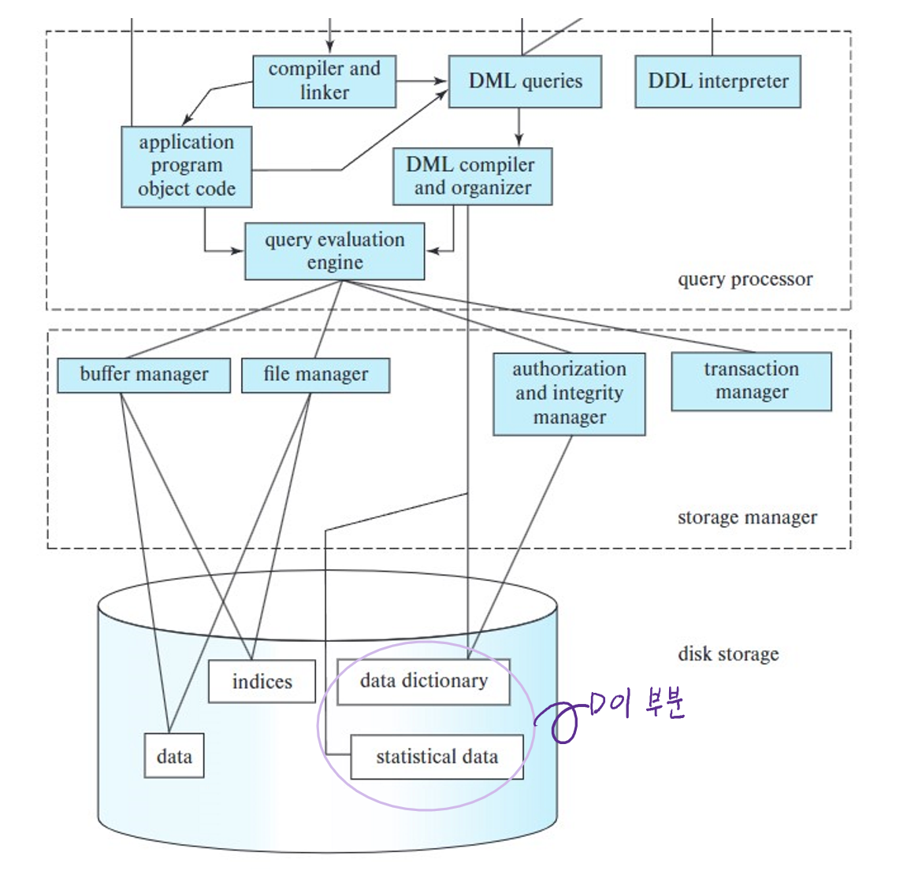
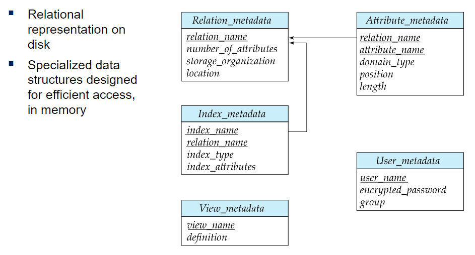

# ⚪Data Dictionary Storage란?

- system catalog라고도 불리는데, **metadata** (데이터에 대한 데이터)를 저장함
- 저장하는 metadata의 예시는 아래와 같음
  - relations에 대한 정보
    - relations의 이름
    - relation의 각 attribute들의 이름, 타입, 길이
    - view의 name과 definition
    - ingegrity constraints (무결성 제약)
  - User and accounting information, including passwords 
  - Statistical and descriptive data 
    - 각 relation의 튜플의 갯수
  - Physical file organization information 
    - 어떻게 relation이 저장되었는지 (sequential/hash/...)
    - relation의 물리적 위치
  - index에 대한 정보

 

 

 

# ⚪메타데이터를 테이블로

RDB의 경우 메타데이터는 일반적인 데이터들과 같이 테이블로 저장할 수 있음

위는 그 예시임

