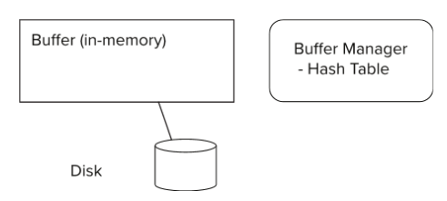

# ⚪<span style="color: #D6ABFA;">Storage Access</span>



- Block은 데이터 이동(disk와 버퍼간) 및 저장공간 할당의 단위임
- DBS는 block transfer 횟수를 최소화하고자 설계되어짐 (캐시 히트율을 높이고자 함)
- Buffer는 디스크의 block의 복사본을 저장하기 위한 메인메모리 공간
- Buffer Manager는 메인메모리에 buffer space를 할당하는 기능을 함

<br>

<br>

<br>

# ⚪<span style="color: #D6ABFA;">Buffer Manager</span>

- 응용프로그램이 디스크의 어떤 block을 요청하게 되면, 버퍼매니저는 해당 블록이 버퍼에 존재하는지 먼저 확인하고 있다면 메인메모리에 있는 해당 블록(페이지)의 주소를 return함
- 만약 버퍼에 없다면, 디스크에서 버퍼로 블록을 읽어온 후 그 주소를 return 하게 됨
- 그러기 위해서는 버퍼에 공간을 마련해야 함
  - 버퍼에서 교체당할 희생자(victim, 교체 당할 블록)을 선택하고 교체함
  - 희생자로 선택된 블록이 수정사항이 있다면 그냥 버리는 것이 아니라 I/O작업을 통해 디스크에 반영해줘야 함

## 🔹Pinned block

디스크에 쓰기가 허용되지 않은 메모리 블럭 (동시성 제어 관점)

- Pin은 block에서 data를 read/write하기 전에 수행됨
- Unpin은 read/write가 끝났을때 수행됨
- 여러개의 동시적인 pin/unpin 명령이 가능함 (한 블록에 대한)
  - pin count를 기록하면서, pin count=0일때만 해당 버퍼블록은 교체 및 제거 대상이 될 수 있음

## 🔹Shared and Exclusive locks on buffer

- 어느 순간에 오직 하나만이 page를 이동하거나 수정할수있게 보장하고, 이동/수정할때 해당 페이지를 읽는것을 막기 위해서 필요
- Readers는 shared lock을 얻고, block에 updates가 필요한 경우에는 exclusive lock을 얻음
- Locking rules:
  - 한번에 하나의 프로세스만 exclusive lock을 얻을 수 있음
  - shared lock은 exclusive lock과 동시에 수행될 수 없음
  - 여러 프로세스들에 동시에 shared lock이 부여될수도 있음

## 🔹Buffer-Replacement Policies

- 대부분의 운영체제에서는 block 교체 정책으로 LRU(least recently used)를 사용함 (가장 오랫동안 사용되지 않은 것을 교체)

- 그러나 DBS에서는 LRU방식이 특정 쿼리들의 작동방식상 좋지않음

- 그 좋지 않은 쿼리의 예시는 다음과 같음

  ```
  for each tuple tr of r do 
  	for each tuple ts of s do 
  		if the tuples tr and ts match ...
  ```

  왜냐하면 r 테이블의 첫번째 튜플을 잡은채로 s테이블의 처음부터 마지막 튜플까지 순서대로 비교를 하게되고,

  그리고 다시 r테이블의 두번째 튜플을 잡은채로 s테이블의 처음부터 마지막 튜플까지 순서대로 비교를 하게된다...

  이러면 s테이블의 튜플은 맨처음부터 마지막까지를 반복하는데, 그럼 LRU특성상 s테이블의 젤 처음튜플부터 교체대상이 될것이기때문에 I/O작업을 자주해야 한다

### 🔸Toss-immediate 전략

블록의 마지막 튜플이 처리되는 즉시, 해당 블록이 버퍼에서 차지하는 공간을 free함

### 🔸Most Recently Used (MRU) 전략

시스템은 현재 처리중인 block을 pin한다

해당 block의 최종 tuple이 처리가 완료되면, 해당 block은 unpinned되고 most recently used block이 된다.

(사실상 Toss-immediate랑 비슷한 전략)

