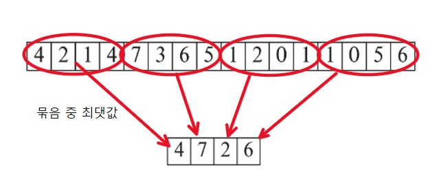
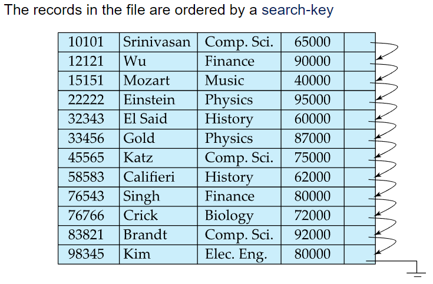
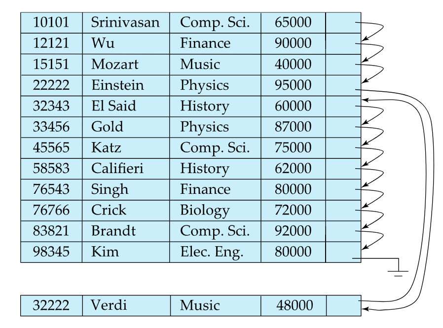
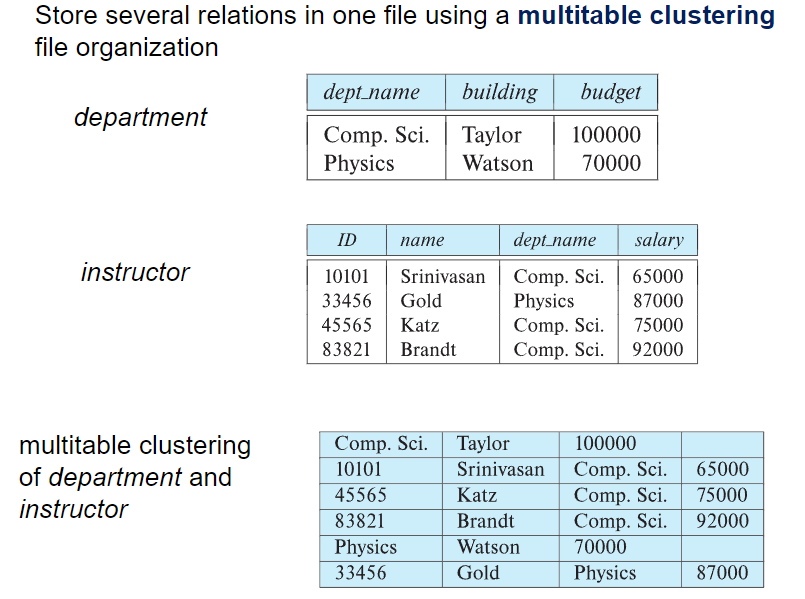

# ⚪Heap

- Record들은 파일 내 공간이 있는 어느곳이든지 위치할 수 있음 (순서개념이 없음)

- Heap File을 구성하는 블록([Slotted Page 구조](https://igh01gi.github.io/db/DataStorageStructures/#slotted-page) 참고)이 여러개 있을텐데, record순서가 중요하지 않기 때문에 블록들간에 record를 굳이 이동시키지 않음 (블록 내에선 움직임)

- Heap File을 구성하는 블록들 각각에 빈 공간이 얼마나 있는지 효율적으로 찾는것이 중요함 (그래야 삽입할 레코드 크기를 소화할수있는 블록을 찾아서 삽입이 가능하기 때문)

- 블록별 빈 공간 상태정보를 알기 위해서 **Free-space map**이라는 자료구조로 사용함

  - 

  - 그러나 위 방식을 그대로 사용하면, block개수가 실제로는 매우 많기 때문에, 해당 배열을 스캔하는 것도 큰 부하가 될 수 있음

  - 따라서 **second-level free-space map**을 사용함

    -  

      4개씩 묶음일때의 second level free space map 예시

 

 

 

# ⚪Sequential

- 모든 레코드들을 순차적으로 접근할때는 유리한 파일구조
- 특정 레코드 하나만 접근할때는 비효율적
- 위 사진같은 경우 레코드의 물리적,논리적 순서가 일치하는 경우임. 그러나 항상 이런것은 아님.  
  초기화되었을때는 위와 같겠지만 db 수정이 일어나면서 바뀌게 됨

## 🔹삽입, 삭제

- 삭제는 링크드리스트 삭제할때처럼 포인터를 조작하면 됨
- 삽입의 경우
  - 삽입할 값이 들어갈 위치를 찾은담에, 해당 위치가 들어갈 블록에 free space가 있다면 그곳에 insert함
  - free space가 없다면 임시 block인 **overflow block**에 삽입하고 링크를 연결함 (위 사진의 Verdi교수가 그 예시)
  - 어떤 경우든간에 pointer chain은 업데이트 되어야 함
- 삽입,삭제가 많이 일어날수록 이 구조가 복잡해져서 I/O작업이 더 많이 일어나게 되어 효율이 안좋기때문에  
  주기적이든 어떤 기준에 의해서 file을 reorganize해줘야 함 (그러면 논리적 순서와 마찬가지로 물리적 순서도 정렬되게 됨)  
  그러나 용량이 크면 이 reorganize도 상당한 부담

 

 

 

# ⚪Multitable Clustering File Organization

여러 테이블을 하나의 파일에다가 같이 저장하는 Multitable Clustering 을 쓰는 이유 :

- department ⨝ instructor와 같은 자연조인(이름이 같은 컬럼 조인)에 효율적
- 한 학과에 대해서 교수들을 검색하는 경우 효율적 

안좋은 경우는:

- department테이블의 레코드만 쿼리로 얻으려는 경우

 

- 이 파일 구조의 경우 파일 내의 레코드들은 당연히 variable size record임
- 특정한 테이블의 레코드만 접근하는것에 단점이 있다고 했는데, 이런 점을 보완하기 위해서 특정 테이블의 레코드들간의 링크를 연결할 수 있음

 

 

 

# ⚪B+ tree file organization 과 Hashing

두 방법은 따로 포스팅을 할 예정.

특히 B+ tree는 현재 가장 널리 쓰이는 file organization 방법임

