# ⚪<span style="color: #D6ABFA;">인덱스를 왜 사용?</span>

디스크에 저장된 DB의 용량은 너무 크기 때문에 메인메모리에 한번에 적재하기도 힘들고 검색할때도 부하가 심함

따라서 특정 attribute(s)를 대상으로 **인덱스**를 생성해서, 대상으로 하는 attribute가 있는 디스크 파일 내 레코드에 포인터방식으로 빠르게 접근할 수 있게 해줌  
(실제로는 직접적으로 블록내 레코드를 포인터하는 것은 아니고 [slotted page의 slot부분을 포인팅](https://igh01gi.github.io/db/DataStorageStructures/#slotted-page)하여 indirect access하는 방식) 

해당 attribute(s)를 이용한 db access가 필요할때 I/O작업을 줄이면서 빠르게 수행할수있게됨

그러나 db에 수정/삽입/삭제가 일어날때마다 인덱스도 갱신이 필요하고, 인덱스 자체도 공간을 차지하기때문에 남용하면 좋지 않음

<br>

<br>

<br>

# ⚪<span style="color: #D6ABFA;">Search Key</span>

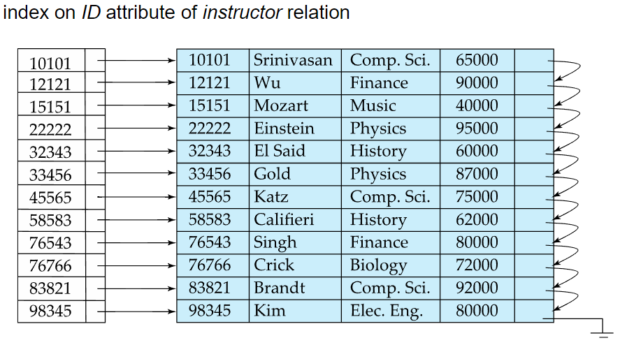

- 파일에서 레코드를 검색하는데 사용되는 attributes의 집합
- 인덱스로 사용할 Search Key를 먼저 정해야 그것을 바탕으로 인덱스를 생성 가능
- Search Key는 속성 하나일수도 있고 여러개일수도 있음
- 위 사진은 교수 테이블에서 ID 속성을 대상으로 인덱스를 만든 예시. 이때의 Search Key가 ID컬럼임
- 실제 인덱스는 위처럼 단순한 배열처럼 구성되지는 않음. 개념적 이해를 위한 예시사진임

<br>

<br>

<br>

# ⚪<span style="color: #D6ABFA;">Index File</span>

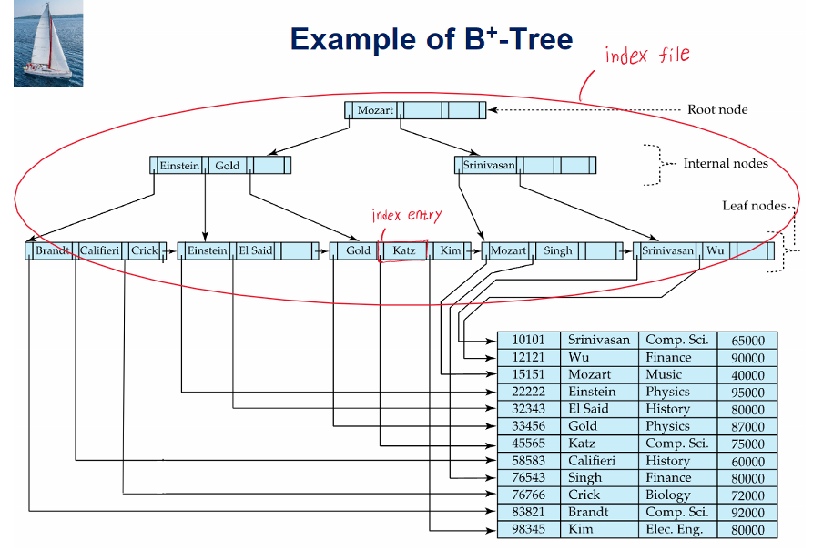

- index file은 (search-key, pointer)의 형태로 이루어진 **index entry**라고 불리는 record들로 이루어져 있다
- db에서의 b+트리는 트리이지만 알고리즘때 공부했던 트리와는 다르게 디스크상에 저장된 파일임
- index file의 크기는 오리지널 데이터 파일의 크기보다 훨신 작음

<br>

<br>

<br>

# ⚪<span style="color: #D6ABFA;">Ordered Index</span>

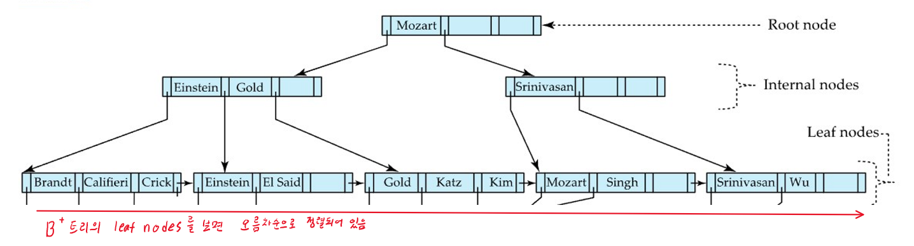

- ordered index에서는 index entry들이 search key값으로 정렬되어서 저장됨
- ordered index는 단지 인덱스의 정렬유무만으로 결정되는 것임
- 오리지널 데이터파일의 정렬에 따른 구분은 또 **Clutered index**이냐 **Nonclustered index**이냐로 나뉨

## 🔹Clustered index

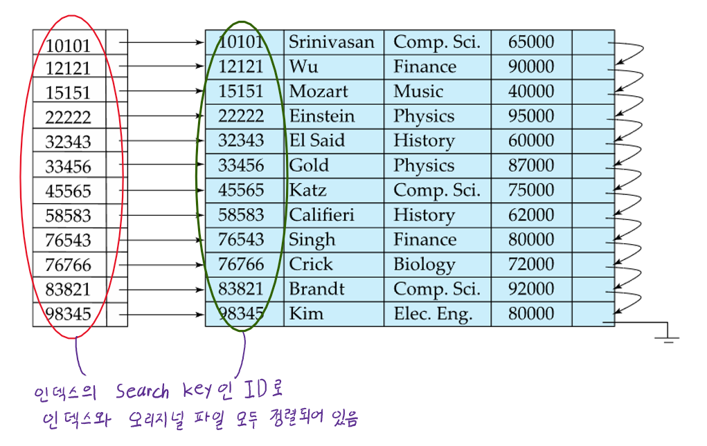

- ordered index일때 data file의 레코드 자체(원본 데이터 파일)도 해당 index의 search key값으로 정렬되어 있을때 그것을 **Clustered index**라고 함
- **Primary index**라고도 부름
- Clustered index(Primary index)의 search key는 보통 테이블에서의 primary key이지만, 반드시 primary key여야 하는것이 아님
- 위 사진의 경우 **Clustered index**이면서 **Dense index**인 경우의 예시임 
- **Clustered index는 Sparse index도 가능**

## 🔹Nonclustered index

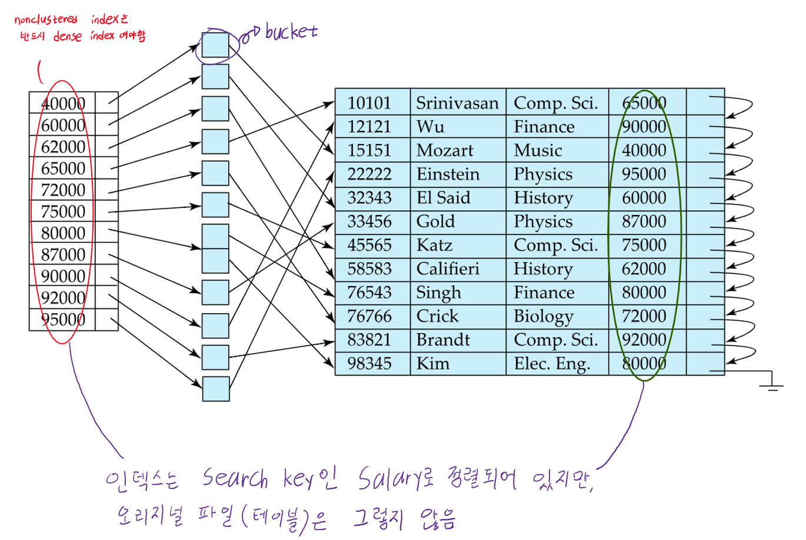

- 오리지널 data file의 정렬 순서가 index의 search key의 정렬순서와는 다를때 **Nonclustered index**라고 함
- **Secondary index**라고도 부름
- 위 사진의 nonclustered index의 search key는 후보키가 아니기때문에 특정 record를 고유하게 지정할 수 없음.   
  따라서 인덱스가 직접적으로 레코드포인팅을 하는 것이 아니라, 중간에 실제 record의 위치를 포인팅하는 **bucket을 포인팅**함  
  (후보키가 아니기때문에 한 search key에 해당하는 레코드가 여러개일 수 있기 때문)
- Nonclustered index는 반드시 **Dense index**여야 함
- Sequential scan은 Clustered index에서는 비교적 효율적이지만,  
  Nonclustered index에서는 상대적으로 효율이 좋지 않음
  - 최악의 경우 data가 저장된 block이 여기저기 흩어져 있으면 디스크 I/O가 비교적 자주 발생하기 때문

## 🔹Dense index

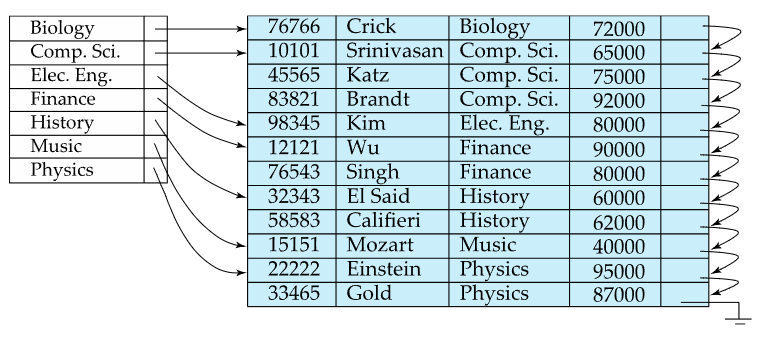  
**Clustered index**이면서 **Dense index**인 경우
{: .notice--primary}

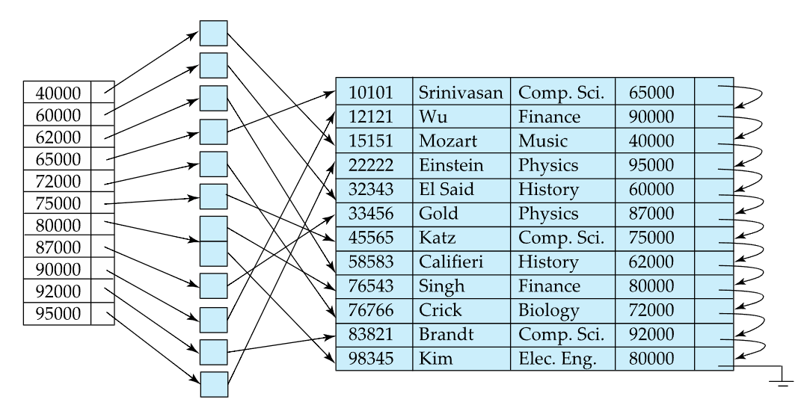  **Nonclustered index**이면서 **Dense index**인 경우
{: .notice--primary}

- data file의 search key의 값들이 index엔트리로 전부 존재하는 경우 **Dense index**라고 함
- Dense index가 꼭 레코드 수만큼의 엔트리가 있어야 하는것은 아님 (중복된 값이 있을 수 있어서)  
  첫번째 사진을 보면 테이블상에 존재하는 학과 이름이 전부 엔트리상에 등록되어있지만 엔트리의 수는 테이블의 레코드수보다 적은걸 알 수 있음
- dense index와 비교되는 것은 sparse index임

## 🔹Sparse index

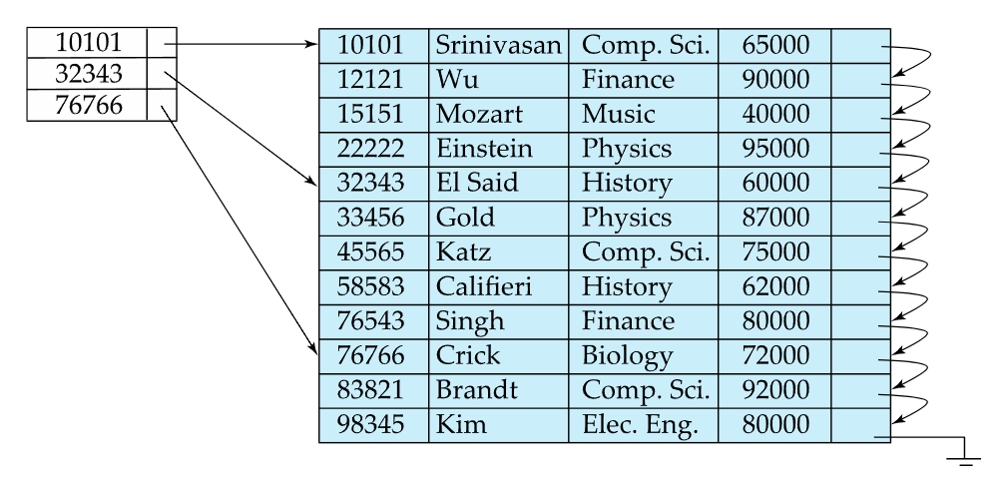

- data file의 search key값들중 일부만이 index엔트리로 존재하는 경우 **Sparse index**라고 함
- 그 특성상 **반드시 clustered index여야만 가능**함
- 위 사진을 예로, ID가 22222인 레코드를 찾고자하면 10101<22222<32343 이기때문에  
  10101에 해당하는 인덱스 엔트리의 포인터를 찾아가서 해당하는 블록부터 순차적으로 이동하며 찾게 됨
- 즉 search key가 K라면,  
  K값보다 작은것중에 최대값을 지닌 index record를 찾은 다음, 해당 인덱스 엔트리가 포인팅하는 블록을 가져온 뒤,  
  순차적으로 찾아가면 됨

## 🔹요약 이미지

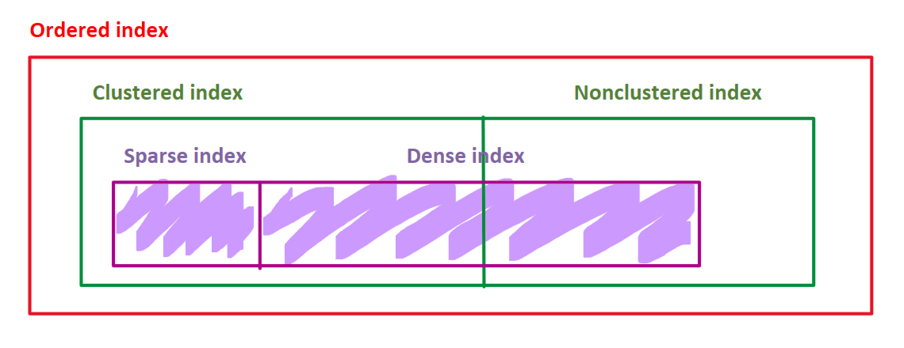

<br>

<br>

<br>

# ⚪<span style="color: #D6ABFA;">Index-sequential file</span>

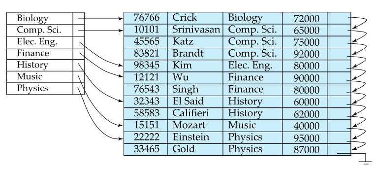

- [sequential file 구조](https://igh01gi.github.io/db/OrganizationOfRecordsInFiles/#sequential)를 지닌 데이터파일이, 특정 Search key로 정렬된 상태라고 했을때  
  해당 Search key에 대해서 Clustered index가 설정되어 있는 경우
- 순차파일접근 방식과 인덱스 접근 방식을 혼용하는 방식인데, 이것이 되려면 반드시 인덱스 자체가 Clustered index여야 함

<br>

<br>

<br>

# ⚪<span style="color: #D6ABFA;">Multilevel index</span>

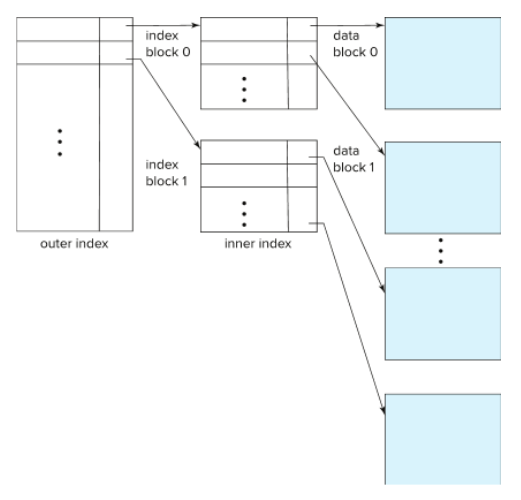

- 인덱스 자체도 용량이 커지면 메인메모리에 올리기 힘들기 때문에 Multilevel index를 사용함
  - **inner index** : 기존 index file
  - **outer index** : inner index의 sparse index
- **인덱스 자체를 sequential file로 간주**하고 그것 위에 **sparse index를 또 만드는 방식**을 말함
- 만약에 위 사진처럼 했음에도, outer index가 크다면, 또 새로운 level의 index를 생성하면 됨
- file에 레코드 삽입/삭제에 따른 index의 update가 필요하다는 부담은 당연히 생김

<br>

<br>

<br>

# ⚪<span style="color: #D6ABFA;">Hash Index</span>

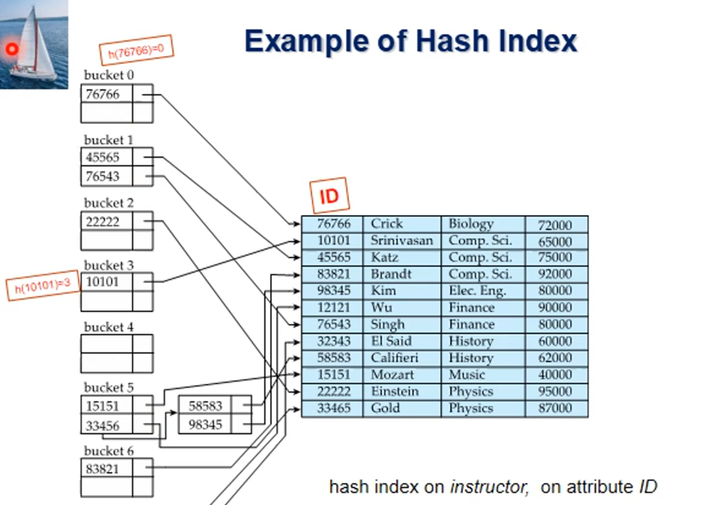

Ordered Index와 구분되는 또 다른 종류의 인덱스

Hash 함수를 이용한 Index

자세한 설명은 생략

<br>

<br>

<br>

# ⚪<span style="color: #D6ABFA;">SQL에서 Index</span>

- 인덱스 생성

  ```
  create index <index-name> on <relation-name>(<attribute-list>)
  
  ex : create index ID_idx on instructor(ID)
  ```

  복수개의 컬럼(`<attribute-list>`부분)을 한번에 인덱스로 지정할 수도 있음

- 인덱스 제거

  ```
  drop index <index-name>
  ```

  

<br>

<br>

<br>

# ⚪<span style="color: #D6ABFA;">상용 DBMS에서의 인덱스</span>

- 보통 상용 DBMS에서는 따로 인덱스를 생성하지 않아도 primary key에 대하여 인덱스를 자동으로 생성함
  - 질의검색 성능향상을 위해
  - INSERT문을 처리할때도 도움이 됨. (중복 판별. 특히 PK)
- 응용이 실제 사용되기 시작하면, 사용 정보를 바탕으로 인덱스를 추천해주는 툴들이 있음

<br>

<br>

<br>

# ⚪<span style="color: #D6ABFA;">unique index</span>

- create unique index를 하게 되면, 간접적으로 해당 유니크 인덱스의 search key가 후보키임을 명시함과 동시에 사용자가 실수로 중복되는 값을 삽입하는걸 막을 수 있음
  - SQL unique 무결성 제약이 지원되는 경우에는 필요없다고 써있긴 함

<br>

<br>

<br>

# ⚪<span style="color: #D6ABFA;">unique search key</span>

사용자가 a<sub>i</sub>를 search-key로 하는 인덱스를 만들었는데, a<sub>i</sub>가 non-unique한 속성이라고 하면, 

사용자가 알아차리지 못하게

PK 또는 

시스템 내부적으로 각 레코드에 부여되는 고유 식별자인 rowid 또는

a<sub>i</sub>와 조합해서 합성키가 되었을때 unique하게 될 수 있는 속성들을 조합하여서 

유니크한 합성키 (a<sub>i</sub>,A<sub>p</sub>)를 인덱스로 대신 생성한다.

이때 유니크하게 만들기위해서 갖다 붙이는 값을 **Uniquifier** 라고 함

## 🔹non-unique search key에 대해

non-unique search key는

리프 노드가 buckets을 포인팅하게해서 해당 bucket에서 여러 레코드들을 포인팅하는 방법 (bad)

리프노드에 포인터를 단일이 아닌 List of tuple pointers로 갖는 방법

등으로 구현할 수 있겠는데, 구현이 복잡해지고 단점들이 있기때문에 

보통은 위에서 설명했듯이 uniquifier를 추가해서 Unique search key로 만들음.
