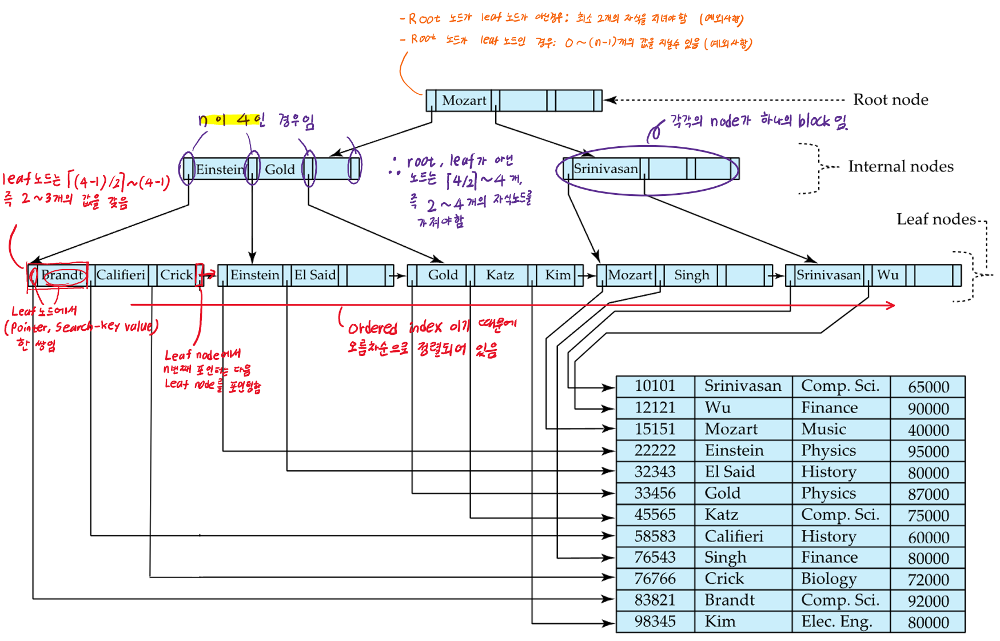
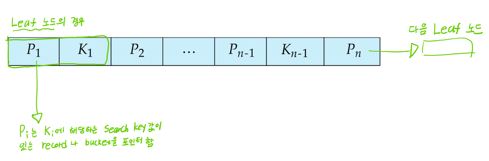
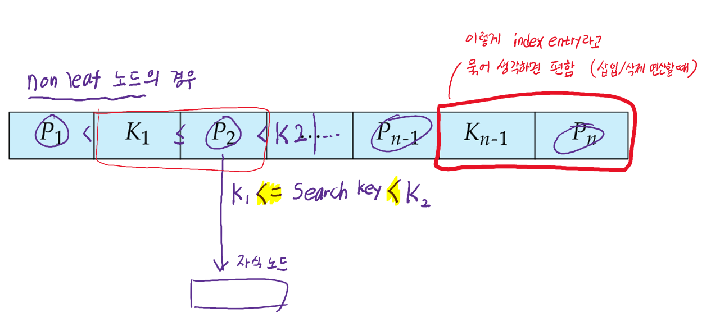
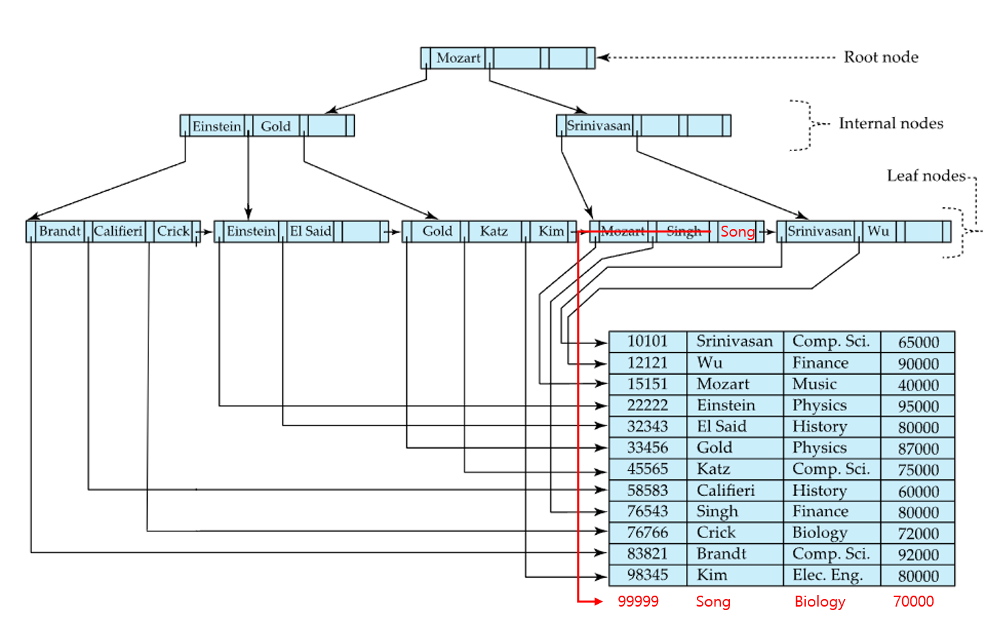

# ⚪<span style="color: #D6ABFA;">왜 사용하는가</span>

DB시템에서 인덱스를 저장할 때 가장 많이 사용하는 것이 **B+-Tree 인덱스 파일**임

- [indexed-sequential files](https://igh01gi.github.io/db/Index/#index-sequential-file)은 파일 크기가 커질수록 overflow block들이 생성되기때문에 성능이 안좋아짐. 따라서 주기적으로 전체 파일의 재조직이 필요함
- 이러한 단점을 줄이고자 대부분 B+ tree를 이용해서 index files을 생성하는데
  - 스스로 재구성 하는것을 적은 부담으로 자동으로 할 수 있고
  - 좋은 성능을 위해서 파일 전체를 재구성할 필요가 없게됨
- 그렇다고 B+ tree가 삽입/삭제에 따른 오버헤드가 전혀없는것은 아니고, 저장공간을 차지하는것도 맞지만 이점이 더 크기 때문에 널리 사용됨

<br>

<br>

<br>

# ⚪<span style="color: #D6ABFA;">특징</span>



- **디스크**에 저장되는 tree임
- **각각의 노드가 하나의 block** 임
- leaf node에서 root node까지의 길이가 모두 같은 **Balanced tree**임
- 아래에서 사용하는 **'n'**은 각 노드가 가질 수 있는 자식 노드의 maximum 수 (포인터의 수).  
  흔히 트리에서 **Branching factor** 또는 **fanout**이라고 함
- **root나 leaf node가 아닌 모든 노드**들은 **⌈n/2⌉ ~ n 개의 자식(children)**을 지닌다
- **leaf node**는 **⌈(n-1)/2⌉ ~ n-1개의 값(value)**을 지닌다
- **Root node**의 경우는
  - root 노드가 **leaf가 아닌 경우**, **최소 2개의 자식**을 갖어야 함
  - root 노드가 **leaf인 경우**, **0~(n-1)개의 값**을 지닐 수 있음
- 노드간 연결을 포인터로하기 때문에, 논리적으로는 가까운 블록일지라도 물리적으로 가까울 필요는 없다
- non-leaf level의 노드들(루트 포함)은 [Multilevel sparse index](https://igh01gi.github.io/db/Index/#multilevel-index)를 구성하고 있음
- B+ 트리의 number of levels(즉, 높이)는 그렇게 높지 않음
  - Level below root has at least 2 * ⌈n/2⌉ values
  - Next level has at least 2 * ⌈n/2⌉ * ⌈n/2⌉ values
  - .. etc.
  - 결론적으로, 파일에 **K개의 search-key 값**들이 있다면, tree의 높이는 **⌈log<sub>⌈n/2⌉</sub>(K)⌉**보다 높지 않음
  - 따라서 검색이 효율적으로 수행될 수 있음
- logarithmic time안에 인덱스를 재구성할 수 있으므로, 메인 데이터 파일에 대한 삽입/삭제가 효율적으로 행해질 수 있음

## 🔹노드의 구조

- K<sub>i</sub>는 **search-key value**를 의미함

- P<sub>i</sub>는 **포인터**

- **Leaf node**인 경우

  - 

  -  P<sub>i</sub>는 K<sub>i</sub>에 해당하는  record나 records들의 bucket을 포인터함
  - search-key는 오름차순 정렬하기 때문에 i<j 라고 하면, i번째 노드들의 search key 값은 항상 j번째 노드들의 search key값들보다 작은 값임 (중복의 경우 나중에 따로 다루므로 고려 X)
  - P<sub>n</sub>은 다음 leaf 노드를 포인터함

- **Non-leaf node**의 경우

  - 
  - P<sub>i</sub>는K<sub>i-1</sub>이상이고 K<sub>i</sub>보다 작은 search key들을 지니는 자식을 포인터함. (K<sub>i-1</sub> <= P<sub>i</sub> < K<sub>i</sub>)

 <br>

<br>

<br>

# ⚪<span style="color: #D6ABFA;">삽입</span>

## 🔹 리프노드에 공간 O



- 해당하는 리프노드에 공간이 있다면 (v = "Song", pr)을 삽입하고 끝

## 🔹리프노드에 공간 X

```
꽉 차서 더 삽입할 수 없는 노드를 **오버플로우 노드**라고 함  
non-leaf node에 있는 값들은 search key라고도 하지만 **분할값(split value)**이라고도 함  
```

- 꽉찬 리프노드에 새로 삽입하려는 (v,pr)을 삽입했다고 가정했을때, 새로 넣은걸 포함해서 리프노드에 n개의 짝```(search key valuye, pointer)```이 있으면, ⌈n/2⌉개의 쌍은 기존 노드에 유지시키고, 나머지는 새로운 노드를 생성해서 옮김
- 새로 생성된 노드는 **오버플로우 노드의 오른쪽**에 형제노드로써 생성됨
- 새로 생성된 노드의 가장 좌측 
