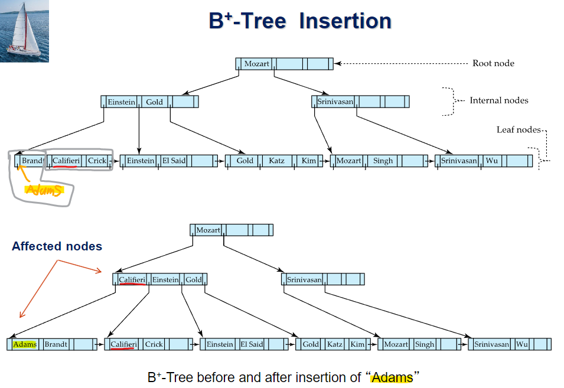
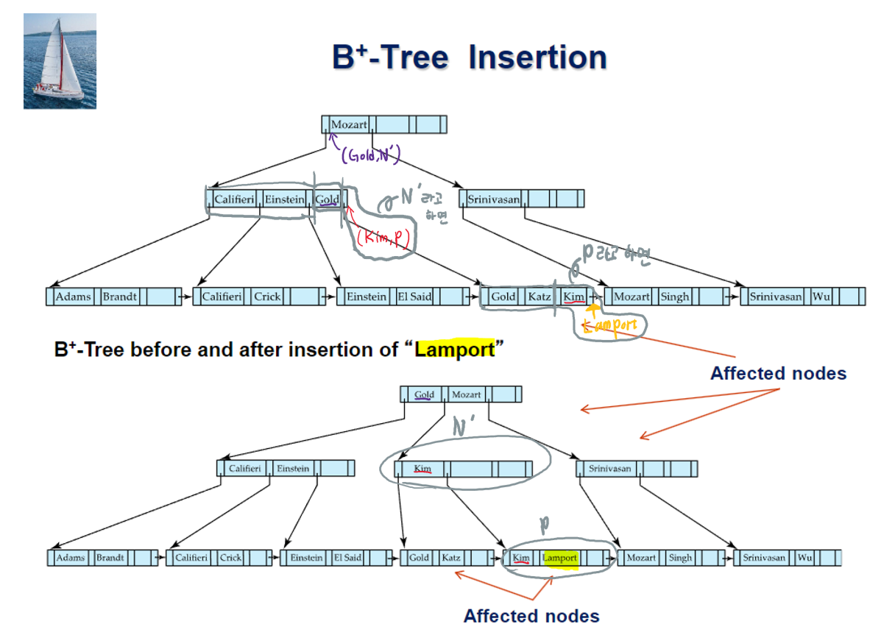
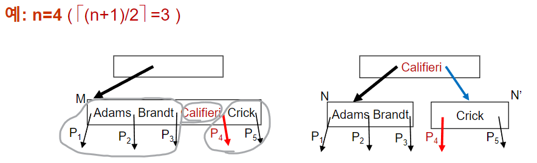
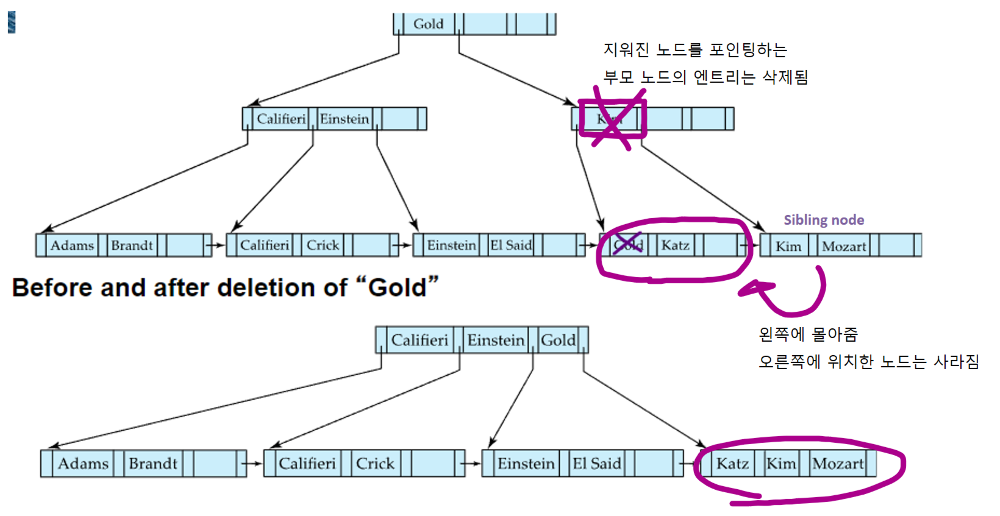
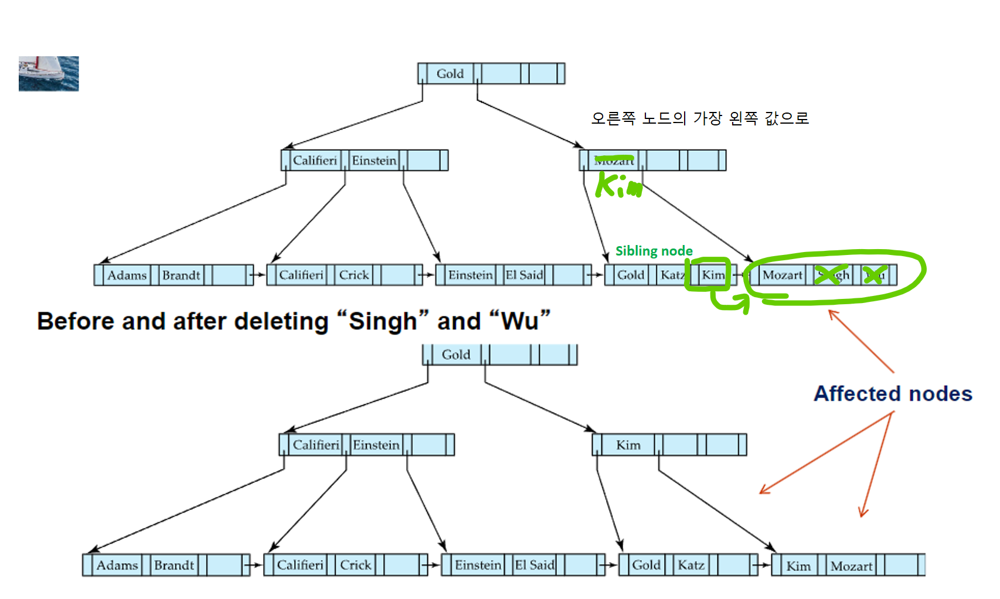
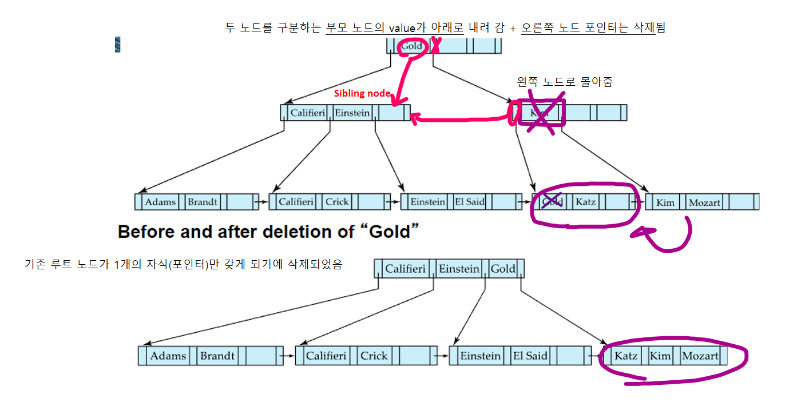
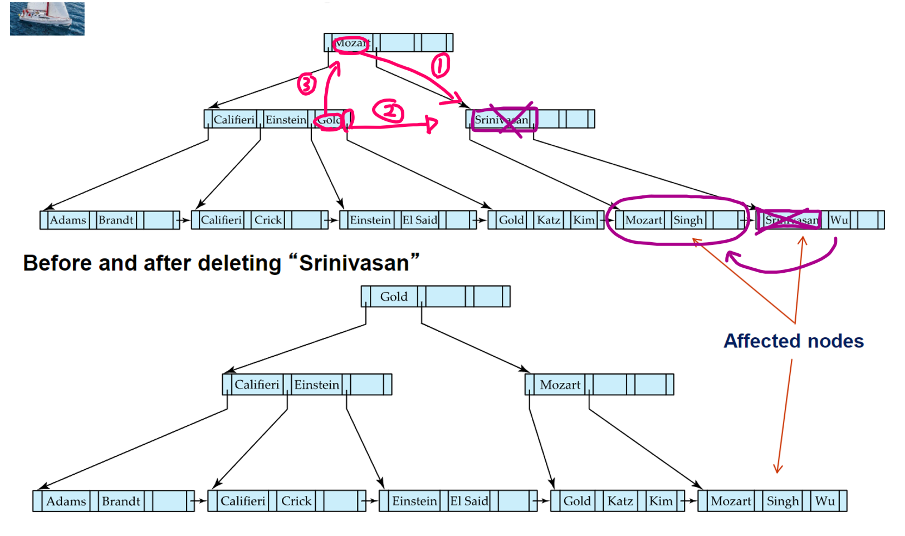
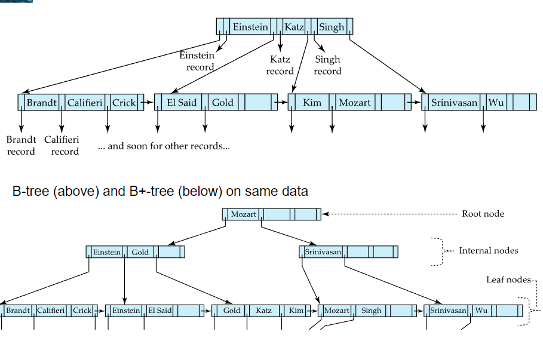
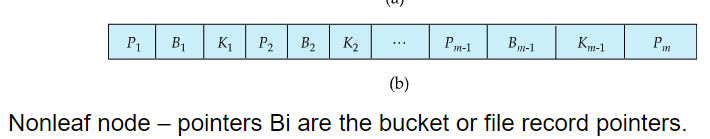

# ⚪<span style="color: #D6ABFA;">왜 사용하는가</span>

DB시스템에서 인덱스를 저장할 때 가장 많이 사용하는 것이 **B+-Tree 인덱스 파일**임

- [indexed-sequential files](https://igh01gi.github.io/db/Index/#index-sequential-file)은 파일 크기가 커질수록 overflow block들이 생성되기때문에 성능이 안좋아짐. 따라서 주기적으로 전체 파일의 재조직이 필요함
- 이러한 단점을 줄이고자 대부분 B+ tree를 이용해서 index files을 생성하는데
  - 스스로 재구성 하는것을 적은 부담으로 자동으로 할 수 있고
  - 좋은 성능을 위해서 파일 전체를 재구성할 필요가 없게됨
- 그렇다고 B+ tree가 삽입/삭제에 따른 오버헤드가 전혀없는것은 아니고, 저장공간을 차지하는것도 맞지만 이점이 더 크기 때문에 널리 사용됨

<br>

<br>

<br>

# ⚪<span style="color: #D6ABFA;">특징</span>


- **디스크**에 저장되는 tree임
- **각각의 노드가 하나의 block** 임
- leaf node에서 root node까지의 길이가 모두 같은 **Balanced tree**임
- 아래에서 사용하는 **'n'**은 각 노드가 가질 수 있는 자식 노드의 maximum 수 (포인터의 수).  
  흔히 트리에서 **Branching factor** 또는 **fanout**이라고 함
- **root나 leaf node가 아닌 모든 노드**들은 **⌈n/2⌉ ~ n 개의 자식(children)**을 지닌다
- **leaf node**는 **⌈(n-1)/2⌉ ~ n-1개의 값(value)**을 지닌다
- **Root node**의 경우는
  - root 노드가 **leaf가 아닌 경우**, **최소 2개의 자식**을 갖어야 함
  - root 노드가 **leaf인 경우**, **0~(n-1)개의 값**을 지닐 수 있음
- 노드간 연결을 포인터로하기 때문에, 논리적으로는 가까운 블록일지라도 물리적으로 가까울 필요는 없다
- non-leaf level의 노드들(루트 포함)은 [Multilevel sparse index](https://igh01gi.github.io/db/Index/#multilevel-index)를 구성하고 있음
- B+ 트리의 number of levels(즉, 높이)는 그렇게 높지 않음
  - Level below root has at least 2 * ⌈n/2⌉ values
  - Next level has at least 2 * ⌈n/2⌉ * ⌈n/2⌉ values
  - .. etc.
  - 결론적으로, 파일에 **K개의 search-key 값**들이 있다면, tree의 높이는 **⌈log<sub>⌈n/2⌉</sub>(K)⌉**보다 높지 않음
  - 따라서 검색이 효율적으로 수행될 수 있음
- logarithmic time안에 인덱스를 재구성할 수 있으므로, 메인 데이터 파일에 대한 삽입/삭제가 효율적으로 행해질 수 있음

## 🔹노드의 구조

- K<sub>i</sub>는 **search-key value**를 의미함

- P<sub>i</sub>는 **포인터**

- 리프노드는 **(P<sub>i</sub>, K<sub>i</sub>)가 인덱스 엔트리**지만, non-리프노드는 **(K<sub>i</sub>, P<sub>i+1</sub>)이 인덱스 엔트리**임

- **Leaf node**인 경우
  - 
  
  -  P<sub>i</sub>는 K<sub>i</sub>에 해당하는  record나 records들의 bucket을 포인터함
  - search-key는 오름차순 정렬하기 때문에 i<j 라고 하면, i번째 노드들의 search key 값은 항상 j번째 노드들의 search key값들보다 작은 값임 (중복의 경우 나중에 따로 다루므로 고려 X)
  - P<sub>n</sub>은 다음 leaf 노드를 포인터함
  
- **Non-leaf node**의 경우

  - 
  - P<sub>i</sub>는K<sub>i-1</sub>이상이고 K<sub>i</sub>보다 작은 search key들을 지니는 자식을 포인터함. (K<sub>i-1</sub> <= P<sub>i</sub> < K<sub>i</sub>)

 <br>

<br>

<br>

# ⚪<span style="color: #D6ABFA;">삽입</span>

## 🔹리프노드에 공간 O


- 해당하는 리프노드에 공간이 있다면 (v = "Song", pr)을 삽입하고 끝

## 🔹리프노드에 공간 X



```
꽉 차서 더 삽입할 수 없는 노드를 **오버플로우 노드**라고 함  
non-leaf node에 있는 값들은 search key라고도 하지만 **분할값(split value)**이라고도 함  
```

- 꽉찬 리프노드에 새로 삽입하려는 (v,pr)을 삽입했다고 가정했을때, 새로 넣은걸 포함해서 리프노드에 n개의 짝```(search key valuye, pointer)```이 있으면, ⌈n/2⌉개의 쌍은 기존 노드에 유지시키고, 나머지는 새로운 노드를 생성해서 옮김
- 새로 생성된 노드는 **오버플로우 노드의 오른쪽**에 형제노드로써 생성됨
- 새로 생성된 노드를 p, p의 가장 왼쪽 값을 k라고 할때, **(k,p)엔트리 를 부모노드에 삽입**. 이때 삽입 위치는 **오버플로우 노드를 포인팅하던곳의 바로 오른쪽**

<br>

만약 이때, 부모노드가 꽉 찬 상태라면, 이러한 split 과정을 꽉 차지 않은 노드가 나타날때까지 위로 계속 해 나감

최악의 경우에는 root node가 split되어서 tree의 height가 1 증가하게 됨

아래에서 이러한 non-leaf node에 삽입하는 방법을 설명함

## 🔹non-리프노드에 공간 X





(k,p) 인덱스 엔트리를 이미 꽉차 있는 non-leaf node인 N에 삽입할때

- 기존 노드 N의 포인터의 개수가 n개, search key의 개수가 n-1이라고 했을때,   
  메모리 공간상에 **n+1개의 포인터**, **n개의 search key**를 갖는 **임시 노드 M**을 생성하고,  
  기존 **노드 N의 값들을 복사**한다
- (k,p) 를 M에다가 삽입한다. (M은 인덱스엔트리 1개가 더 들어갈 수 있도록 늘어난 상태임)
- 임시노드 M에서 **P1, K1, …, K<sub>⌈(n+1)/2⌉-1</sub>, P<sub>⌈(n+1)/2⌉</sub>** 을 복사해서 노드N에다가 붙여넣어 다시 구성한다
- 임시노드 M에서 **P<sub>⌈(n+1)/2⌉+1</sub>, K<sub>⌈(n+1)/2⌉+1</sub>, ..., K<sub>n</sub>, P<sub>n+1</sub>** 을 복사해서 새로운 노드 N'을 구성한다
- (K<sub>⌈(n+1)/2⌉</sub>,N') 인덱스 엔트리를 노드N의 부모 노드에 삽입한다. 이때 이때 삽입 위치는 **오버플로우 노드를 포인팅하던곳의 바로 오른쪽**

 <br>

<br>

<br>

# ⚪<span style="color: #D6ABFA;">삭제</span>

```
[underflow (=under-full)란?]

('n'은 각 노드가 가질 수 있는 자식 노드의 maximum 수 (포인터의 수))
- root나 leaf node가 아닌 모든 노드들은 ⌈n/2⌉ ~ n 개의 자식(children,포인터)을 지닌다
- leaf node는 ⌈(n-1)/2⌉ ~ n-1개의 값(value)을 지닌다
- Root node의 경우는
  - root 노드가 leaf가 아닌 경우, 최소 2개의 자식을 갖어야 함
  - root 노드가 leaf인 경우, 0~(n-1)개의 값을 지닐 수 있음
  
노드의 엔트리가 삭제되었을때 위 조건을 만족하지 못하게 되면 underflow가 발생했다고 함
```

파일에서 레코드가 이미 지워졌을때, V를 해당 레코드의 search-key value, Pr을 해당 레코드에 대한 포인터라고 가정한다.

## 🔹리프노드 underflow X

- 리프노드에서 (Pr, V)를 지워도 underflow가 발생하지 않았다면 그대로 삭제 과정 종료

## 🔹리프노드 underflow O

underflow를 대응하는 방법에는 **1. 병합(merging)** 과 **2. 재분배(redistribution)**가 있다

merging을 먼저 시도하고, 불가능하다면 redistribution을 시도

### 🔸리프노드 merging



- 리프노드에서 (Pr, V)를 지웠을때 underflow가 발생했다면 먼저 merging을 시도. 그 방법은 아래와 같음
- 먼저 sibling node를 찾는다
- 본인과, sbling node중에 왼쪽에 있는곳으로 값을 몰아준다
- 오른쪽에 있던 노드는 텅 비었기 때문에 삭제함
- 삭제된 노드를 포인팅하는 부모노드의 인덱스 엔트리를 삭제함

### 🔸리프노드 redistribution



- 리프노드에서 (Pr, V)를 지웠을때 underflow가 발생했고, merging이 불가능한 상황이라면 redistribution을 시도. 그 방법은 아래와 같음
- 먼저 sibling node를 찾는다
- 본인과 sibling node 둘다 최소 엔트리 갯수 조건을 충족하도록 엔트리를 분배한다
- 해당하는 부모노드의 엔트리에서 search-key value를 오른쪽 자식노드의 가장 왼쪽 값으로 수정한다

## 🔹non-리프노드 merging



빨간색 부분을 주목

- non-leaf node에서 underflow가 발생하면, 먼저 merging을 시도함. 그 방법은 아래와 같음
- 먼저 sibling node를 찾는다
- underflow가 발생한 노드와 sibling node를 구분하는 부모노드의 split value를 왼쪽 자식노드쪽으로 옮긴다
- 오른쪽 노드속 내용들을 왼쪽 노드로 옮긴다
- 이 과정에서 루트 노드가 1개의 자식(포인터)만을 갖게 된다면, 해당 루트 노드는 삭제된다 (새로운 루트노드 탄생)

## 🔹non-리프노드 redistribution



빨간색 부분을 주목

- non-leaf node에서 underflow가 발생했고 merging이 불가능하면 redistribution을 시도. 그 방법은 아래와 같음
- 먼저 sibling node를 찾는다
- 1# underflow가 발생한 노드와 sibling node를 구분하는 **부모노드의 split value**를 오른쪽 자식노드의 가장 왼쪽으로 옮긴다
- 2# 왼쪽 노드의 비어있지 않은 엔트리중 가장 오른쪽 엔트리의 **포인터**를 오른쪽 노드의 가장 왼쪽으로 옮긴다
- 3# 왼쪽 노드의 비어있지 않은 엔트리중 가장 오른쪽 엔트리의 **split-value**를 비어있게 된 부모노드의 split value자리로 옮긴다
- 1~3의 과정을 최소 엔트리 갯수 조건을 충족할때까지 반복한다

<br>

<br>

<br>

# ⚪<span style="color: #D6ABFA;">Complexity of updates</span>

- 단일 엔트리 삽입 및 삭제 비용(I/O 작업이라는 면에서)은 트리의 높이에 비례함
  - K개의 엔트리가 있고 최대 fanout(포인터 갯수 일듯)이 n일떄,  
    엔트리의 worst case complexity of insert/delete는 **O(log<sub>⌈n/2⌉</sub>(K))**
- 실제로는 I/O작업의 횟수는 더 적음
  - 내부 노드가 버퍼에 있는 경향이 있고
  - split과 merge는 드물게 발생하고, 대부분의 insert,delete 작업은 리프노드에만 영향을 끼치기 때문

<br>

<br>

<br>

# ⚪<span style="color: #D6ABFA;">B - Tree와의 차이</span>



- B - Tree는 search-key 값을 중복 없이 한번만 등장하게 함
-   
  non-leaf node에도 search-key에 해당하는 실제 레코드(bucket or file record) 포인터 정보를 추가적으로 들고 있음

## 🔹B - Tree 장점

- B+ - Tree에 비해서 적은 노드를 사용 가능함
- 가끔 leaf node에 도달하기 전에 search-key를 찾아서 레코드 접근 가능

## 🔹B - Tree 단점

- search-key가 일찍 찾아지는건 매우 일부분임
- non-leaf node가 더 크기 때문에 fan-out(자식 수)가 상대적으로 적어서 depth가 더 커지게 됨
- 삽입 삭제가 더 복잡하고, 범위 질의문같은걸 처리할때 리프노드만 쭉 보면 되는 B+ Tree와 달리 상대적으로 복잡한 과정을 거쳐야 함
- 보통 이러한 단점이 장점을 상쇄할 정도로 크다고 여겨짐

<br>

<br>

<br>

# ⚪<span style="color: #D6ABFA;">Index rebuild</span>

인덱스를 만들어놓고 사용하다보면 점차 인덱스의 성능이 떨어지는 것을 확인할 수 있음.

그렇기 떄문에 대부분의 상용 DBMS시스템들은 Index rebuild기능을 제공하고 있음.

왜냐하면 B+ 트리를 보면, 초기에 인덱스가 생성되었을때는 논리적으로 가까운 노드들이 물리적으로도 가까운 위치에 있을 가능성이 높음  
(하드디스크상에서 같은 track, cylinder 상에 있을 확률 높음. = Seek time 관련)

그러나 시간이 지나면서 삽입/삭제에 따른 노드들의 병합이라던지 분할등이 일어나면서 논리적으로는 가깝지만 다른 track, sylinder에 있을 가능성이 높아지면서 Seek time이 증가하게됨. 

