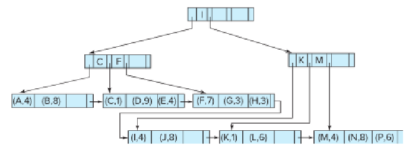
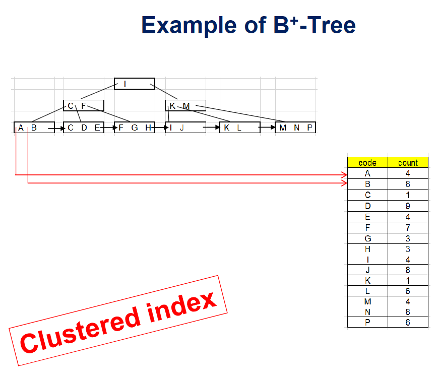
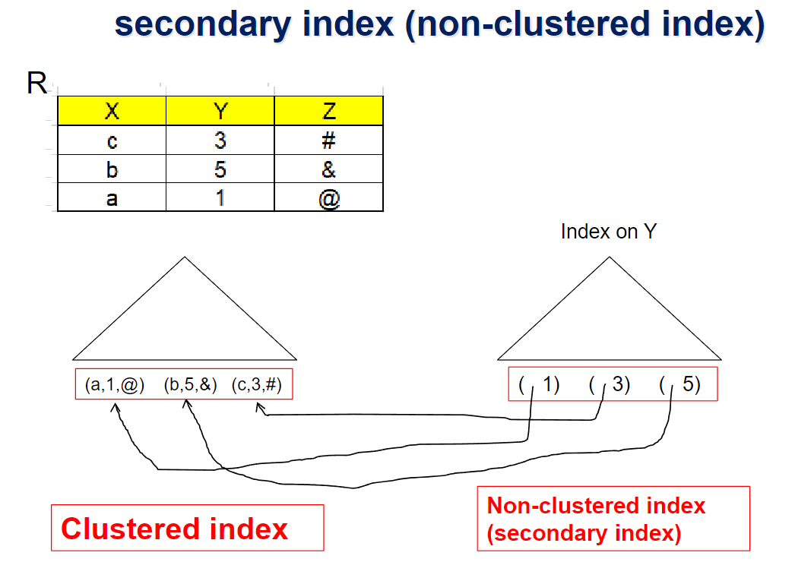
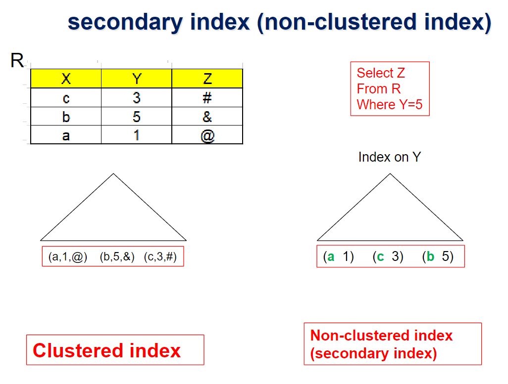

# ⚪B+ Tree File Organization은 무엇인가

- **리프노드**에 레코드에 대한 포인터가 아닌, **실제 레코드 값 자체**를 저장하는 경우
- insertion, deletioni, update가 발생해도 data records가 clustered 되도록 할 수 있음. 당연히 clustered index가 됨
-    
  [sequential file](https://igh01gi.github.io/db/OrganizationOfRecordsInFiles/#sequential){:target="_blank"}방식을 사용하여 데이터파일 따로 B+ 인덱스 파일 따로하여 Clustered index를 구현하는 방식은,   
  sequential file의 특성상 레코드의 논리적 순서와 물리적 순서가 일치하지 않게 되어, 때때로 reorganization을 해서 그 둘의 순서를 맞춰주는데 이는 부담이 되는 작업임
- 따라서  상용 DBMS에서 이 B+ Tree File Organization 구조가 많이 채택되고 있음
- 근본은 B+ 트리이기 때문에 Leaf nodes는 여전히 절반 이상 채워져 있어야한다는 조건을 만족해야 함
- 레코드의 삽입,삭제는 B+ tree index의 삽입 삭제에서 행하는 방식과 동일하게 처리됨
- 포인터보다 레코드가 더 많은 공간을 차지하기 때문에 공간 활용도가 높아야하는데, 이를 위해서 상용 DBMS들은 **B* tree**를 많이 사용함
  - **B* Tree**는 공간 요건이 노드당 2/3이상 full
  - 노드에 삽입상황에서 overflow났을때, B* tree는 바로 split하지 않고 형제 노드의 빈공간을 최대한 이용함(그곳에 넣음)
  - 그러다가 형제노드도 다 가득찼다면, 가득찬 형제노드 2개를 3개로 분할함 (2/3씩)

 

 

 

# ⚪Non-clustered index(secondary index)를 사용하게 되면 생기는 문제

## 🔹문제점 

X에 대한 B+ Tree File Organization일때, Y 속성에대해서 non-clustered index를 만들었다고 가정하자 

이때, 위처럼 해당하는 리프노드를 포인팅하는 방식으로 구현하면   
레코드가 저장되어있는 clustered index의 리프노드가 분할이라던가 재분배 등이 일어날때마다 non-clustered index의 포인터도 업데이트 되어야 하는 문제가 있음

## 🔹해결법

Non-clustered index에서 레코드 포인터대신   
B+ Tree File Organization의 **search key**를 사용하면 됨!

- 레코드를 찾기 위해서 추가적인 traversal of file organization이 생긴다는 단점이 있긴 함  
  (위 사진의 경우 Y=5로 탐색했을때 나온 search key가 b이기 떄문에 이를 사용해서 다시 검색해야 함)
- 만약에 B+ Tree File Organization의 **search key**가 non-unique하다면 record-id를 추가
