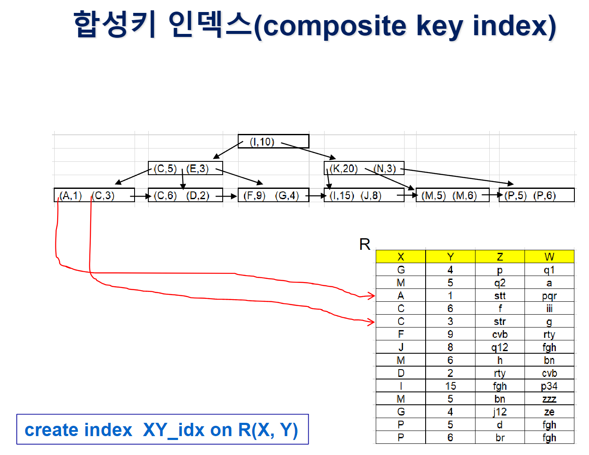
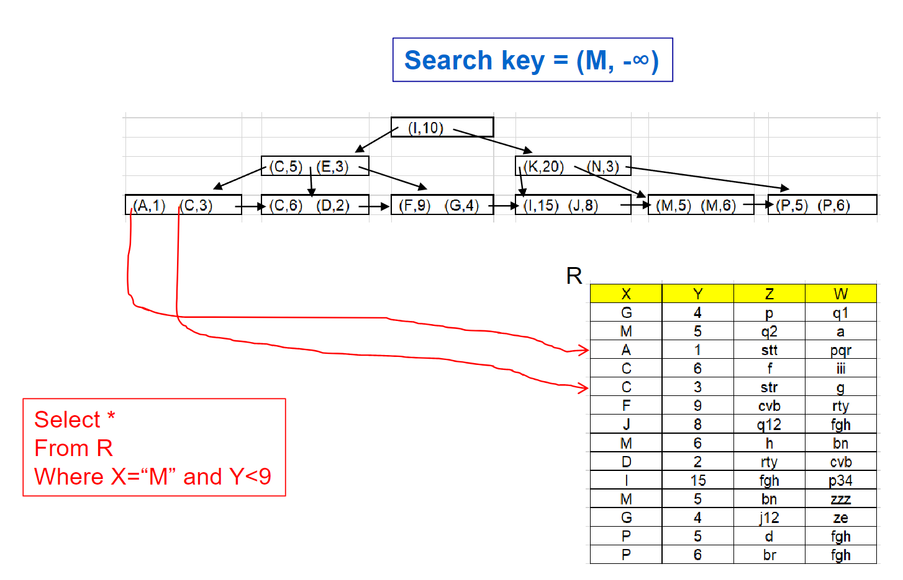
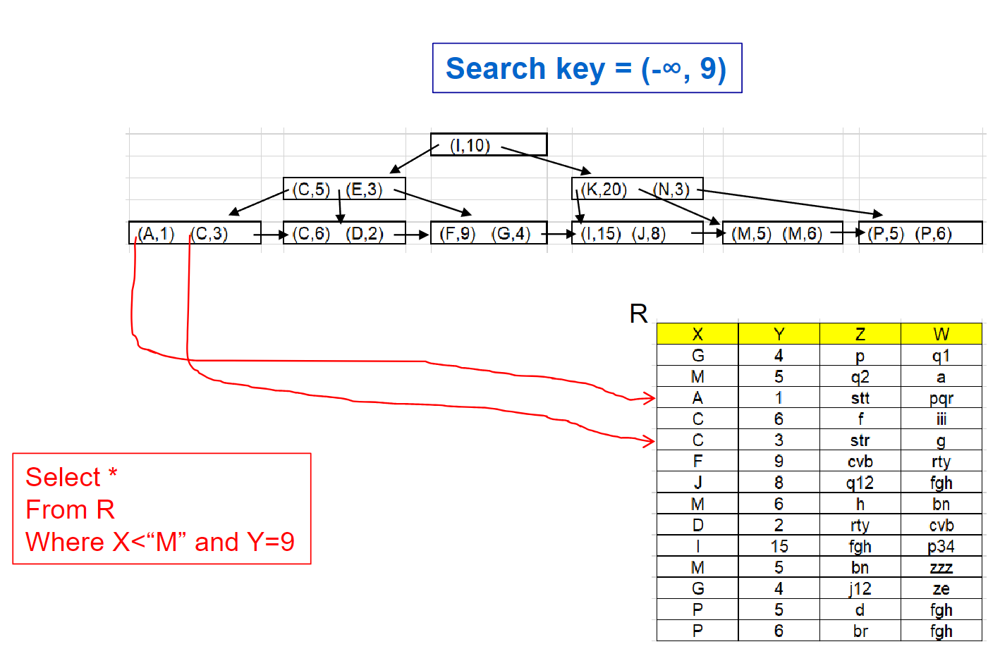

# ⚪<span style="color: #D6ABFA;">합성키 인덱스를 왜 쓰는가</span>



```sql
SELECT ID
FROM instructor
WHERE dept_name = “Finance” AND salary = 80000
```

합성키 인덱스를 사용하지않으면 

1. dept_name 단일 인덱스로 학과가 Finance인 교수를 모두 찾은 다음에 salary = 80000인걸 찾는다
2. salary 단일 인덱스로 salary가 80000인  교수를 모두 찾은 다음 dept_name = "Finance" 인걸 찾는다
3. dept_name 단일 인덱스에서 학과가 Finance인 교수 포인터를 구하고, salary 단일 인덱스로 salary가 80000 교수 포인터를 구한담에 둘의 교집합을 구한다

그러나 합성키 인덱스는 **search-key** 자체를 (dept_name , salary) 이런식으로 합성키 조합으로 하여서 효율적으로 레코드를 검색할 수 있게 됨.

## 🔹주의 사항

그러나 합성키 인덱스의 특성상, 그 **구성 순서도 매우 중요**함! 

```sql
CREATE INDEX dept_salary_idx ON instructor(dept_name,salary)
```

로 합성키 인덱스를 구성했을때,

```sql
WHERE dept_name = "Finance" AND salary = 80000
WHERE dept_name = "Finance" AND salary < 80000
```

의 조건은 위 합성키 인덱스에서 효율적으로 지원 가능하지만 

```sql
WHERE dept_name < "Finance" AND salary = 80000
```

의 조건은 상대적으로 많은 레코드의 fetch가 필요하기 때문에 비효율적이게 된다

(그 이유는 합성키 인덱스의 search-key를 비교하는 방식때문. 바로 아래 참고)

<br>

<br>

<br>

# ⚪<span style="color: #D6ABFA;">합성키 인덱스 값 비교</span>

(a1, a2), (b1, b2) 를 예로 들면

- a1 < b1 이라면, a2,b2값에 상관없이 (a1, a2) < (b1, b2)
- 만약 a1 = b1 이라면 a2 와 b2를 비교하여 a2 < b2라면  (a1, a2) < (b1, b2)

<br>

<br>

<br>

# ⚪<span style="color: #D6ABFA;">범위 검색시</span>

<div style="display: flex;">
    
    
</div>

위와같이 search-key로 -∞를 사용할 때가 있는데, 

해당 컬럼에 올수있는 가장 작은값을 메타데이터에 저장해놓는 등으로 기억한 값을 사용하는 것임

<br>

<br>

<br>

# ⚪<span style="color: #D6ABFA;">Covering index</span>

- Leaf node에 <레코드 pointer, Search key 값>의 인덱스 엔트리만 들어있는 것이 아닌, some attributes 값을 저장하는 것
- 즉, <레코드 pointer, Search key값, some other attribute values>, ...
- **장점**은 만약 index on instructor(ID)이고 커버링 인덱스가 <레코드 포인터, ID값, salary값>일때, SELECT salary FROM instructor WHERE ID=10101 과 같을때 레코드 포인터를 이용할 필요 없이 **리프노드만 보고 바로 결과**를 리턴 가능함

## 🔹합성키 인덱스와 비교

합성키 인덱스도 커버링 인덱스와 마찬가지로 SELECT절에 따라서 리프노드만 보고 바로 결과 리턴이  가능하지만, 

합성키 인덱스는 **non-leaf node**에 search-key가 1개가 아니라 복수개기 때문에, 

상대적으로 covering index의 경우가 non-leaf node에서 더 많은 fanout (자식의 갯수)을 갖을 수 있게 되어 height가 더 짧을 가능성이 있음
