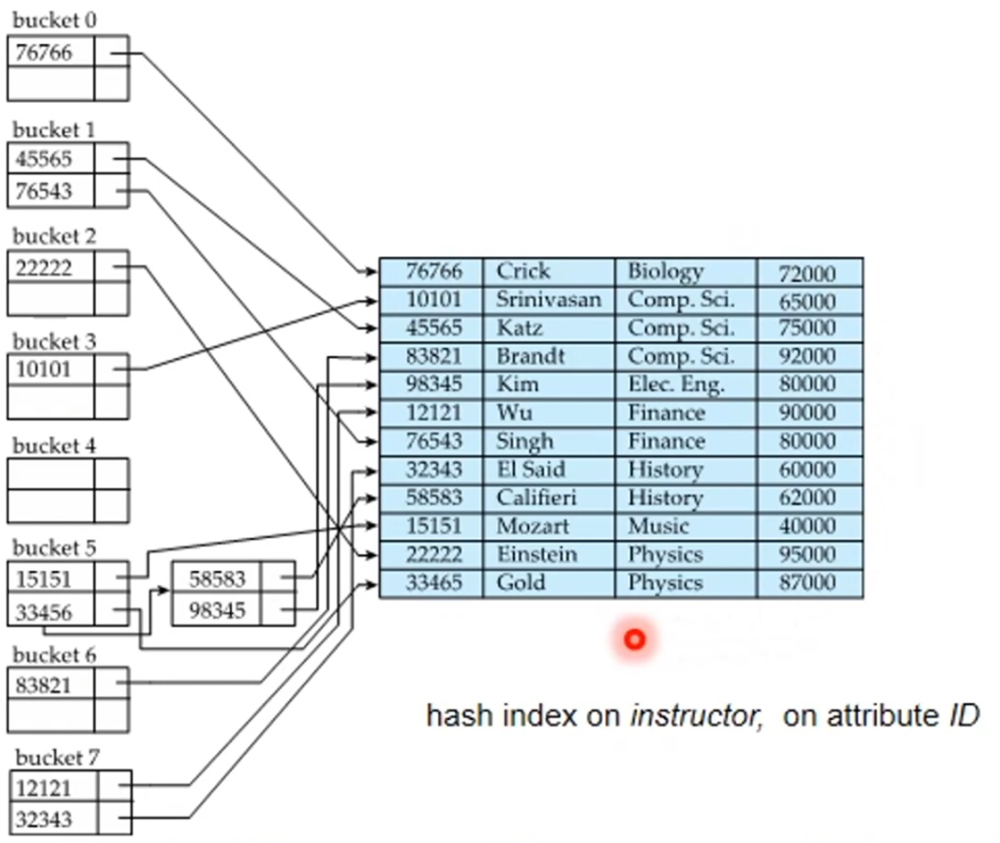
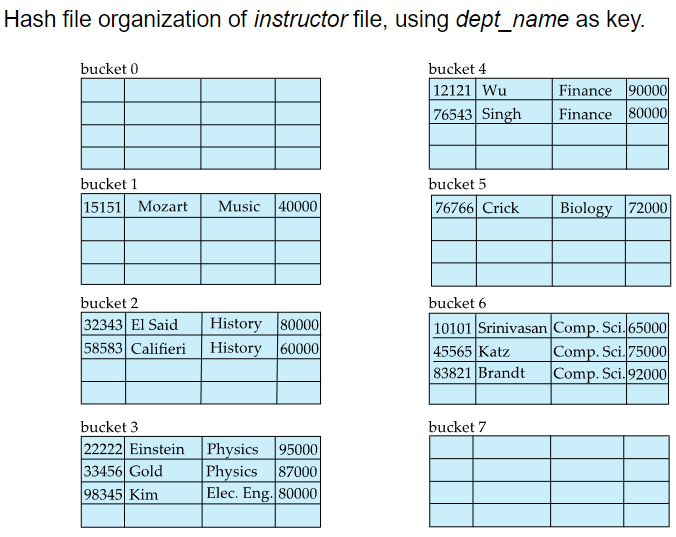
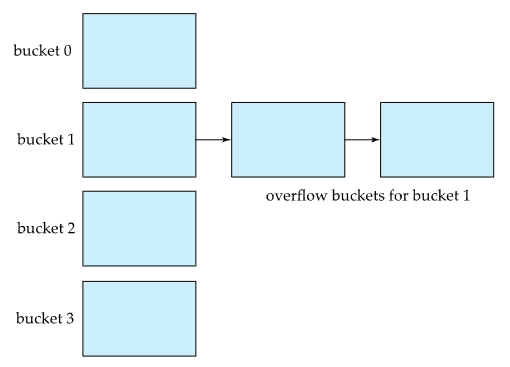

# ⚪Static Hashing

보통 Hashing이라고만 말하면 Static Hashing을 의미하는 것임

- **bucket**은 1개 이상의 엔트리를 포함하고, 보통 bucket 1개가 disk block 1개임
- h가 해시함수라 했을때 h(k1)=h(k2), k1≠k2면 k1과 k2는 **동의어**라함 (**synonym**)
  - 동의어가 발생할때 충돌(collison)이 발생했다고 함
- 해시 함수는 대표적으로 모듈러 함수를 이용해서 많이 함 
  - h(k) = k mod 10 ...이런식(버켓이 10개일 경우. 0~9번 버켓으로 분배해줌)
-     
  **hash index**에서는 bucket이 레코드에 대한 포인터를 갖는 엔트리를 저장하고 있음
-   
  **hash file-organization**에서는 bucket이 레코드 자체를 저장하고 있음

 

 

 

# ⚪Bucket Overflows

버켓이 불충분하거나, 레코드가 특정 값만 너무 많이 갖고 있다거나, 해시 함수가 균등히 분배를 못하는 등의 상황때 발생함.

overflow bucket을 완전히 막을순 없고 이를 적절히 다루는 방법이 있음

## 🔹Overflow chaining (closed addressing)

bucket이 overflow되면 위 그림처럼 링크를 걸어서 이어주는 기법

**closed addressing** 이라고도 불림

## 🔹Open addressing

보통 db에서는 사용되지 않는 방법인데, 오버플로우 체인처럼 추가 공간을 마련하지않고 기존 파일의 있는 공간을 최대한 활용하는 방법임.

여러가지 방법이 있긴함.
