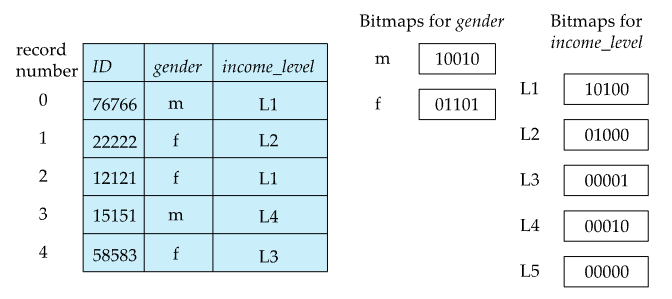

# ⚪Bitmap Index

- 각 Bitmap은 레코드의 개수만큼의 비트로 이루어짐
- 1이면 해당 값이 있다는것이고 0이면 해당 값이 없다는 것
- 비트맵 특성상 AND, OR, NOT 등의 연산에 유리하기 때문에, 여러 속성에 대한 쿼리에서 유용함
- Males with income level L1: 10010 AND 10100 = 10000
- 해당하는 결과를 counting하는 것은 심지어 더 빠름 (결과의 1 갯수만 세면 되니까)
- 만약에 어떤 레코드가 **삭제**되었을때는, 중간의 비트를 지워서 한칸씩 모두 땡기는건 비효율적임!
  - 따라서 **Existence bitmap**을 사용하여서, 레코드가 삭제된 부분은 0을, 그렇지 않으면 1이 들어있음
  - 이 Existence bitmap을 최종 결과에다가 마지막으로 AND연산을 해야지 비로소 진짜 존재하는 결과를 얻을 수 있음

## 🔹 공간 효율성

테이블 사이즈대비 비트맵 인덱스가 차지하는 비율이 매우 작음

예를들어 레코드 하나의 크기가 100bytes, number of distinct attribute가 8이라면

- 레코드 수: n
- Relation 크기(bit) : n * 100 bytes = 800n bits
- Bitmap index 크기 : n bits

 bitmap index는 8n/800n = 1% , 즉 테이블 크기 대비 1%의 공간으로 표현 가능함

