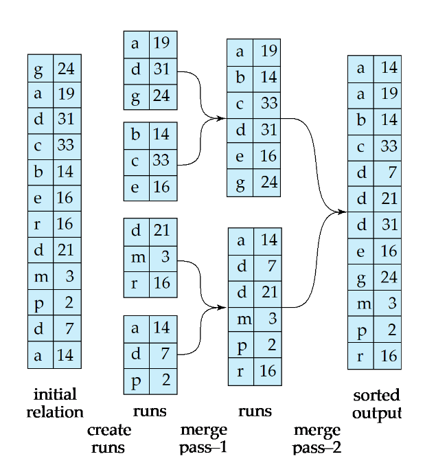
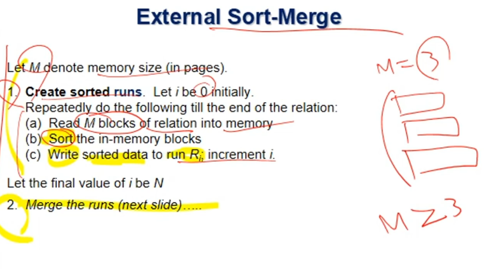
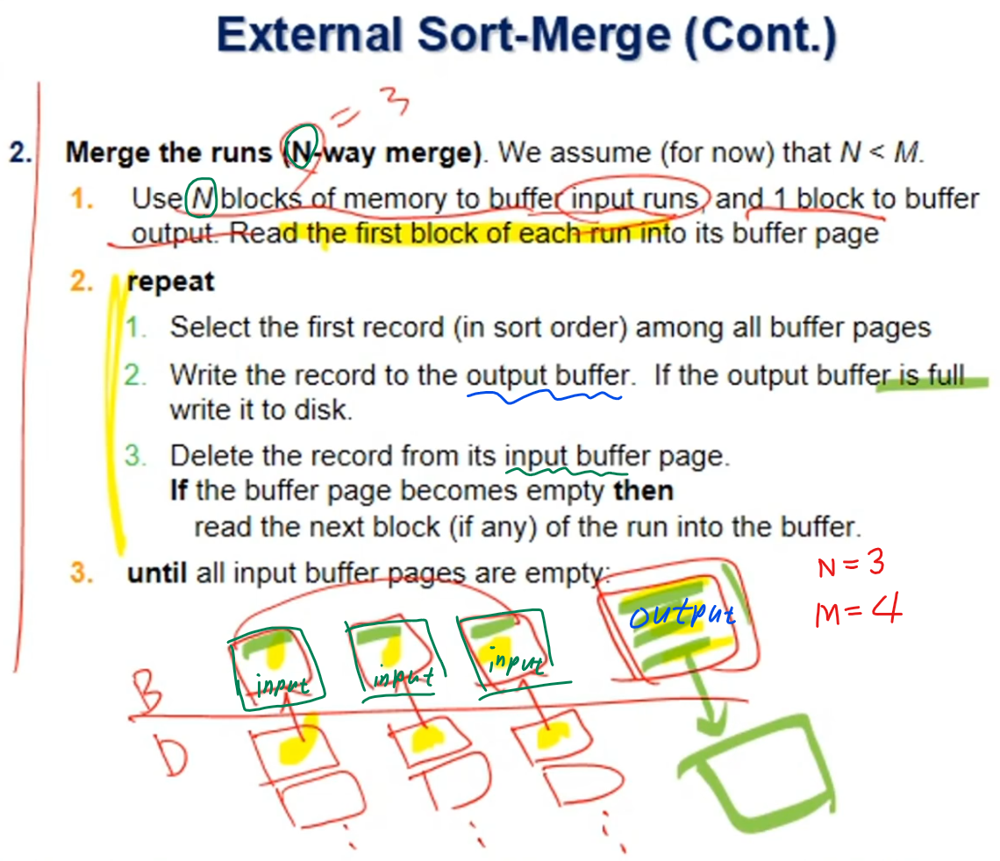
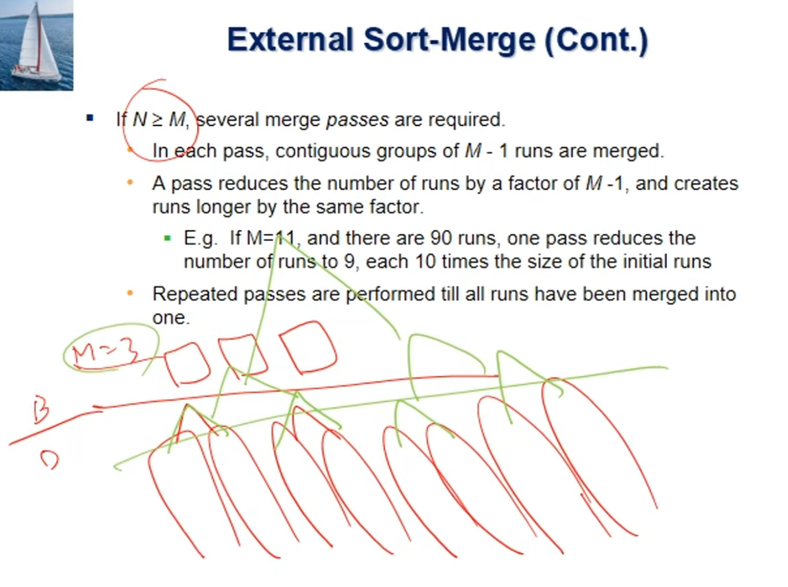

# ⚪External Sort?

order by 쿼리문 사용등으로 인해서 레코드를 정렬할 필요성이 생기는데, (order by에 해당하는 ordered 인덱스가 있을때, 해당 인덱스를 사용해서 차례대로 레코드를 뽑아오면 최악의 경우 레코드 한개마다 디스크 블록을 한번씩 모두 access해야 할수도... 그럼 차라리 외부정렬을 해서 접근하는게 이득일 수도 있음...)

파일의 용량이 크기 때문에 한꺼번에 메모리에 가져와서 quicksort 하기 같은 방법은 불가능

따라서 memory에 fit하지 않는 relations에 대해서는 **external sort-merge**가 좋은 방법임

 

 

 

# ⚪External Sorting Using Sort-Merge

{: .notice--primary} 

- 위 사진에서 blocking factor = 1
- 위 사진에서 br = 12
- 위 사진에서 정렬에 사용한 buffer page 수(M) = 3 
- 위 사진에서 initial run의 개수 = 4
- 위 사진에서 각각의 initial run은 몇개의 block으로 구성? = 3 (M과 같음)
- 위 사진은 2-way-merge  ((M-1) way merge) 

​    

- run은 부분 정렬이 끝난다음 디스크에 있는 상황

- 처음 run을 initial run이라고 함 (초기 런 생성단계에서의 pass 는 무조건 1)

- **br** = 테이블을 구성하는 블록의 총 개수

- **M** = 메모리 buffer page 수 (3 이상 이어야 함. 1개는 output용이기 때문에)

- **pass**는 테이블을 전부 읽어서 처리한 다음에 그 전부를 디스크에 쓰는 과정

- 1 pass = 2br I/O 가 필요.

- **I/O횟수**를 일반화하여 공식을 만들면 **br(2⌈logM-1(br/M)⌉+1)**
  
  - **M-1**은 output용 page 1개 빼고 나머지 페이지 수이므로, **(M-1)-way merge**한다는 의미
  - **br/M**은 initial runs의 갯수. (초기 런의 갯수)
  - **logM-1(br/M)**은 Merge단계에서의 pass 수 (초기 런 생성때의 pass는 제외한 것임)
  
  - 책에는 Seek 타임을 고려하여서 식이 약간 다름. (bb를 수업에선 무시)
  - 위 사진에 적용하면 결과가 60( = 5br)가 나오는데, 실제로 세어 봤을때는 72( = 6br)임.   
    왜 br 만큼 작게 나오냐면,   
    cost비교할때 맨 마지막으로 정렬된 걸 디스크에 write하는건 모든 알고리즘의 공통이기때문에 포함할 필요가 없기 때문

 

 

 

# ⚪교재 수도코드

## 🔹초기 run을 만들음

결과적으로 n개의 초기 run이 만들어짐

## 🔹N(초기run 수)<M(메모리 page 수) 일때 Merge

이 조건에 해당된다면  **N - way merge**를 하는것이기 때문에

1 pass로 정렬이 끝남

## 🔹N(초기run 수) >= M(메모리 page 수) 일때 Merge

한방에 정렬하지 못할 뿐 할수는 있음.

(merge 단계에서 **복수개의 passes**가 필요함)

즉, 이경우엔 N - way merge가 불가능한 대신, **(M-1)-way merge**를 하게 됨.

