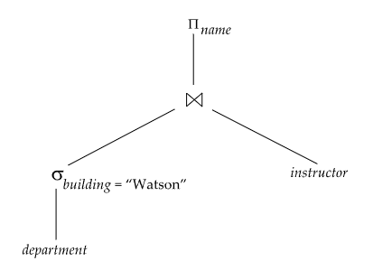

# ⚪expression tree

{: width="50%"}

- 실제 sql문으로 질의가 주어지면, 여러 연산들이 조합되어 나타남
- 그것을 db시스템은 내부적으로 expression tree(또는 query tree라고도 함)같은 것을 만들어서 연산을 수행함
- 리프노드는 base table을 의미함
- 논 리프노드는 intermediate result(중간 결과)라고 부름
- 트리의 리프노드부터 루트노드까지 진행하면 최종 결과가 나옴

 

 

 

# ⚪expression tree를 처리하는 방식

크게 두 가지로 나뉨

1. **Materialization**(실체화) : (inputs이 relations거나 이미 계산된 값인) 표현식의 결과를 생성하고, 이를 디스크에 저장한다. 이 과정을 루트를 향하여 반복한다  
   - 메모리에 붙들고 있기에 중간결과가 너무 크거나 하기 때문에 디스크에 씀
   - 한번에 한 연산을 실행함
   - lowest-level부터 시작해서, next-level operations을 evaluate하기 위해 temporary relations로 materialized된 intermediate results를 사용한다
2. **Pipelining** : 동시에 여러 operations을 evaluate한다. 자식 레벨 노드의 연산을 수행해서 결과가 일부 얻어지면, 부모 노드 연산에 그 결과를 바로바로 넘기면서 자식,부모 레벨의 연산을 동시에 진행한다  
   - temporary relation을 disk에 저장하지 않기때문에 materialization보다 cheaper
   - 항상 가능한 것은 아님. 연산의 알고리즘에 따라 불가능할 수 있음 (ex. sort나 hash-join같은 경우 불가능) 
