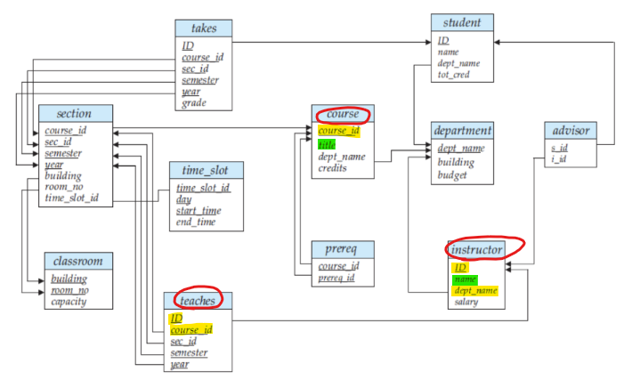
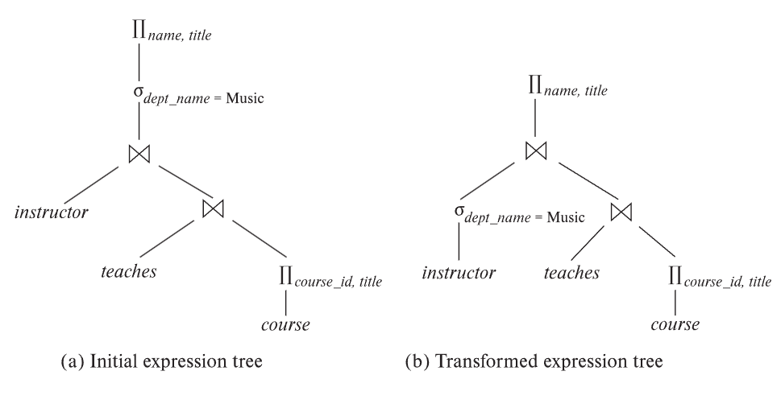
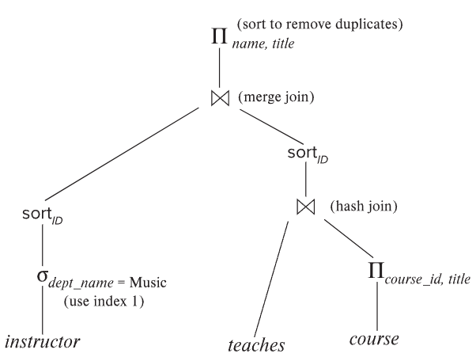
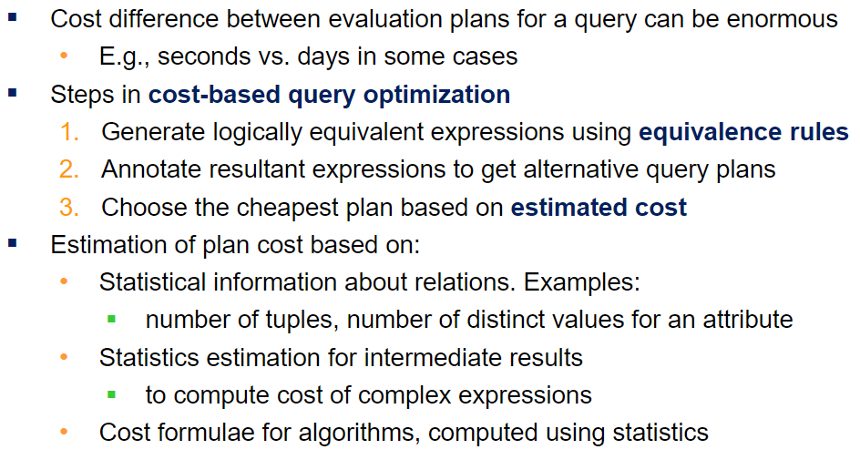
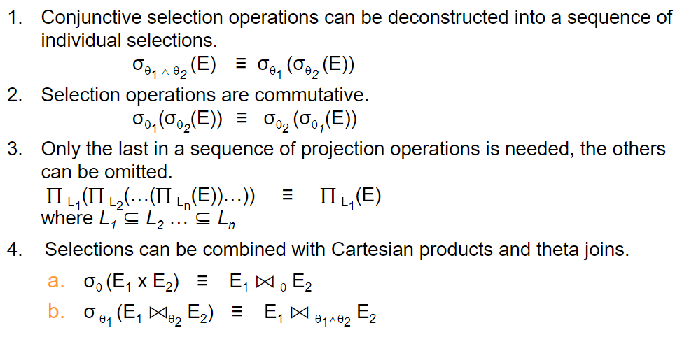
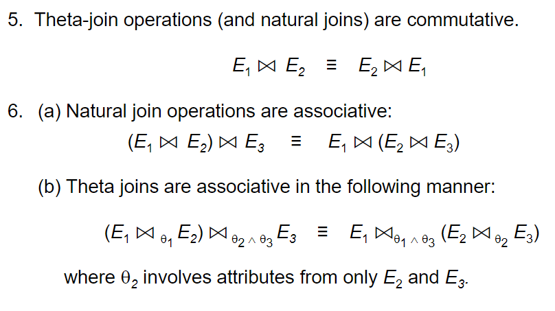
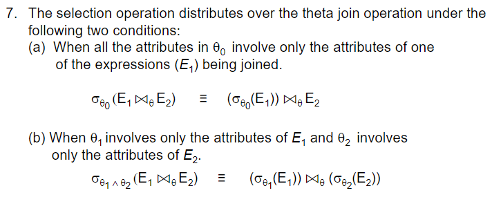
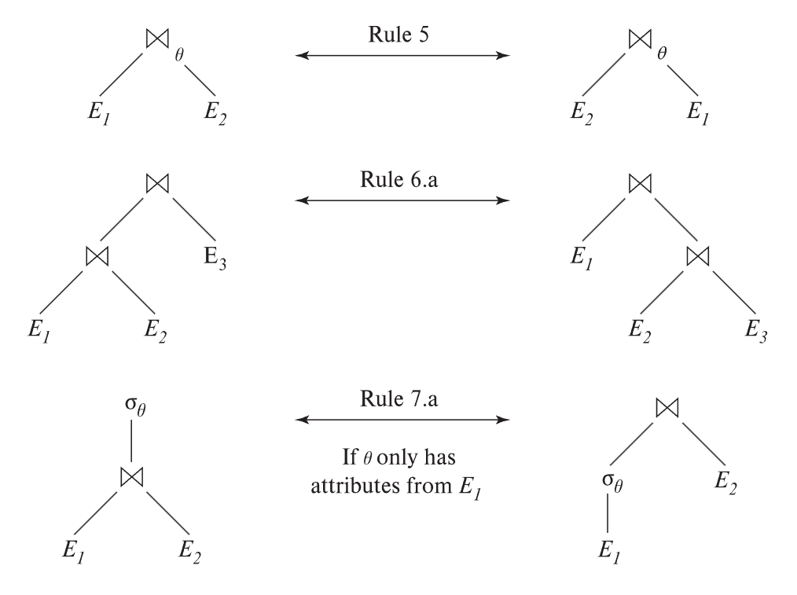
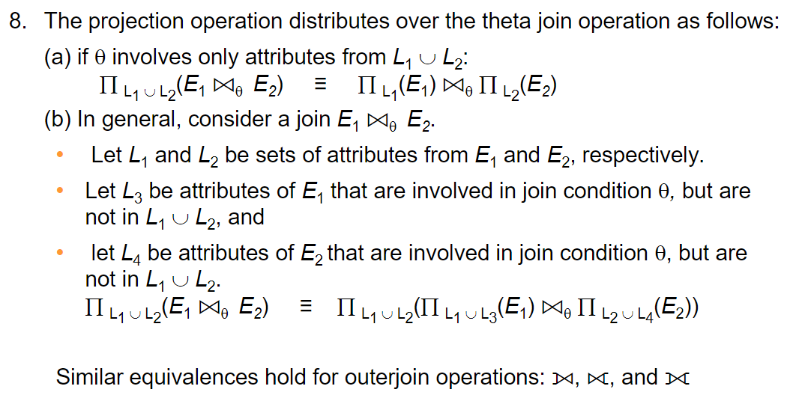
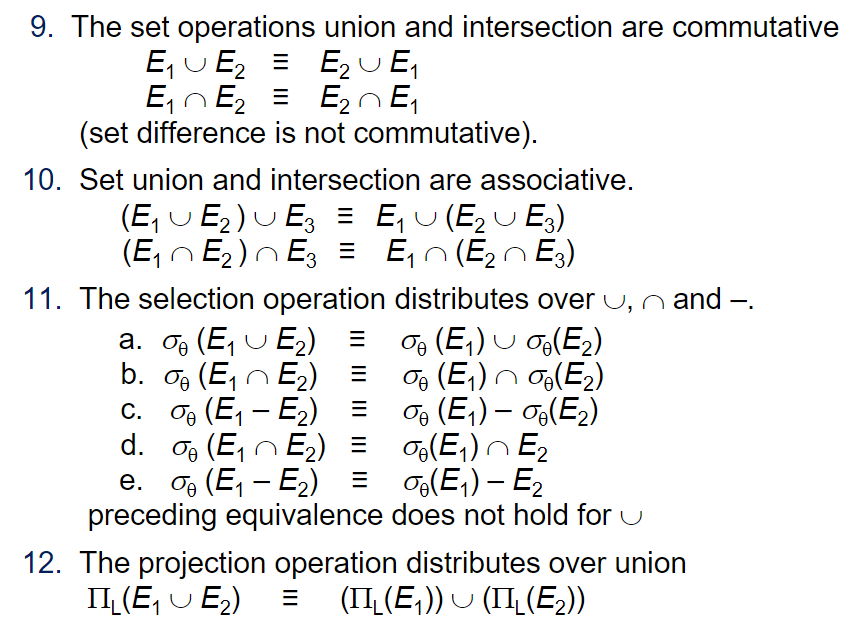

# ⚪<span style="color: #D6ABFA;">Equivalent expressions</span>



```sql
SELECT name, title
FROM I,T,C   //I는 instructor, T는 teaches, C는 course
WHERE I.dept_name="Music" and I.ID=T.ID and T.course_id=C.course_id
```

위 같은 쿼리에 대해서 여러 가지의 expression tree가 나올 수 있음



그러나 이 expression tree자체만으로는 evaluation plan이라고 볼 수는 없음

프로젝트,셀렉트,조인을 어떤 알고리즘으로 수행할지 정해진게 없기 때문

<br>

<br>

<br>

# ⚪<span style="color: #D6ABFA;">Evaluation plan</span>



evaluation plan은 각 operation에 어떤 algorithm을 쓸지, 그리고 execution of the operations가 어떻게 조직화되는지를 정의하는 것임

<br>

<br>

<br>

# ⚪<span style="color: #D6ABFA;">cost-based query optimization</span>



<br>

<br>

<br>
# ⚪<span style="color: #D6ABFA;">Generating Equivalent Expressions</span>

Equivalence Rule들에 대해서 첨부함

{: width="80%"}

{: width="80%"}

{: width="80%"}

{: width="80%"}

{: width="80%"}

{: width="80%"}

기타 팁: 

- selection을 join에 앞서서 먼저 하면 좋음
- Projection을 join에 앞서하면 조인 부담 줄어서 좋음
- 3개를 자연조인할때, 범위가 확 줄어드는걸 먼저 조인하자 

