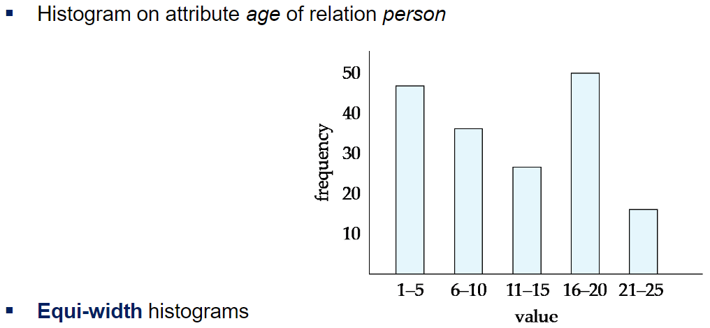
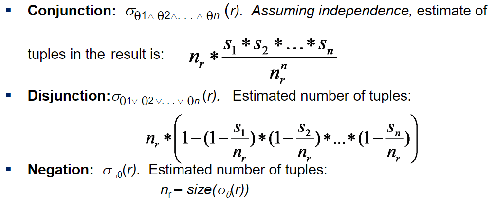
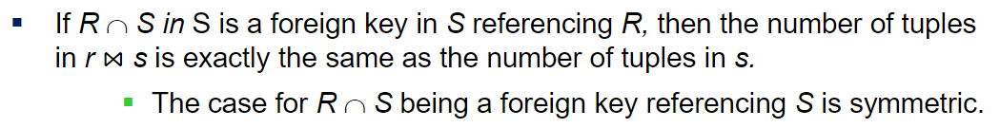
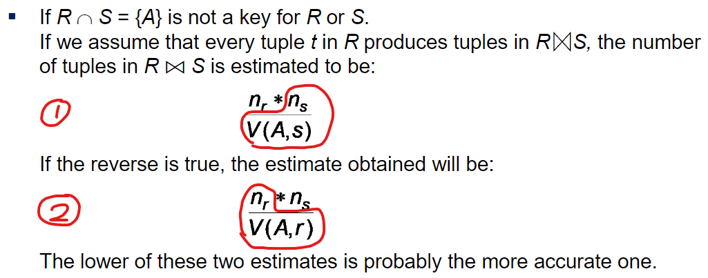
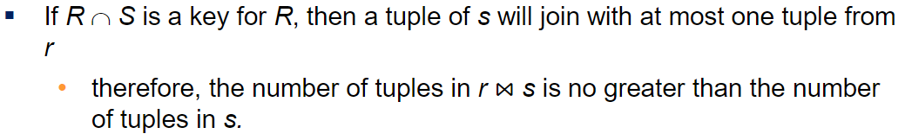
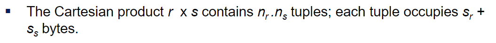
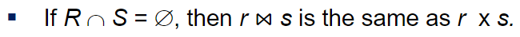

# ⚪Statistical Information for Cost Estimation

- **nr** : 릴레이션 r의 튜플의 수
- **br** : 릴레이션 r의 블록의 개수
- **Ir** : 릴레이션 r의 튜플의 사이즈
- **fr** : 릴레이션 r의 blocking factor (블록 1개에 r의 튜플이 몇개 들어가는지)
- **V(A,r)** : 속성A에 대하여 나타나는 distinct한 value의 수 (예를들어서 학년 속성에 1,2,3,4학년이 있다면 4가 나옴)
- 만약 r의 튜플들이 파일로 저장된다면 **br = ⌈nr/fr⌉**

 

 

 

# ⚪Selection Size Estimation

- **σA=v(r)**
  - nr / V(A,r) : 이 selection을 만족하는 레코드 수는 이 식으로 추정함 (균등분포라고 가정하고 있음)
  - 만약 key 속성에 대한 selection이었다면 size estimate는 1임
- **σA<=v(r)** (σA>=v(r)인 경우는 생략)
  - c를 조건을 만족하는 튜플의 추정개수 라고 정의하자
  - min(A,r)과 max(A,r)의 값이 db 카탈로그에 정보가 있을때,
    - c = 0 if v < min(A,r)
    - c = nr * { (v-min(A,r)) / (max(A,r) - min(A,r)) }   ==>비율로 추정하는 방식 (균등분포라고 가정하고 있음)
  - 만약 통계치 정보가 없을때는 c = nr/2 로 러프하게 추정함

{: width="50%"}

만약 histograms이 있다면  더 정교한 추정치를 얻을 수 있음

## 🔹selectivity

selectivity(선택도)는 조건 θi가 주어지면 테이블의 각 레코드가 그 조건을 충족할 확률을 구하는 것

만약 si가 릴레이션r 에서 조건을 충족하는 튜플의 개수라고 하면, **θi의 selectivity는 si/nr**

{: width="70%"} 

 

 

 

# ⚪Join Size Estimation

{: width="80%"}

r,s의 자연조인일때, 한쪽이 foreign key이고 한쪽이 referencing 되는 입장일때

foreign key쪽의 튜플개수가 결과 튜플의 수임

 

{: width="80%"}

조인하는 컬럼이 두 릴레이션에서 모두 키가 아닐때

둘중에 낮은 값을 선택해서 추정함

 

{: width="80%"}

조인했을때 A컬럼이 R에서 pk일때, 조인결과 튜플의 개수는 S의 튜플개수보다 많을 수 없음 

(모두 매칭이 되어봤자 최대 S의 튜플개수이기 때문에)

 

{: width="80%"}

카티션곱을 했을때의 튜플의 수와 결과 튜플 한개가 차지하는 바이트

 

{: width="80%"}

겹치는게 컬럼이 없을때 자연조인하라는 것은 카티션곱과 동일함
