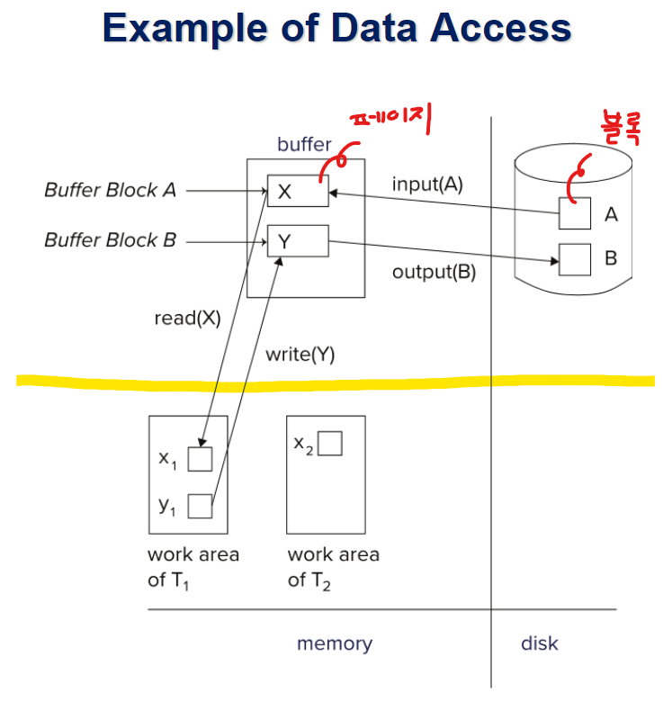

# ⚪Transaction이란

다양한 데이터 항목에 접근하고 가능하면 업데이트 하는 프로그램 실행 단위

전체가 다 실행되던지 하나도 실행되지 않던지..  "All(commit) or Nothing(rollback)"

다양한 유형의 고장을 대비해야하고, 복수개의 트랜잭션을 여러개 실행시키는 것에 대한 대비를 해야 함.

트랜잭션의 ACID Properties는 아래와 같음

- **Atomicity**: 디비 시스템은 **고장**등으로 인해서 트랜잭션이 부분적으로만 실행된것이 db에 반영되지 않게 보장해야 한다
- **Consistency** : 어떤 트랜잭션을 실행하고 나서 부정확한 결과가 나오면 안됨. (**동시성**(concurrency)에 연관된 문제)
- **Isolation** : T1트랜잭션 실행중 T2가 T1이 작업중인 값을 read해서 보여준다던지 할때 문제가 생길 수 있는데, 이런 문제가 안생기게 보장해야 함. 마치 자기가 독점하는 것처럼 인식하게... (**동시성**(concurrency)에 연관된 문제)
- **Durability** : 소프트웨어,하드웨어 **고장**이 발생해도 트랜잭션으로 db에 업데이트된 내용은 영구히 반영이 되어야 한다

 

 

 

# ⚪Data Access 흐름

- 노란선 위쪽이 DB영역에 해당되고, 아래쪽 주기억 장치 부분이 해당 응용프로그램의 메모리 영역임
- read를 했을때, 먼저 메모리 버퍼를 확인해 그곳에 있다면 가져오고, 없다면 디스크로부터 input을 해온 다음에 그것을 가져옴
- write연산을 했을때 디스크 영역이 아닌 메모리 버퍼 영역에다가 쓰는 것임 (최대한 I/O를 줄이려고. 물론 바로 디스크에다가도 쓸수도 있지만 항상 그렇지는 않음)

 

 

 

# ⚪Transaction State

- 모든 트랜잭션은 결말이 aborted, committed 둘중에 하나

-  aborted는 트랜잭션이 아예 실행되지 않았던것처럼 무효시킴

- committed은 성공적으로 트랜잭션이 실행된것

- failed는 실패한것이므로 aborted로 넘어감

- partially committed는 트랜잭션의 마지막 statement까지 다 실행은 했지만 commit할지 abort할지 아직 결정이 안된것. commit된 상태 아님

 

 

 

# ⚪Schedule

- 여러 트랜잭션의 instructions가 실행되는 순서를 명한 것
- 모든 instruction이 다 나타나야 함
- 각각 트랜잭션 본인 입장에서 보면 그 instruction의 순서가 유지가 되어야 함
- 트랜잭션이 성공적으로 끝나면 마지막이 commit, 아니면 abort

{: width="30%"}

이런건 serial schedule 이라고 함

섞어서 동시에 (concurrent) 실행하지 않기때문에 결과가 정확함이 보장됨 

 

{: width="30%"}

이런건 serial schedule이 아님. 그러나 첫번째 스케줄과 equivalent함

(serial한 스케쥴과 같은 결과가 나오기 때문에 정확하다고 알 수 있음)

 

{: width="30%"}

이 스케쥴은 정확한 스케쥴이 아님. 

왜냐하면 T1,T2 순서로 serial하게 실행한 스케줄, T2,T1순서로 serial하게 실행한 스케줄 둘 중 어느것과도 같은 결과가 안나오기 때문.

왜 그러냐면 **lost update** 문제 때문. 서로 값을 수정하고 write하는 과정에서 덮어쓰는 현상이 나타나기 때문

 

 

 

# ⚪Serializability

concurrent한 스케줄의 정확성을 판단하는 기준이 되는것이 serializability(직렬 가능성)임

serial한 스케줄은 항상 정확함

어떤 concurrent한 스케줄의 실행결과가 serial한 스케줄의 실행결과와 동일하다면 그 스케줄을 **serializable**하다고 함

 

두 가지 종류의 serializability가 있음

1. **Conflict serializability** (보통 db시스템에서 그냥 serializability를 말하면 이걸 뜻함)
2. **View serializabililty**

## 🔹Conflict serializability

이때 Conflict의 의미는 read와 write 명령어를 제외한 나머지는 다 무시하고 (write)와 (read또는 write) 간의 위치를 변경할 수 없게 되는데 이것은 write명령어로 인해서 충돌이 일어나기 때문임

read끼리는 충돌이 안남

 

{: width="70%"}

정리해서 Q라고하는 같은 데이터를 Ti, Tj트랜잭션이 동시에 접근할때 Ii, Ij를 각 트랜잭션의 instruction이라고 하자

 위 사진처럼 충돌여부를 알 수 있음

두 instruction이 충돌관계가 아니라면 두 연산의 순서를 바꿀 수 있음 

{: width="70%"}

이런식으로 연산의 순서를 바꿔서 serial한 스케줄이 된다면 **serializable** 한 스케줄이라고 할 수 있음

위 그림처럼 스케줄S와 스케줄S의 non-conflicting instructions을 swap하여 생성된 serial한 스케줄S'이 있을때,  
S와 S'은 **conflict equivalent** 하다고 함

그리고 이때의 S는 **(conflict) serializable**하다고 함

 

그럼 어떻게하면 serializable한 스케줄을 생성할까?

보통 **locking protocol**을 사용해서 생성함

 

 

 

# ⚪Recoverable Schedules

트랜잭션 Ti가 먼저 write했던 데이터를 Tj가 읽게 된다면,

 Ti의 commit이 Tj보다 먼저 나와야 recoverable(복구 가능)한 스케줄임

위 사진은 그렇지 못한 예이기 때문에 not recoverable한 스케줄임

만약 위 그림에서 Tj가 commit된 이후 Ti가 abort되어야 한다면 Tj는 inconsistent database state를 read한 것임 (심지어 유저에게 보여줬을 수 도 있음)

따라서 **database는 반드시 스케줄이 recoverable하다는 것을 보장**해야 함

 

 

 

# ⚪Cascadeless Schedules

{: width="50%"}

위 그림은 하나의 transaction failure가 series of transaction rollbacks을 유발하는 예시임

이런 것을 **Cascading rollback**이라고 함

이것은 많은 양의 작업을 undo하게 되는 결과를 유발함

 

위 같은 현상을 막기 위해서 **Cascadeless schedules**를 사용하면 됨

- 동일 데이터A에 대해서 Ti가 먼저 write하고 Tj가 A데이터를 read해야 한다면,  
  Tj가 read하기 전에 Ti를 먼저 commit하면 cascadeless schedules가 됨
- 당연히 cascadeless schedule은 recoverable함
- 강제사항은 아니지만 권장되는 사항

