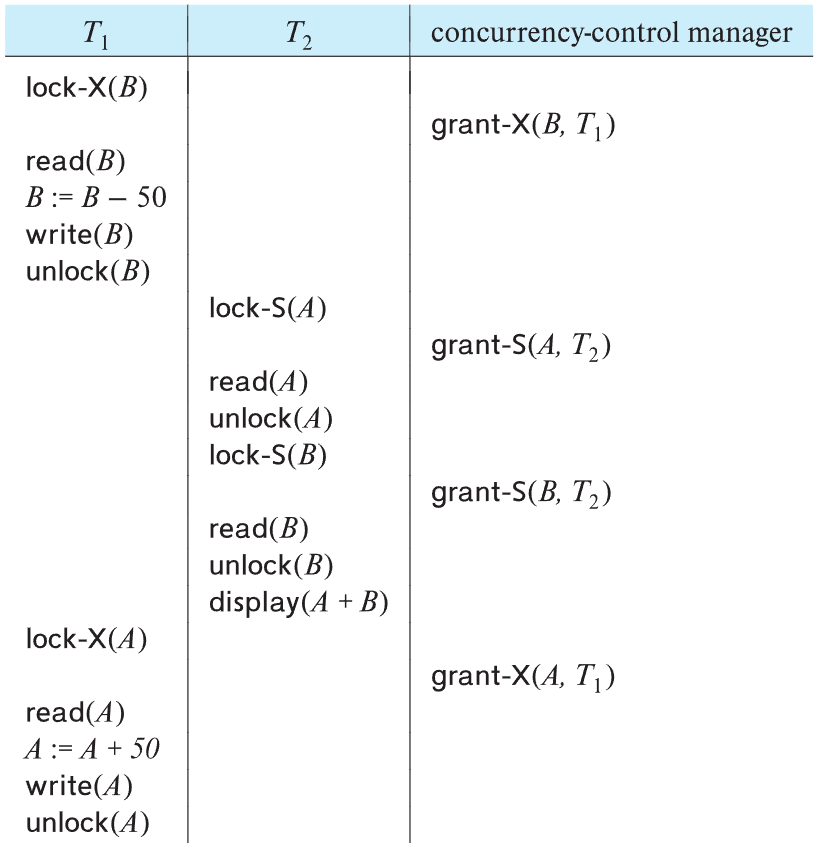
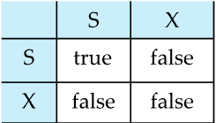
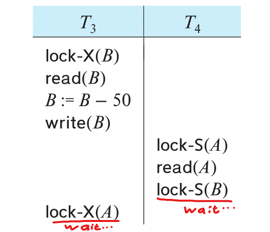
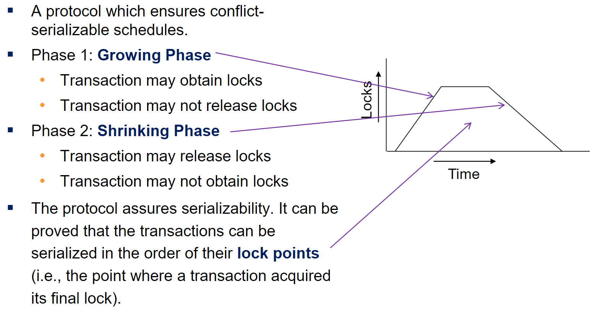
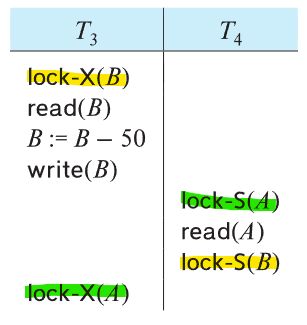
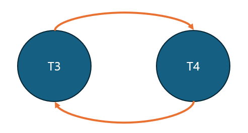
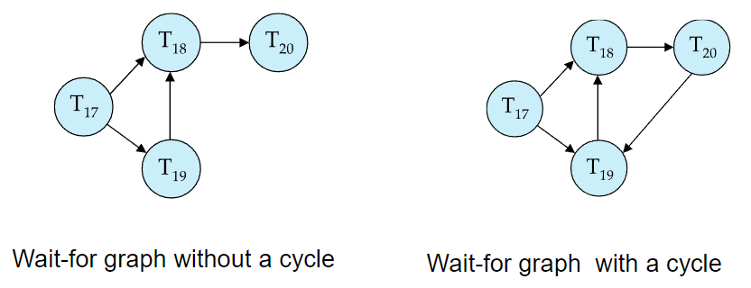

# ⚪Lock-Based Protocols

**Locking Protocol**이라고도 불림

lock은 트랜잭션들이 data item에 concurrent하게 접근하는것을 제어하기 위한 메카니즘

2종류의 락이 존재함

- **exclusive** : 트랜잭션이 어떤 데이터를 업데이트 하고자할때 거는 락. 다른 트랜잭션들이 해당 데이터를 읽지도 쓰지도 못하게 막음. X-lock은 lock-X라는 instruction을 통해서 실행됨
- **shared** : 다른 트랜잭션들이 해당 데이터를 읽는것은 허용하되, 업데이트 하는것은 차단함. S-lock은 lock-S라는 instruction을 통해서 실행됨

 

{: width="50%"}

dbms내의 트랜잭션 매니저중에 concurrency-control manager 에다가 lock request를 함

그 요청이 허용되어야만 트랜잭션이 proceed 가능

그러나 **위 스케줄은 not serializable**함. 

그래서 serializability를 보장하기 위해서 **Two-Phase Locking Protocol(2PL)**을 사용함 (아래에 설명)

 

Lock-compatibility matrix는 위와 같음

 

 

 

#  ⚪Deadlock

{: width="50%"}

위 그림처럼 deadlock 상황이 발생할 수 있음

이때 트랜잭션중 하나를 골라 roll back 시켜서 lock을 release하면 해결 됨

 

 

 

#  ⚪Two-Phase Locking Protocol(2PL)

2PL 방식을 사용하면 **serializability가 보장**됨. 그러나 **Deadlock은 발생할 수 있음**

1단계 :Growing Phase에서는 lock을 얻기만하고

2단계: Shrinking Phase에서는 lock을 풀기만 하는 방식

 

2가지 종류가 있음

- **Strict two-phase locking** : exclusive lock을 commits/aborts할때까지 unlock하지 않는 방식. shared lock은 기존처럼 2단계 에서 unlock함  
  - recoverability가 보장되고 cascading roll-back을 피할 수 있음
- **Rigorous two-phase locking** : 모든 락(exclusive,shared)을 commit/abort 될때까지 unlock하지않고 들고 있다가 그 이후에 unlock함
  - 트랜잭션이 commit되는 순서대로 serialized 될 수 있음

2단계를 관리해야한다는 부담이 동시성으로 보는 이득보다 더 크기 때문에 대부분의 db는 Rigorous two-phase locking을 사용함.

따라서 two-phase locking을 말하면 Rigorous two-phase locking을 의미하는 것임

 

 

 

#  ⚪Deadlock Detection

<html lang="en">

<head>
    <meta charset="UTF-8">
    <meta name="viewport" content="width=device-width, initial-scale=1.0">
    
    <title>Side by Side Images</title>
</head>
<body>
    

        
        
    

</body>
</html>

 

화살표가 시작하는 트랜잭션이 화살표 방향의 트랜잭션이 unlock할때까지 wait한다는 뜻임

이런식으로 **Wait-for graph**를 그렸을때 **cycle이 생긴다면 deadlock**이 발생했음을 알 수 있음

## 🔹Deadlock Recovery

데드락이 발견되면 사이클을 형성하고 있는 노드 하나를 victim(희생자)로 선정해서 abort시킴(roll back됨)

그럼 해당 트랜잭션이 가지고 있던 락이 풀어지게 되고, 데드락 상황이 해소됨

## 🔹Deadlock prevention

이렇게 wiat-for graph를 유지하면서 사이클을 detect하는게 부담이 될 수 있기때문에 Deadlock prevention을 할 수도 있음

- 트랜잭션 하기 전에 필요한 락을 모두 잡고 시작하는 방법 (동시성이 떨어지고, 동적으로 결정되는 락이 있어서 예측 힘들음)
- **wait-die** (timestamp 정보가 필요함)
  - older transaction은 younger transaction이 락을 풀때까지 기다림
  - younger transaction은 older transaction이 락을 풀때까지 기다리지 않고, 그래야 하는 상황이 오면 대신 rolled back 됨
  - wait: older트랜잭션이 취하는 행위 / die: younger트랜잭션이 취하는 행위
- **wound-wait** (timestamp 정보가 필요함)
  - older transaction이 wait하게 되는 상황이오면, wait하지 않고 younger transaction을  강제로 wound(force rollback)시킴
  - wait-die보다 rollback되는 경우가 적음
  - wound: older트랜잭션이 취하는 행위 / wait: younger트랜잭션이 취하는 행위
- **timeout-based**
  - 특정 시간동안 lock을 위해서 기다리다가, 해당 특정 시간이 넘게되면 roll back함
  - 간단하지만 데드락 아님에도 롤백될때가 자주 발생
  - starvation문제가 있을 수 있음
  - 시간 정하기가 어려움

이때 **wait-die**랑 **wound-wait** 둘다 roll back된 트랜잭션이 재시작될때 **기존의 timestamp를 그대로** 갖고 시작함. 

그래야지 starvation 상태에 안걸림(점점 older해지니까)
