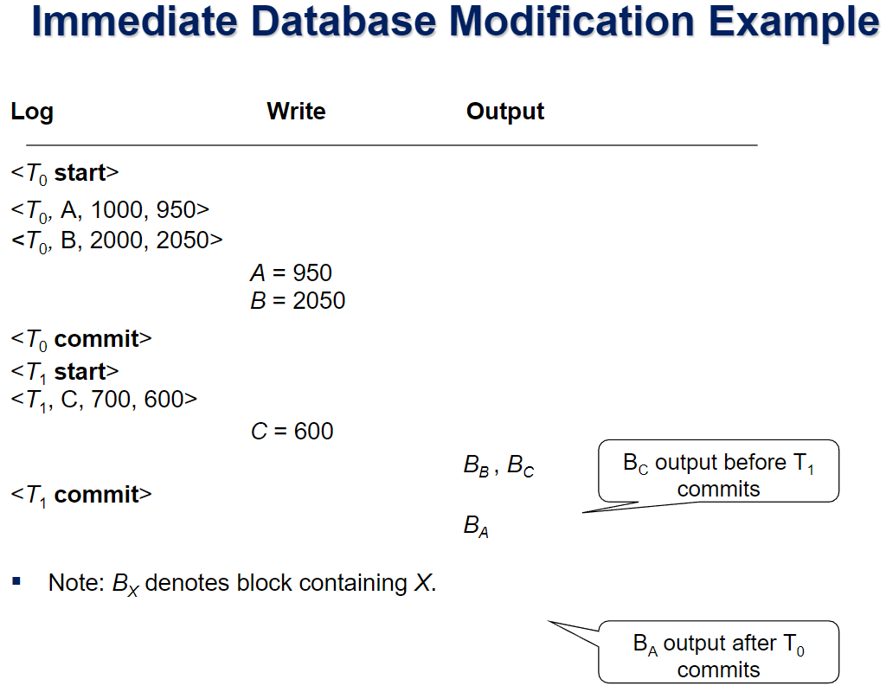

# ⚪Failure 분류

- **Transaction failure** (버퍼,디스크에 문제 없어서 복구 쉬움)
  - **Logical errors** : 트랜잭션이 내부 오류로 완료될수 없는 것(잔고 부족 등...)
  - **System errors** : db시스템이 어떤 액티브 트랜잭션을 에러조건으로 인해 종료시켜야만 하는 상황 (데드락 등)
- **System crash** : 전원이 나가는 등 Buffer에 있는 내용을 다 상실하는 경우(디스크는 괜찮)
- **Disk failure** : 디스크에 문제가 생김(head crash등등...). 평상시 덤프(백업)을 해놓는 방식으로 해결함

이번에 집중할 것은 버퍼가 손실되는 System crash임

(crash입장에서는 disk가 stable storage임)

 

 

 

# ⚪Log based recovery

로그 기반 복구 기법은 logging이라고도 불리며 대부분의 db시스템에서 사용하는 복구 기법임

log는 트랜잭션이 db에 대해서 수행했던 작업 내용을 시간순으로 log records형태로 쭉 기록을 남긴것

log는 stable storage에 저장이 되어야 함 (crash 고장유형 입장에서는 disk가 stable) 

(로그를 바로 직접 disk에 output하지는 않고 메모리의 log buffer에 저장하는 과정을 거침.)

## 🔹로그 레코드 유형

- **<Ti start>** : 트랜잭션이 시작함을 뜻하는 로그
- **<Ti, X, V1, V2>** : 데이터를 업데이트하는 write(X)할때 남기는 로그. (트랜잭션식별자, 데이터, 수정전 값, 수정후 값)
- **<Ti commit>**
- **<Ti abort>**

## 🔹트랜잭션을  수행하는 방식

{: width="50%"}

로컬메모리 영역(work area)에서 값이 업데이트되는 것은 db modification이 아니고, buffer나 disk가 수정되는것이 db modification임

buffer는 write연산에 의해서 수정이되고, disk는 output연산에 의해서 수정이 됨

 

그런 db modification이 즉각적인지 지연되는지, 즉 시점적으로 2가지로 나눌 수 있는데, 

이 시점의 기준은 트랜잭션이 commit되는 시점임 

{: .notice--primary}  
로그 기반의 리커버리를 수행하는 디비시스템에서 트랜잭션을 수행하는 방식 2가지  

- **immediate database modification** 
  - 트랜잭션이 commit되기 전에도 db modification을 허용 (커밋 전에도 버퍼,디스크에다가 업데이트 허용)
  - 로그 레코드는 db item이 버퍼에 쓰여지기 전에 쓰여져야 함
- **deferred database modification**
  - 트랜잭션이 commit되기 전에는 db modification을 허용하지 않음 (커밋전에는 버퍼,디스크 업데이트 못함)
  - 장점: recovery가 간편해진다. (db영역에는 항상 커밋된 값만 늘 존재하기 때문.)
  - 단점: 로컬메모리 영역에 계속 값을 들고있는 것에 대한 overhead가 존재

 

보통 db시스템에서는 **immediate database modification**을 사용함

다음 설명에서도 immediate db modification을 기준으로 설명함

 

버퍼에서 디스크로 output하는 시점은 commit 전이나 후나 둘 다 할 수 있음

심지어 A를 950으로, B를 2050 의 순서로 버퍼에 write했을때 디스크로 ouput되는 순서는 바뀔수도 있음

 

 

 

# ⚪Transaction Commit

{: width="50%"}

복구 알고리즘 관점에서, 트랜잭션이 시간순으로 로그를 쭉 쓰고있을텐데 

이 **로그가 stable storage에 저장되는 순간 commit** 했다라고 함

(로그는 commit했을때 stable storage에 가있지만, 실제 변경이 일어났던 것들은 아직 버퍼에 있을 수도 있음(아직 output이 안된 상태))

 

 

 

# ⚪Undo와 Redo

undo와 redo는 복구작업을 하는 기본 연산 (로그를 바탕으로)

- **undo(Ti)**
  - 트랜잭션 Ti가 했던 업데이트들을 원래의 값으로 되돌려 놓음 (Ti가 없던 일로 만들음)
  - <Ti, start>로 시작은 했지만<Ti, commit> 또는 <Ti, abort>로 결말이 어떻게 지어졌다라는 기록이 없는 트랜잭션은 undo의 대상
  - **buffer에 되돌려 놓는것 까지가 undo**임. disk에는 어떤 값이 들어있을지 모름
  - data item X가 old value V로 복구될때 <Ti, X, V> 라는 로그 레코드가 쓰여짐
  - 트랜잭션의 undo가 끝나면 <Ti, abort> 로그 레코드가 쓰여짐
- **redo(Ti)**
  - Ti라는 트랜잭션이 수행했던 업데이트를 다시 똑같이 반복(재현) 하는 것
  - <Ti, start>로 시작도 했고 <Ti, commit> 또는 <Ti, abort>로 결말이 난 트랜잭션은 redo의 대상
  - **buffer에 다시 재현해놓는 것 까지가 redo**임. disk에는 어떤 값이 들어있을지 모름
  - 로그를 남기지 않음

 

 

 

# ⚪Checkpoints

db 시스템이 오래 작동하면 로그 내용이 매우 길어질 것임

그 모든 로그를 redo/undo 하는 것은 매우 느릴 것임

시간적으로 아주 오래전에 썼던 로그 레코드를 redo하는 등의 작업은 필요없을 가능성이 높아질것임

 

따라서 이런 문제점을 해결하기위해서 db시스템은 **주기적으로 checkpointing**을 실행함

1. 현재 메인메모리(로그 버퍼)에 있는 모든 로그 레코드들을 stable storage로 output함
2. 메모리 버퍼의 업데이트된 페이지들을 disk로 output함 (=이미 commit된 트랜잭션을 redo하지 않아도 되게 됨)
3. `<checkpoint L`>이라는 체크포인트를 했다는 로그 레코드를 write함. L은 체크포인트를 수행하던 시점에 active한 상태로 있던 트랜잭션들의 list를 뜻함
4. 체크포인팅을 하는중에는 active한 트랜잭션들이 수행하던 모든 업데이트들이 중단됨

 

{: width="50%"}
