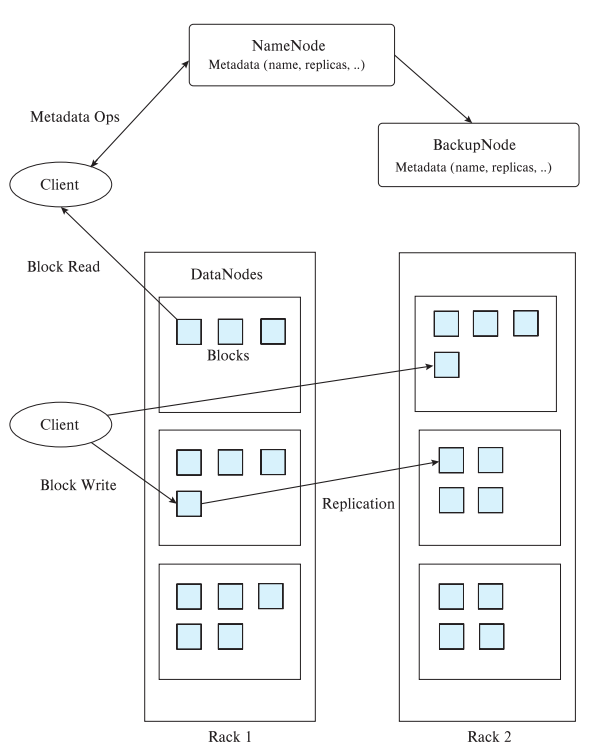

# ⚪<span style="color: #D6ABFA;">Big Data Storage Systems</span>

## 🔹Distributed File Sytems

- 데이터를 10<sup>3</sup>~10<sup>4</sup> 개의 large collection of machines들을 연결한 cluster 환경에 분산 저장하는 시스템
- 응용에서는 싱글 파일인것처럼 인터페이스를 제공함
- redundant한 storage를 제공하는데, 이는 파일을 저장할때 여러 블록으로 나눠서 저장하는데, 하나의 블록이 한 머신에만 저장되는게 아니라 복수개의 머신에 복제본을 저장하게 된다는 의미임 
  - 상대적으로 저사양 머신에 저장됨 (많은 머신을 사용해서)
  - 많은 머신이 네트워킹된 환경이기 때문에 상대적으로 unreliable함
  - 복제본을 저장하는 이유도 고장에도 불구하고 해당 블록에 접근 가능하게 하기 위해서
  - redundant storage로 복제본을 유지하는 것은 가용성(Availabiliity)를 높이기 위한 것
- Example:
  - Google File System (GFS)
  - Hadoop File System (HDFS)

### 🔸Handoop File System 



- NameNode는 메타데이터를 저장함
  - filename을 list of Block IDs로 매핑해주는 정보가 들어있음
  - 각각의 Block ID는 복제본이 여러 데이터노드에 들어있으므로, Block ID가 어느 데이터 노드에 저장되어 있는지에 대한 매핑 정보가 들어있음
- DataNode에는 파일들이 여러개의 블록으로 분할되었을때의 그 블록이 저장되어 있음
  - Block ID를 디스크상에 저장된 physical location으로 매핑해 줌
  - 한 블록은 보통 64MB
  - 각각의 블록은 복제본을 만들어서 여러 DataNode에 저장됨 (default 복제본 수는 3 copies)
  - 이런 복제본 저장은 데이터의 가용성(Availability)를 높이기 위함
- Client는 NameNode에 접근해서 메타데이터(파일이 어떤 블록들로 나뉘어져 있고 그 블록들은 어느 데이터노드에 저장되어 있는가)를 얻은 후, 실질적인 접근은 데이터노드를 access해서 처리를 하게 됨

## 🔹Sharding across multiple database

- shard는 조각,파편이라는 뜻을 갖고 있음
- sharding은 응용에서 빅 데이터를 파티셔닝(분할)해서 여러개의 데이터베이스에 분할 저장하는 것을 말함
  - 예를들어 레코드가 많이 있는데, 거기 속성중에 user ID속성을 보고 1~100,000은 db1에 저장하고 100,001~200,000까지는 db2에 저장하는 것을 말함
  - sharding을 할때 기준이 되는 속성을 partitioning attributes 또는 partitioning keys 또는 shard keys라고 함 (위 예시에서는 user ID) 

-  application(응용)은 데이터 분할의 상태를 파악하고 관리하고 있어야 함. 그래서 응용에서 queries나 update를 하게 될때 응용단에서 어느 db 를 접근해야하는지 결정함
- 장점은 scalable하고 구현이 간단
- 단점은 
  - transparent 하지 않음 (응용이 데이터 분할의 상태정보를 다 알고 있어야 하기 때문에 저장체계가 응용에 투명하지 않다고 하는 것)
  - db에 데이터가 계속 늘어나면 여러 데이터베이스로 분할하는 체제에 변화가 와야할텐데 그런 변화가 쉽지 않음
  - 점점 많은 수의 데이터베이스를 사용할수록 고장 확률이 높아지고, 복제본을 유지해야할텐데 응용단의 부담을 증가시킴

## 🔹Key-value storage systems

- Key Value Store라고도 부름
- 매우 많은 수의 레코드(10<sup>9</sup>이상. 각 레코드의 크기는 수KB-MB로 그리 크진 않음)를 저장
- 레코드들은 여러 머신에 partitioned되어 저장됨   
  (machine cluster를 구성하는 머신의 수가 10<sup>3</sup>~10<sup>4</sup>정도의 규모로 scale up이 가능한 분산환경을 고려한 저장 환경임)
- 레코드들을 key값 기준으로 여러 머신에 파티션 하여 저장함
- 시스템이 queires를 해당 정보가 있는 머신으로 routing해서 처리하게 함
- 이런 분산환경은 고장확률이 높을 수 있으므로 availability를 높이기 위해 여러 머신에 복제하는 것을 지원함
  - 복제본의 변경시에는 모든 복제본들이 동일한 값으로 변경됨. (복제본들간의 일관성 consistency를 유지하는 기능을 지원함)
- RDB보다 훨신 단순한 데이터모델을 support함 (아래는 호출할 수 있는 api)
  - put(key, value)
  - get(key)
  - delete(key)
- 구글의 Bigtable같은 것은 range queries를 지원함(범위로 get하기)
- MongoDB는 non-key attribute에 대한 쿼리도 지원함
- Key Value Stores는 full database systems가 아님
  - transactional updates (ACID프로퍼티등...)을 지원하지 못함
  - 질의 최적화에 해당하는 기능들을 응용단에서 직접 관리해야 함

### 🔸No SQL

교재에서는 key value store를 No SQL이라고도 부른다고 하였는데(둘이 동일어인 것처럼), 

보통 No SQL은 데이터모델을 기준으로 3가지로 분류됨

1. **key-value store**
2. **wide column store**
3. **document store**

교재에서는 key value store(=책에선 No SQL이라고 함)라고 하면서 어떻게 저장방식을 분류했냐면

- **uninterpreted bytes**

  - key값에 대해서 value를 그냥 byte로 저장함. 
  - ex) Amazon S3, Amazon Dynamo

- **Wide-table (=wide column store를 의미)**

  - 각 key에 대해서 value가 column단위로 할당,저장,접근,제어 가능하도록 하는 시스템
  - wide column인 이유는 컬럼수가 매우 많을 수 있어서 그럼(빅데이터)
  - ex) Google BigTable, Apache Hbase

- document store

  - semi-structured data를 JSON과 같은 포맷으로 저장해서 데이터 속성들 기반 검색이 가능하도록 하는 시스템

  - ```json
    {
        "ID": "22222",
        "name": {
            "firstname: "Albert",
            "lastname: "Einstein"
        },
        "deptname": "Physics",
        "children": [
            { "firstname": "Hans", "lastname": "Einstein" },
            { "firstname": "Eduard", "lastname": "Einstein" }
        ]
    }
    ```

    semi-structured data를 설명하기 위한 json의 예시인데,   
    어떤 사람은 name에 middlename이 있을수도 있고, deptname 항목이 아예 없을수도 있는등,  
     RDB의 테이블스키마처럼 정형화해서 컬럼으로 나타내기 힘들지만 어느정도 구조가 있는 것을 의미함

  - ex) MongoDB

데이터 항목에 대해서 복수개 버전( timestamp나 version number로 구분)을 저장할수 있도록 지원하는 것도 있음  
(대표적인 예가 Google BigTable)

## 🔹Parallel and distributed databases

- parallel database는 machine cluster에서 동작함
- 고장이 났을때도 availability를 보장하기 위해서 Replication(복제본)이 사용됨
  - 보통 event of failure일때 restart query를 함
  - 근데 large scale이면 restart가 빈번할 수 있음
  - 빅데이터 응용을 위한 병렬처리 프레임워크로 Map-reduce systems이 있는데, 이것은 고장에도 불구하고 쿼리처리를 계속할 수 있음. (고장으로 수행하지 못한 일부분만 다시 수행하는 것이 가능한 체제)

<br>

<br>

<br>

# ⚪<span style="color: #D6ABFA;">CAP Theorem</span>

분산db환경에서 Brewer's CAP "Theorem(정리)" 이라는 것이 있음

**CAP 정리**는 No SQL db의 이론적 토대로도 언급되고 있는데 

C는 Consistency, A는 Availability, P는 network Partition 을 의미함

CAP정리는 위 셋중에 **최대 2개까지만 보장**한다는 정리임

<br>

- **Consistency(일관성)**는 복제본이 update될때 모든 복제본이 똑같이 update되어서 read연산을 하게 되면 어느 copy를 접근하더라도 다 최신의 버전이어야 한다는 것 
- **Availability(가용성)**는 parallel/distributed db환경에서 시스템 일부가 고장이 나더라도 시스템의 동작은 계속된다는 의미  
  데이터를 저장할때 복제본(replication)을 여러개 분산저장해서 한 노드가 고장나더라도 다른 노드의 copy가 접근 가능하다는 것

- {: width="30%"}

  **Network partition**은 분산DB의 노드들이 서로 네트워킹 되어 있을때 만약 위처럼 링크가 끊어졌을때 네트워크가 2개 또는 그 이상으로 분할되는 현상을 의미함.   
  서로 자기 파티션안에서만 동작을 계속할 텐데, 나중에 네트워크가 복원되었을때 x 4개의 copy간의 일관성이 유지되지 않는 문제가 생길것임.   
  즉 이런  network partition이 발생해도 시스템이 지속 동작함을 의미...

<br>

very large system에서 network partition은 언젠가 일어나기 때문에 consistency나 availability 중에 하나를 택 1 해야함 

전통적인 분산 db시스템은 consistency를 선택함

그런데 전자상거래 같은 대부분의 web application들은 availability를 선택함

<br>

No SQL에서 

Amazon Dynamo는 availability를 선택했음

Google의 BigTable의 경우 consistency를 선택했음

<br>

<br>

<br>

# ⚪<span style="color: #D6ABFA;">MapReduce</span>

- MapReduce는 big data를 분할하여 parallel computing(병렬 처리)하기 위한 프로그래밍 모델로서 reliable(고장에 대처가능)하고 scalable한 프레임워크임
- distributed and parallel 환경에서 프로그래머는 그러한 분산,병렬 이슈로부터 투명하게 프로그래밍 가능하게 해주는 프레임워크
- 프로그래머는 map()함수와 reduce()함수를 이용해서 로직만 제공하면 되고, 나머지 모든 이슈(parallelization of computation, coordination, load balancing, 고장이슈...등)는 시스템이 핸들링 함
- MapReduce프로그램이 동작하려면 data storage가 필요한데 distributed file system을 쓰던지 NoSql(교재에서는 key-value store라고 표현)을 사용함

## 🔹요약


과정을 간단히 설명하면  (worker는 map또는 reduce태스크를 담당하는 것)

1. input으로 여러 파티션으로 분할한 big data 파일이 주어짐
2. 분할된 data를 worker에 배당해서 Map 함수를 실행하고 그 결과를 중간 파일로 씀
   - Map 함수의 input은 (key, value) 형태임
   - Map 함수의 output은 (reduce key, value) 형태의 pair를 output으로 생성함. 이런 형태가 여러개 만들어져서 중간저장

3. shuffle단계를 통해서 중간파일을 읽어서 같은 reduce key를 갖는 pair들을 같은 worker에 모이게 함
   - shuffle단계를 통해서 모이면 (reduce key, value_list) 형태로 value는 리스트 형식으로 0~다수개가 들어 있음
4. worker들이 Reduce 함수를 실행해서 최종 결과를 output file에 씀
   - Reduce 함수의 input은  (reduce key, value_list) 형태임
   - Reduce 함수의 output은 (key, value) 형태임 (output을 value보다 list(value)로 표현하는것이 더 일반화 한것이라고 함 )
   - Reduce 함수가 value list를 어떻게 aggregate 할지는 주어진 문제마다 다름

{: width="80%"}


{: width="80%"}

## 🔹예시

### 🔸Word Count

MapReduce로 해결하는 대표적인 예제로  Word Count(단어수 세기)가 있음

{: width="80%"}

map함수와 reduce함수를 실행하면 각각 output이 위처럼 나오게 됨

<br>

일반화해서 진행된 과정을 설명하면

1. 문서들을 나누어서 worker들에게 할당
2. 각각의 worker는 문장을 스캔하면서 map함수를 실행하여 (word, count)쌍을 출력함. (map 함수의 output)
3. (word, count) 쌍들을 같은 word끼리(reduce key) 모이도록 파티션 함. 이것이 shuffle 단계임  
   (shuffle단계는 마치 sql에서 group by와 유사함)
4. 각 worker에서는 reduce함수가 count를 모두 더해서 단어별 총 count를 구함  
   (reduce함수에서 count들을 더하는 과정은 sql 집계함수 처리시 aggregation에 해당하는 작업임.  
   aggregation을 어떻게 할지에 대한 문제는 어떤 문제(응용)인가에 따라서 다름)

<br>

{: width="80%"}

수도코드는 위와 같음.

이 수도코드에서는 map 함수의 input이 (key, value) 형태가 아니라 그냥 record(문장 한 줄, value임)만 받고 있음. 

map 함수의 input을 (key,value)로 하려면 문서 파일의 각 줄에 번호를 매겨서 그것을 key로 하여서 input으로 쓰면 됨

### 🔸Log Processing

책 내용 복붙으로 생략


