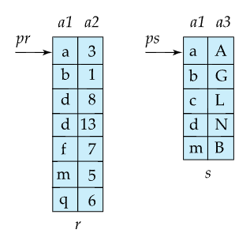

# ⚪join 종류

join은 크게 3가지 알고리즘으로 나뉨

1. Nested-loop join(중첩 루프조인)
   - Nested-loop join, Block nested-loop join, Indexed nested-loop join등이 있는데 Block nested-loop join이 기본적인 형태임
2. Merge-join
3. Hash-join

 

 

 

# ⚪Nested loop join

- 이때 r은 outer relation, s는 inner relation이라고 부름
- 인덱스가 필요없고, 모든 종류의 join연산에서 사용 가능
- expensive함. 두 릴레이션의 모든 튜플쌍을 비교하기 때문
- worst case memory availabilty(메모리 버퍼 페이지 M=3)일때의 cost : nr ∗ bs + br (n은 레코드 수, b는 블록 수)
- best case일때의 cost(크기가 작은 relation을 메모리에 한번에 올려놓을 수 있다면):  br+bs

## 🔹Block Nested loop join

- worst case(메모리 버퍼 페이지 M=3) 일때의 cost:  br * bs + br (그냥 nested loop일때보다 줄어들음)
- best case일때의 cost(크기 작은 relation을 메모리에 한번에 올려놓을 수 있다면, 즉 M이 최소 작은 쪽 블록개수 +2이상일때): br+bs
- 메모리 버퍼 페이지 M(최소 3이상)에 따른 cost 일반식:  ⌈br / (M-2)⌉ * bs + br
  - M-2는 inner relation과 ouput을 위해서 2개의 메모리 버퍼 페이지가 필요하기 때문에 그것을 제외한 나머지를 의미
  - ⌈br / (M-2)⌉ 는 M-2개 블록씩 읽어들이면 br을 몇번만에 읽어들이냐를 의미

## 🔹Indexed loop join

equi-join이나 natural join일때

inner relation의 join attribute에 대해서 인덱스가 있을때,

해당 인덱스를 사용하면 빠르게 조인을 수행할 수 있는 점을 활용

 

r테이블을 한 블록씩 읽어오고, 읽어올때마다 s테이블의 인덱스에다가 넣어서 결과를 얻는 방식

- cost(메모리 버퍼 페이지 M=3일):  br +  nr * c
  - r테이블이 outer loop임
  - br는 r의 블록 수
  - nr은 r의 레코드 수
  - c는 s테이블에 대해서 생성된 인덱스를 탐색하고 매칭된 s테이블의 튜플을 얻는데까지의 cost
- 만약 조인을 수행하려는 r과 s 모두 join attribute에 대해서 인덱스가 있다면, tuple이 더 적은 릴레이션을 outer relation으로 사용

 

 

 

# ⚪Merge join

반드시 join attribute에 대하여 두 개의 relation이 정렬이 되어 있어야 함 ([외부 정렬](https://igh01gi.github.io/db/ExternalSort/){:target="_blank"} 수행)

 

{: width="50%"}

정렬된 두 테이블을 블록단위로 읽어서 포인터를 움직이면서 비교하는 방식

- cost: br + bs  + (정렬이 안돼있을경우 external sort 비용)br(2⌈logM-1(br/M)⌉+1) + bs(2⌈logM-1(bs/M)⌉+1) + (br +  bs)
  - external sort비용이 원래 알던식에서 (br +  bs)를 추가로 더한건, external sort한 후 디스크에 다시 저장하는 비용이 기존에는 포함이 안되어 있었기 때문

 

 

 

# ⚪Hash join

{: width="50%"}

(equi-join에서 사용)

먼저 r,s 테이블의 레코드들의 조인컬럼을 해시함수 h1에 넣어서 partition을 나눔.  
이때의 각 파티션을 ri, si라고 하자.

이때 동일한 해시함수 h1을 사용했으므로, 대응되는 partition끼리만 비교하면 equi join이 가능함. (r의 0번, s의 0번 파티션끼리...)

그리고 모든 파티션 i에 대해서   

- (a) si를 메모리로 로드해서 join attribute를 이용해서 **in-memory hash index**를 생성한다.   
  이 해시인덱스를  만들때 사용하는 해시함수 h2는 파티션을 나눌때 사용한 해시함수 h1과는 다른것이어야 함! (동일한거면 다 같은 bucket으로 몰림)
- (b) ri의 튜플을 si를 사용해서 만든 인메모리 해시 인덱스에 넣어서 equi한 값이 있나 확인하여 output을 생성한다

이때 s를 **build input**이라고 하고, r을 **probe input**이라고 함

이때 build input으로 사용할 s를 파티션을 구성하는 block수가 적은것으로 정해야 메모리 사용량이 적어짐

 

{: width="50%"}

해시조인은 M(메모리 버퍼 페이지)을 일반적으로 많으 사용함. (3보다 클 경우가 많음)

파티셔닝할때 위 그림 예시를보면 파티션을 n개로 나누고자 할때,   
output용으로 사용할 n개의 페이지와, 블록단위로 읽어오기 위한 1개의 페이지, 총 n+1개의 페이지가 필요함

그리고 대응되는 파티션으로 조인짝을 찾는 과정에서, 예를들어 block수가 더 적은 파티션 si를 build input으로 정했을 때,  
build input 파티션의 블록수가 n개라 하면 최소 n+1(probe input읽기용)+1(output용)= n+2개 메모리 버퍼 페이지가 필요함.

 

**cost : 3(br +  bs)**

b는 블록수를 의미함

파티셔닝을 하기 위해서 전체 블록을 1번 다 읽어야하고,  
분류한 것을 다시 1번 디스크로 쓰고,  
조인짝을 찾는 과정에서 파티션들을 다 1번씩 읽어야 하기 때문에  
3을 곱한것
