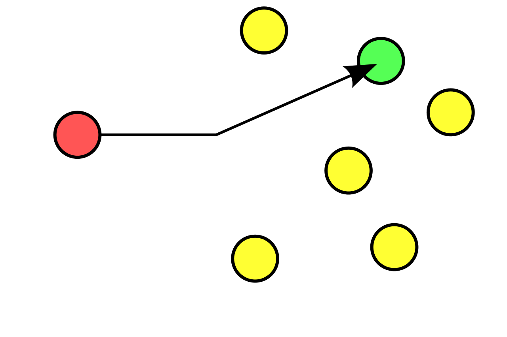
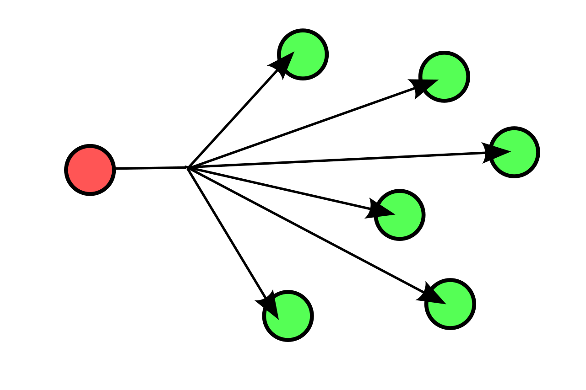
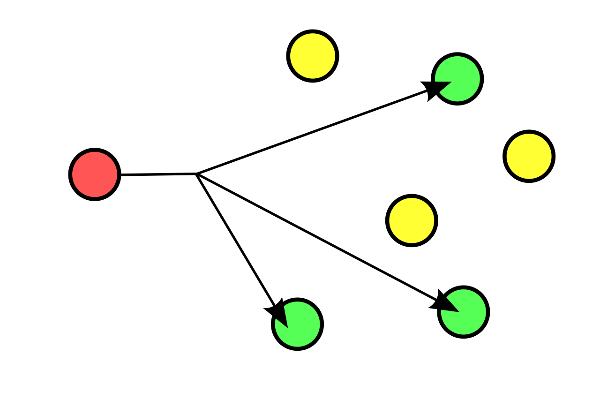

# ⚪유니캐스트(unicast)

- 고유 주소로 식별된 하나의 네트워크 목적지에 1:1로 트래픽 또는 메시지를 전송하는 방식
- 유니캐스트 통신 방식은 목적지 주소(MAC)가 아닌 다른 PC들의 CPU성능을 저하시키지 않음.  
  왜냐하면 자신의 MAC 주소가 아니라고 랜카드(NIC)가 판단하면 프레임을 버리기 떄문

 

 

 

# ⚪브로드캐스트(broadcast)

- 송신 호스트가 전송한 데이터가 네트워크에 연결된 모든 호스트에 전송되는 방식
- 스위치가 수신한 이더넷 프레임의 목적지 주소가 FFFF:FFFF:FFFF, 즉 48비트가 전부 '1'일 경우 발생
- ip에서는 호스트 부분의 비트가 전부 '1'일 경우 해당 네트워크 전체에 있는 모든 호스트들에게 브로드캐스트

 

 

 

# ⚪멀티캐스트(multicast)

- 네트워크의 일부 노드 집합을 지정해서 전송
- 멀티캐스트 전송을 위한 그룹 주소는 D Class IP 주소(224.0.0.0 ~ 239.255.255.255)로 전세계 개개인의 인터넷 호스트를 나타내는 A,B,C Class IP주소와는 달리 실제 호스트를 나타내는 주소는 아니며,  
  그룹 주소를 갖는 멀티캐스트 패킷을 전송받은 수신자는 자신이 패킷의 그룹에 속해있는가를 판단해 패킷의 수용여부를 결정함

