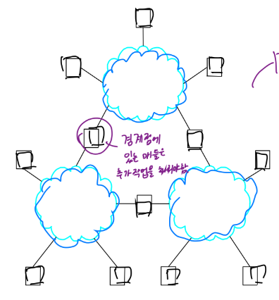

# ⚪구성 요소

- **노드(nodes)** : 단말기, 라우터, 범용 워크스테이션... (보통 노드가 단말, 스위치 둘 다 포함함)
- **링크(links)** : 광케이블, 동축케이블, 무선채널...

 

 

 

# ⚪직접 링크(Direct Links)

노드 사이에 다른 노드가 없을때가 직접 링크

- **점대점 연결 (point-to-point)**  : 가장 간단한 네트워크  
    
  point가 늘어나면 링크를 너무 많이 사용하게 된다는 단점이 있음

- **다중 접근 (multiple access)**   
    
  점대점 연결에 비해서 링크를 적게 쓴다는 장점이 있지만, 동시사용이 안된다는 단점이 있음.   
  누가 언제 얼만큼 쓸건지 제어가 필요함.  
  와이파이도 이 방식임

 

 

 

# ⚪간접 연결(Switched Networking)

간접 연결 (Indirect Connectivity) = Switched Networks

- **스위칭 네워크(switching networks)**  
    
- **인터네트워크(InterNetworks=Network of Networks)**  
  

 

## 🔹간접 연결 방법 : 스위칭 정책

- **회선 스위칭 (circuit switching)**  
  

  - 전화 네트워크에서 사용
  - 스위치가 사전에 output link에 전용 회선(용량) 확보
  - 비트스트림을 중단/간섭 없이 송/수신 (흘려 보냄)
  - 기본적으로 point-to-point 연결
  - 컴퓨터 통신에서 트래픽의 특징은 특정 시점에 몰렸다가 없어졌다 하기때문에 적합하지 않은 방식임. (다 만들어놓고 안쓰는 시간이 많아서 비효율적)  
    반면 전화는 한번 연결해놓고 쭉 말하기 때문에 비교적 좋은 방식임  

  ​    
  
- **패킷 스위칭 (packet switching)**   

  - 데이터를 묶음(패킷)으로 전송
  - 패킷이 다 와야 전송함. (반면 circuit switching은 오는대로 쭉 흘려보냄)
  - 스위치 동작: store-and-forward
  - 컴퓨터 통신에 있어서는 circuit방식보다 packet방식이 더 적합함
