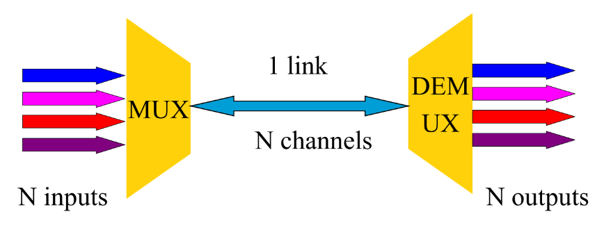
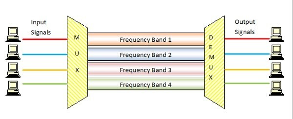
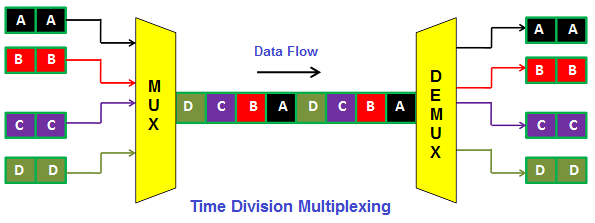
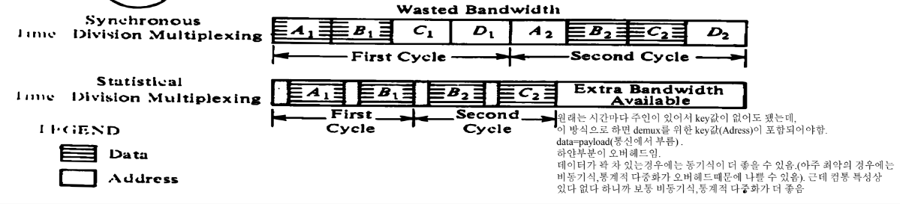
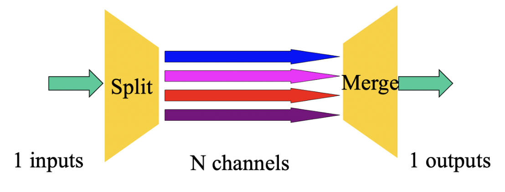
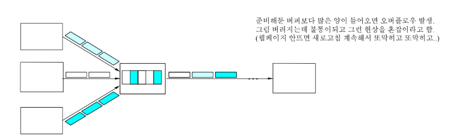

# <span style="color: #D6ABFA;">⚪다중화(multiplexing) 란?</span>



여러 사용자들이 네트워크 자원(노드 및 링크)을 공유하도록 하는것을 **다중화(multiplexing)** 라고 함

(위 그림에서 여러개의 데이터를 섞는것이 아닌 자원을 공유하는 것임)

흔히 사용되는 다중화 정책은

- **시분할 다중화(Time-Division Multiplexing: TDM)**
- **주파수분할 다중화(Frequency-Division Multiplexing: FDM)**

<br>

<br>

<br>

# <span style="color: #D6ABFA;">⚪주파수분할 다중화(Frequency Division Multiplexing)</span>



- FDM이라고도 부름
-  데이터링크(채널)의 주파수 대역폭을 몇 개의 작은 주파수 대역으로 나누어 각각 부채널(Sub Channel)로 재구성한 후 각 부채널을 여러 디바이스에 할당함으로써 각 디바이스로부터 나오는 신호를 동시에 전송하는 방식
- 데이터링크의 대역폭을 나누어서 만든 부채널상의 신호는 서로 다른 주파수 대역으로 변조(Modulation)되어 전송된다
- 수신지는 적절한 필터(Filter)를 통해 각 부채널의 신호를 구분한 후 각 부채널별로 복조(Demodulation)해 본래의 신호로 재구성
- 부채널 간의 상호 간섭을 방지하기 위해 보호 대역(Guard Band)을 사용하는데 이는 대역폭을 낭비하는 결과를 가져와 채널 이용률을 낮추는 요인
- 장점은 비교적 간단한 구조로 구현되므로 가격이 저렴하고 그 자체가 주파수 편이 변복조기 역할을 하므로 별도의 변조기나 복조기가 필요하지 않음

<br>

<br>

<br>

# <span style="color: #D6ABFA;">⚪시분할 다중화(Time Division Multiplexing)</span>



- TDM이라고도 부름
- 채널에 할당된 데이터 전송 허용시간을 일정한 시간 슬롯(Time Slot)으로 나누고 채널도 다시 부채널로 나누어 각 시간 슬롯을 부태널에 순차적으로 할당해 사용하는 방식
- 각 단말기는 입출력 어댑터(I/O Channel Adapter)에 연결되는데 이러한 어댑터는 버퍼 역할을 수행하며 동시에 다중화기 단말기와 데이터를 주고받기 위해 필요한 제어 기능도 수행 (어댑터에는 단말기와 시분할 다중화기의 내부 동작 속도 차이를 보상하기 위한 버퍼 기억장치가 있음)
- 각 부채널을 차례로 스캔(Scan)하는 동작을 수행해 시간 슬롯을 각 부채널에 할당한다.   
  이때 부채널에 전송할 데이터가 없는 경우에도 시간 슬롯이 할당되는데, 이는 낭비되는 시간
- 장점은 조가 비교적 간단해 구현이 용이하고 비용이 저렴하다는 장점이 있다. 또한 데이터 전송률의 조절이 가능
- 단점으로는 시간 슬롯의 낭비

<br>

<br>

<br>


# <span style="color: #D6ABFA;">⚪통계적 다중화(Statistical Multiplexing)</span>



- 통계적 다중화 = 비동기식 다중화
- 시분할 방법을 변형한 것
- 시간을 나누는건 똑같지만 그 각각의 시간의 임자가 정해져있지 않음
- 통계적 다중화라고 부르는 이유는 요구에 따라서 동적 다중화를 하기 때문에 그렇게 부름
- demux를 위한 key값(adrress)이 포함되어야 하기 때문에 오버로드가 생김. 그러나 컴퓨터 통신 특성상 데이터가 확 몰렸다가 없다가 하기 때문에, 보통 동기식tdm보다는 비동기식이 더 좋음

<br>

<br>

<br>


# <span style="color: #D6ABFA;">⚪Splitting</span>



- 과거와 달리 최근 데이터의 크기가 매우 커져 하나의 링크로는 감당할수 없기 때문에, 보내는 쪽에서 여러개로 보낸 후 받는쪽에서 합치는 방식을 사용
- 무선 같은 경우에도 링크가 아주 굵어질 수 없기때문에 유효할 수 있음

<br>

<br>

<br>


# <span style="color: #D6ABFA;">⚪통계적다중화와 패킷스위칭</span>



```
통계적 다중화와 패킷 스위칭은 다름!
- 통계적 다중화는 링크를 공유하는 방법
- 패킷 스위칭은 노드가 목적지를 향해 데이터를 전달하는 방법
- 패킷 스위칭: 패킷 단위로 링크 사용을 재스케쥴링
  * 패킷 스위칭의 결과, 링크는 (거의) 통계적 다중화
  * 링크에서 통계적다중화를 하려면, 노드에서는 패킷 스위칭 필요
- 다른 출발지/소스로부터의 패킷들이 링크에서 섞이게 됨
- 링크로 나가기 위해 경쟁하는 패킷들을 저장: 버퍼링(buffering)
- 패킷은 FIFO로 처리되거나, 기타 다른 방식으로 처리
- 버퍼 오버프로우(overflow)를 혼잡(congestion)이라 부름.
```

