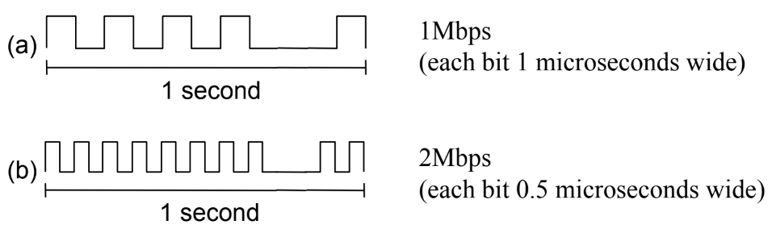
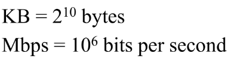
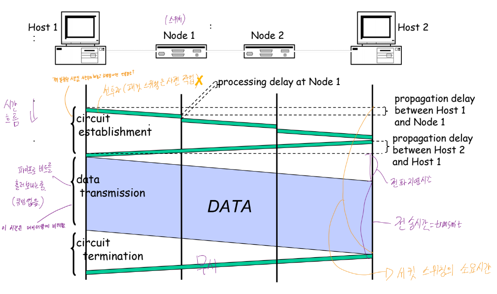
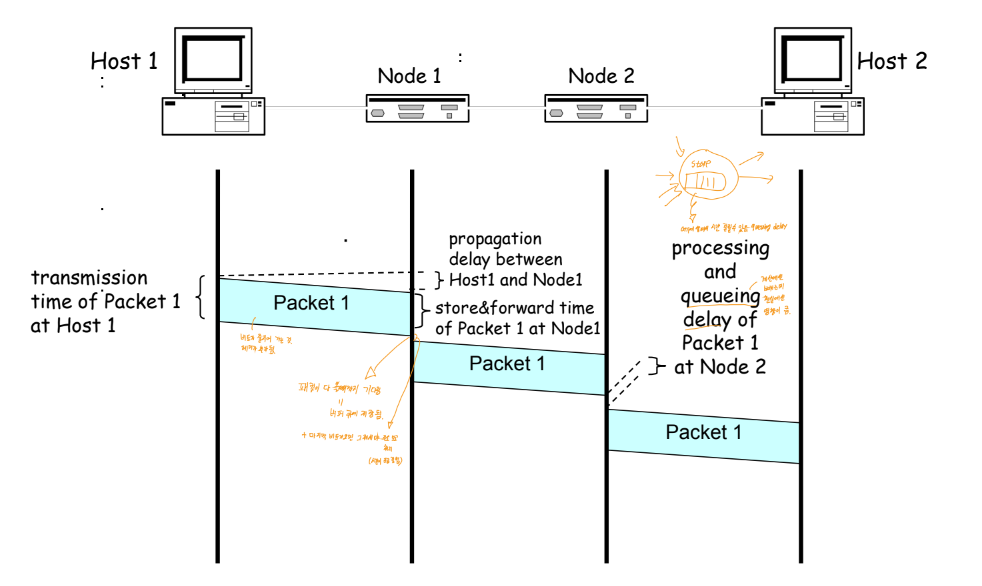
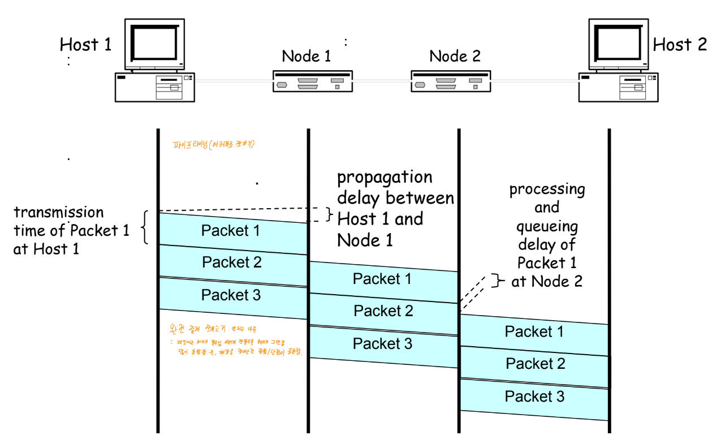
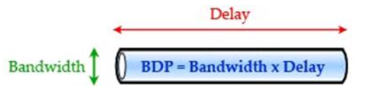

# ⚪대역폭(Bandwidth)

- 단위 시간당 전송될 수 있는 데이터의 양
- 파이프에 물이 꽉차서 흐른다는 가정하에 초당 흐르는 물의 양이라고 흔히들 이야기함

- 대역폭은 비트폭(bit width)과 관련이 있다. 속도가 높아지면 비트폭이 좁아진다.(오류날 가능성 up)

- 표기방법

ex)10Mbps

 

 

 

# ⚪Latency, Delay

- Latency(소요시간), Delay(지연시간) 둘이 거의 같은 의미로 많이 쓰이는 듯
- A지점에서 B지점으로 메시지를 송신하는데 걸리는 시간
- **왕복지연시간(round-trip time: RTT)** 가 중요할 수도 있음

 

**소요시간(Latency) = 전파지연시간(Propagation) + 전송시간(Transmit) + Queue [+ 스위칭 시간]**

- 전파지연시간(Propagation) = Distance / SpeedOfLight(신호의 속도는 상수로 간주함)
- 전송시간(Transmit) = Size(메시지 크기)/Bandwidth

직접링크에서는 큐잉 지연(queuing delay)은 없음. 스위칭을 하는경우에만 있음. 즉 서킷 스위칭은 큐잉이 없음

 

요즘 전체 통신망에서 성능 잡아먹는 병목 지점은 **스위치**임

 

 

 

# ⚪그림으로 보는 상황별 시간 차이

- 세로는 시간의 흐름을 나타냄

## 🔹Timing in Circuit Switching

- circuit switching방식이기 때문에 선 투자 시간이 필요함
- 비트 스트림 형식임

## 🔹Timing of Packet Switching

- 각 노드에서 패킷이 전부 다 올때까지 기다리고(버퍼 큐에 저장해 놓음), 마지막 비트가오면 그제서야 주소를 보고 처리함.
- queueing delay 가 실성능에 영향을 미침

## 🔹Packet Segmentation : Pipelining

- 파이프라이닝을 사용하여 패킷을 더 효율적으로 보낼 수 있음 (패킷을 여러개로 쪼갬)
- 너무 작은 조각으로 자르지 못하는 이유는, 패킷에는 헤더가 필수기때문에 쪼갤수록 헤더가 그만큼 많이 포함됨. 그것을 고려하여 적당히 나눠야함

 

 

 

# ⚪대역폭과 소요시간의 상대적 중요성

- 작은 메시지: 소요시간 중요
- 큰 메시지: 대역폭 중요

 

 

 

# ⚪BDP

- BDP = Bandwidth-delay product
- 대역폭(Bandwidth) X 지연시간(Delay) = BDP
- 양 End point간의 데이터의 최대 처리량을 의미함.  즉 데이터를 보냈는데 상대편에서는 아직 안받은 상태인, 선로에서 이동중일 수 있는 데이터의 최대양
- 링크의 부피라고 생각해도 됨
- 지연시간과 대역폭을 곱하기때문에 BDP의 단위는 보통 bits거나 byte임
- BDP보다 더 보내면 쌓여서 overflow가 남
- ex) 100ms x 45Mbps =약 560KB

