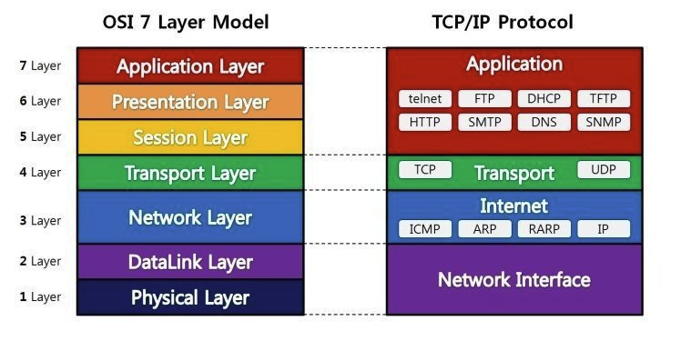

# ⚪네트워크 계층을 나누는 이유

- 통신이 일어나는 과정을 단계별로 파악할 수 있기때문
- 문제가 생긴 부분을 순차적으로 찾아나갈 수 있음

 

 

 

# ⚪OSI 7 계층

>OSI 모형(Open Systems Interconnection Reference Model)은 국제표준화기구(ISO)에서 개발한 모델로, 컴퓨터 네트워크 프로토콜 디자인과 통신을 계층으로 나누어 설명한 것이다. 일반적으로 OSI 7 계층이라고 한다.

-1699447498702-5.png)

1. **물리계층 (Physical Layer)**
   - **전기적, 기계적, 기능적인 특성을 이용하여 통신 케이블로 데이터를 전송**한다.
   - 사용되는 통신 단위는 비트(bit)이며, 0또는 1만 나타낼 수 있다.
   - 단지 데이터를 전달만 할 뿐 전송하려는, 또는 받으려는 데이터가 무엇인지는 전혀 신경쓰지 않는다.
   - 대표적인 장치로 통신 케이블, 리피터, 허브 등이 있다.
2. **데이터 링크계층 (DataLink Layer)**
   - **물리 계층을 통해 송수신되는 정보의 오류와 흐름을 관리하여 안전한 정보의 수행을 도와주는 역할**을 한다.
   - **맥 주소(MAC Address)를 가지고 통신**한다.
   - 전송되는 단위를 프레임(frame)이라고 하며, 대표적인 장비로는 브리지, 스위치 등이 있다.
   - 이더넷, 투 포인트 프로토콜(HDLC, ADCCP), 근거리 네트워크 프로토콜(LLC, ALOHA) 등이 있다.
3. **네트워크 계층 (Network Layer)**
   - 데이터를 목적지까지 가장 안전하고 빠르게 전달하는 기능(라우팅)을 한다.
   - **경로를 선택하고 주소를 정하고 경로에 따라 패킷을 전달해주는 역할**을 한다.
   - 대표적인 장비로 라우터, (라우팅 기능이 포함된)스위치가 있으며, **IP 주소를 사용**한다.
   - 데이터를 연결하는 다른 네트워크를 통해 전달함으로써 인터넷이 가능하게 만드는 계층이다.
4. **전송 계층 (Transport Layer)**
   - **통신을 활성화하기 위한 계층**이다. 보통 **TCP 프로토콜을 사용**하며, 포트를 열어서 응용 프로그램을 전송한다.
   - 양 끝단의 사용자들이 신뢰성 있는 데이터를 주고 받을 수 있게 해 주어, 상위 계층들이 데이터 전달의 유효성이나 효율성을 생각하지 않도록 한다.
   - 특정 연결의 유효성을 제어하고, 일부 프로토콜은 상태 개념이 있고 연결 기반이다. 전송 계층의 패킷들이 유효한지 확인하고 전송 실패한 패킷을 다시 전송함을 의미한다.
5. **세션 계층 (Session Layer)**
   - **데이터가 통신하기 위한 논리적인 연결**을 한다.
   - **세션 설정, 유지, 종료, 전송 중단시 복구 등의 기능**이 있다.
   - 양 끝단의 응용 프로세스가 통신을 관리하기 위한 방법을 제공한다.
   - TCP/IP 세션을 만들고 없애는 책임을 진다.
6. **표현 계층 (Presentation Layer)**
   - **데이터 표현이 상이한 응용 프로세스의 독립성을 제공하고, 암호화**한다.
   - 코드 간의 번역을 담당하여 사용자 시스템에서 데이터의 형식상 차이를 다루는 부담을 응용 계층으로 덜어준다.
   - 예를 들면, EBCDIC로 인코딩된 문서 파일을 ASCII로 인코딩된 파일로 바꿔주는 것
   - 해당 데이터가 텍스트인지, 그림인지, GIF인지, JPG인지의 구분 등의 역할을 한다.
7. **응용 계층 (Application Layer)**
   - 최종 목적지로서 HTTP, FTP, SMTP, Telnet 등과 같은 프로토콜이 있다.
   - **응용 프로세스와 직접 관계하여 일반적인 응용 서비스를 수행**한다.
   - 네트워크 소프트웨어의 UI 부분, 사용자의 입출력 부분을 담당한다.

 

 

 

# ⚪TCP/IP 4계층

1. **네트워크 인터페이스 계층 (Network Interface, Network Access)**
   - OSI 계층의 1,2 계층에 해당된다.
   - TCP/IP 패킷을 네트워크 매체로 전달하는 것과 네트워크 매체에서 TCP/IP 패킷을 받아들이는 과정을 담당한다.
   - 에러 검출 기능과 패킷의 프레임화 기능을 수행한다.
   - 네트워크 접근 방법, 프레임 포맷, 매체에 대해 독립적으로 동작하도록 설계되었다.
   - 흐름 제어(Flow Control)는 Header(MAC)에서, 에러 제어(Error Control)는 Tailer(CRC)에서 수행한다.
2. **인터넷 계층 (Internet)**
   - OSI 계층에서 3계층에 해당된다.
   - 어드레싱(addressing), 패키징(packaging), 라우팅(routing) 기능을 제공한다.
   - 논리적 주소인 IP를 이용한 노드간 전송과 라우팅 기능을 처리하게 된다.
   - 네트워크상 최종 목적지까지 정확하게 연결되도록 연결성을 제공한다.
   - 핵심 프로토콜은 IP, ARP, ICMP, IGMP 등이 있다.
3. **전송 계층 (Transport)**
   - OSI 계층에서 3,4 계층에 해당된다.
   - 자료의 송수신을 담당한다.
   - 어플리케이션 계층의 세션과 데이터그램 통신서비스를 제공한다.
   - TCP/UDP가 핵심 프로토콜이다. TCP/UDP에 대한 구분을 하고 데이터에 대한 제어 정보가 여기에 포함된다.
4. **응용 프로그램 계층 (Application)**
   - 다른 계층의 서비스에 접근할 수 있게 하는 어플리케이션을 제공한다.
   - 어플리케이션들이 데이터를 교환하기 위해 사용하는 프로토콜을 정의한다.
   - TCP/IP 네트워크를 사용하거나 관리하는 것을 도와주는 프로토콜이다.